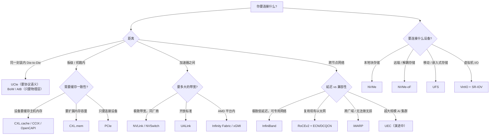

# 选型速查

> 不要从"我想用哪个协议"出发，从"我要解决什么问题"出发。

## 1. 决策树

## 2. 按需求选

| 需求 | 首选 | 备选 | 关键权衡 |
| --- | --- | --- | --- |
| 板级连接任意设备 | **PCIe** | — | 通用但无一致性 |
| 内存容量扩展 / 池化 | **CXL.mem** | — | 加内存而不换 CPU |
| 设备进入 CPU 缓存一致域 | **CXL.cache** | CCIX / OpenCAPI | 复杂度高、生态仍在成熟 |
| 本地高性能块存储 | **NVMe** | — | 队列深度换 IOPS |
| 存储与计算解耦 | **NVMe-oF** | iSCSI（旧） | 网络 RTT 决定下限 |
| 移动 / 嵌入式存储 | **UFS** | eMMC | 功耗与体积优先 |
| 低延迟跨节点通信 | **InfiniBand** | RoCEv2 | IB 需专用网络 |
| 复用现有以太网做 RDMA | **RoCEv2** | iWARP | 无损网络配置是难点 |
| 广域 / 无法部署无损网 | **iWARP** | — | 依赖 TCP，开销略高 |
| 超大规模 AI 训练网络 | **UEC + RoCEv2** | IB | UEC 规范仍在推进 |
| GPU 间高带宽 | **NVLink / NVSwitch** | UALink | 私有 vs 开放 |
| 加速器开放互连 | **UALink** | CXL | 生态成熟度 |
| Chiplet 互连 | **UCIe** | BoW / AIB | 成本与能效 |
| 虚拟机 I/O | **VirtIO** + **SR-IOV** | — | 灵活性与性能的取舍 |

## 3. 容易混淆的五组协议

### PCIe vs CXL vs NVLink

| 维度 | PCIe | CXL | NVLink |
| --- | --- | --- | --- |
| 语义 | IO（DMA/MMIO） | 内存 + 缓存行 | 内存语义 load/store |
| 缓存一致 | 无 | 有（可选） | 无（但可 load/store） |
| 主要用途 | 接设备 | 内存扩展 / 池化 | GPU 互连 |
| 生态 | 通用 | 快速增长 | NVIDIA 私有 |
| 一句话 | 总线 | 内存 | GPU 的"内存总线" |

### InfiniBand vs RoCE vs iWARP

| 维度 | InfiniBand | RoCEv2 | iWARP |
| --- | --- | --- | --- |
| 底层 | 专用 IB 网络 | 以太网 + UDP | TCP/IP |
| 是否要求无损网络 | 原生无损 | **是**（PFC/ECN） | 否 |
| 可路由 | 是 | 是（v2） | 是 |
| 部署难度 | 专用网络、成本高 | 调无损网复杂 | 最易，复用现网 |
| 性能 | 最好 | 接近 IB | 略逊于 RoCE |
| verbs API | 同一套 | 同一套 | 同一套 |

### NVMe vs NVMe-oF

| 维度 | NVMe | NVMe-oF |
| --- | --- | --- |
| 传输 | PCIe | RDMA / TCP / FC |
| 延迟 | 介质主导（数十 µs） | 网络 + 介质 |
| 适用 | 本地盘 | 存储解耦、共享 |
| 队列 | SQ/CQ + doorbell | 本地 SQ/CQ + capsule |

### UCIe vs BoW vs AIB

| 维度 | UCIe | BoW | AIB |
| --- | --- | --- | --- |
| 定位 | 完整 D2D 互连标准 | 轻量物理接口 | 物理接口 |
| 协议层 | 有（PCIe/CXL/Streaming） | 无（上层自定义） | 无（上层自定义） |
| 复杂度 / 成本 | 较高 | 低 | 低 |
| 谁主导 | 开放联盟 | OCP | Intel（开源） |

### VirtIO vs SR-IOV

| 维度 | VirtIO | SR-IOV |
| --- | --- | --- |
| 实现层面 | 软件半虚拟化 | 硬件虚拟化 |
| 性能 | 取决于后端（vhost/DPDK） | 接近原生 |
| 灵活性 | 高（设备模型在软件里） | 受硬件功能限制 |
| 热迁移 / 快照 | 友好 | 较难 |
| 常用组合 | VirtIO 做控制面 | SR-IOV 做数据面直通 |

## 4. 选型检查清单

1. **距离**：封装内 / 板级 / 机箱内 / 跨节点？先定这一条。
2. **一致性**：需要缓存一致、内存语义，还是显式 DMA 就够？
3. **请求模型**：要用队列（命令-完成）还是直接用内存事务？
4. **延迟预算**：能接受一个往返是多少？网络存储值不值得？
5. **并发资源**：队列深度 / outstanding 数够不够达到目标带宽？（用 Little 定律算）
6. **生态与成本**：专有方案（NVLink、IB）还是开放标准（UALink、RoCE、UCIe）？
7. **运维复杂度**：无损网络、IOMMU 配置、设备直通，谁来维护？
8. **演进**：规范是否还在推进（UEC、UALink、UCIe 2.0）？避免押注冻结前的方案。

## 5. 一句话总结每个协议

| 协议 | 一句话 |
| --- | --- |
| PCIe | 现代总线的语法 |
| CXL | 把内存从机箱里解放出来 |
| CCIX | 加速器进入一致性域 |
| OpenCAPI | 低延迟一致性内存接口 |
| NVMe | 队列深度即吞吐 |
| NVMe-oF | 让存储离开服务器 |
| UFS | 移动设备的高速闪存接口 |
| InfiniBand | 专用网络上的极致 RDMA |
| RoCE | 让以太网跑上 RDMA |
| iWARP | 让 TCP 跑上 RDMA |
| UEC | 为 AI 集群重新设计以太网传输 |
| NVLink | GPU 之间的内存总线 |
| Infinity Fabric | AMD 的片内与片间主干 |
| UALink | 开放的加速器互连 |
| UCIe | Chiplet 的通用插座 |
| BoW | 用一"捆"线把芯片缝在一起 |
| AIB | 并行 D2D 的先行者 |
| VirtIO | 软件里重建的 I/O 队列 |
| CAPI / PSL | POWER 与 FPGA 的心跳 |

---

回到[总览矩阵](/compare/overview)，或从[导读](/guide/intro)重新开始。
