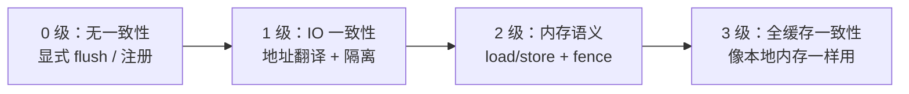
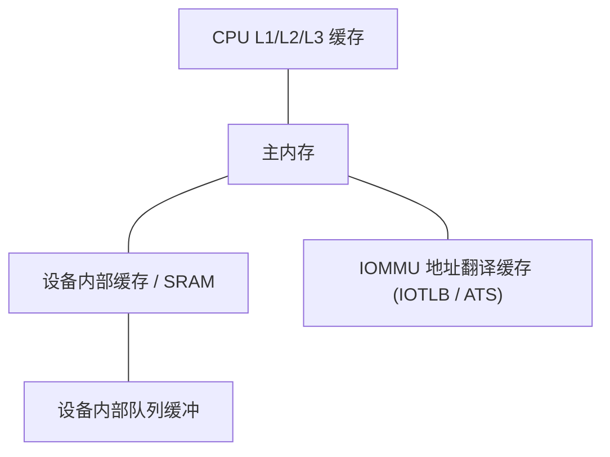
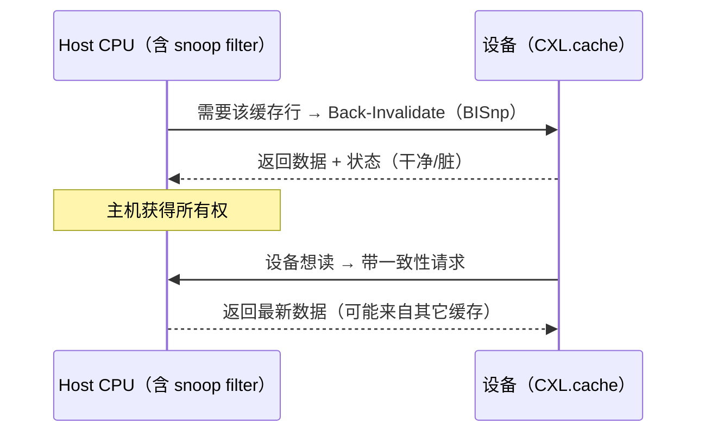
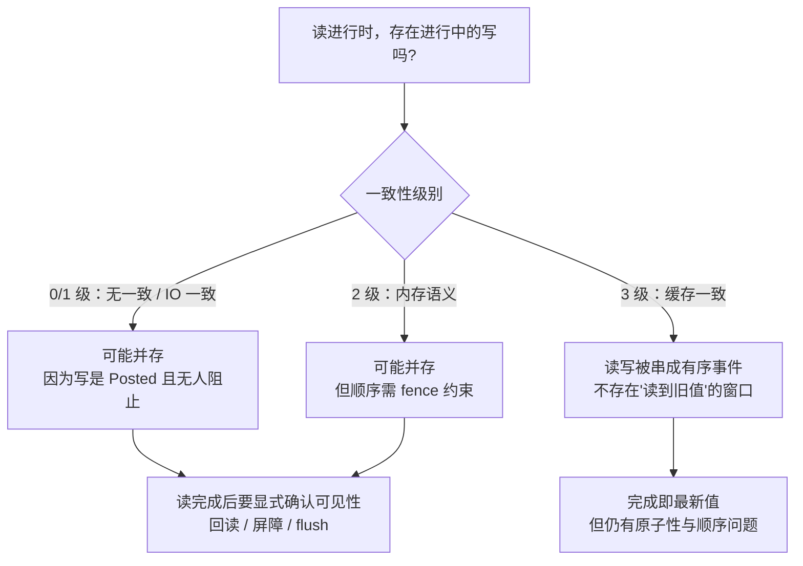

# 一致性与内存语义

> 一致性解决"同一地址哪个副本为真"，内存语义解决"能不能用 load/store 访问远端"。
> 这是两个不同的问题，但经常一起出现。

## 1. 四级光谱

| 级别 | 名字 | 保证什么 | 程序员要做什么 |
| :---: | --- | --- | --- |
| **0** | 无一致性 | 只有"你们约定好的那块内存"，且必须显式同步 | flush 缓存、注册内存、插屏障、用门铃/完成确认 |
| **1** | IO 一致性 | 设备用虚拟地址，有页表和隔离 | 仍然要 flush / 屏障；翻译不等于缓存一致 |
| **2** | 内存语义 | 可用 load/store 访问远端地址 | 用 fence / 原子保证顺序；无自动缓存一致 |
| **3** | 全缓存一致性 | 硬件维护缓存状态，读总能看到最新值 | 基本不需要手动 flush，但仍要注意顺序与原子性 |

::: tip 别被"内存语义"骗了
"能用 load/store 访问"（2 级）**不等于**"缓存一致"（3 级）。NVLink 允许 GPU 直接 load peer 显存，但如果对方刚写完、你没插 fence，仍可能读到旧值。**内存语义放宽的是访问方式，不是一致性。**
:::

## 2. 每个协议落在哪一级

| 协议 | 级别 | 硬件保证 | 软件责任 |
| --- | :---: | --- | --- |
| **PCIe 裸 DMA** | 0 | 排序规则（强序 + RO） | 一致性由软件负责：flush/invalidate、屏障、读回 |
| **PCIe + ATS/PASID** | 1 | 设备侧地址翻译 + 进程隔离 | 仍需显式同步；SVA 只解决地址，不解决缓存 |
| **NVMe** | 0 | 队列内顺序、FUA、Flush | 用 Flush/FUA 保证持久化顺序；无缓存一致 |
| **NVMe-oF** | 0 | 传输层保序 | 同 NVMe，注意网络重传 |
| **UFS** | 0 | 命令队列顺序 | Cache Flush 命令 |
| **InfiniBand / RoCE / iWARP** | 0 | QP 内保序（RC）、CQE | 内存注册、fence verb、回读确认 |
| **UEC** | 0 | 传输层语义（演进中） | 同上 |
| **CXL.io** | 0 | 同 PCIe | 同 PCIe |
| **CXL.cache** | 3 | 设备缓存主机内存，硬件监听 | 一般不 flush，但要注意死锁与背压 |
| **CXL.mem** | 2~3 | 主机访问设备内存；HDM + 一致性 | 视是否参与 host coherent 域 |
| **CCIX** | 3 | 加速器参与一致性域 | 少量同步 |
| **OpenCAPI** | 3 | 一致性内存接口 | 少量同步 |
| **CAPI / PSL** | 3 | POWER 一致性域 | 少量同步 |
| **NVLink** | 2 | 内存语义 load/store | **必须用 fence / 原子**；不是透明一致 |
| **Infinity Fabric** | 3（片内） | 片内缓存一致，跨 socket 经 xGMI | 跨 socket 时注意 NUMA 延迟 |
| **UALink** | 2 | 加速器间内存语义 | 完成 + fence |
| **UCIe** | 上层决定 | 透传 PCIe / CXL / Streaming | 取决于上层协议 |
| **BoW / AIB** | 0 | 仅物理层 | 全部由上层定义 |
| **VirtIO** | 0 | 无 | `virtio_mb()` 屏障 + 通知顺序 |

## 3. 缓存的"副本问题"

无一致性协议之所以麻烦，是因为同一份数据可能同时存在于多个地方：

任何一层有旧副本，就会读到旧值：

| 旧值来源 | 典型现象 | 解决手段 |
| --- | --- | --- |
| CPU 缓存 | CPU 写了但设备 DMA 读到旧值 | `clflush` / 非临时写 / DMA 一致性 API |
| 设备内部缓存 | 设备写了但主存没更新 | 设备 Flush；或读设备寄存器确认 |
| IOTLB / ATS 缓存 | 地址翻译过旧 | `ATS Invalidate`、IOMMU 失效 |
| 队列本身的缓存行 | 门铃写了但设备没看到新 tail | 屏障 + 门铃写顺序 |

## 4. 全缓存一致是怎么做到的（以 CXL.cache 为例）

三种主流实现思路：

| 机制 | 说明 | 代表 |
| --- | --- | --- |
| **snoop（监听）** | 每次访问广播询问其它缓存 | 传统 SMP、CXL.cache、CCIX |
| **directory / snoop filter** | 用目录记录谁有副本，定向询问 | 大规模 SMP、CXL |
| **home agent + 状态机** | 由"家代理"维护每行的状态 | CCIX |

CXL 的独特之处是引入了 **bias（偏置）**：一行可以"偏向主机"或"偏向设备"。偏向设备时设备可以自由修改，主机要访问需先收回；这减少了监听往返，代价是状态切换有延迟。

## 5. 为什么跨节点一律不做缓存一致？

| 因素 | 板级 / 机箱内 | 跨节点 |
| --- | --- | --- |
| 往返延迟 | 数十 ~ 数百 ns | µs 级 |
| 监听扇出 | 有限（几个 ~ 几十个代理） | 成千上万，不可接受 |
| 故障域 | 共享电源/时钟，故障相关 | 独立故障域，必须容忍丢失 |
| 协议复杂度 | 可实现状态机 | 需要重传、序号、拥塞控制 |

**结论**：跨节点一律"无一致性 + 显式注册 + 完成通知"。一致性带来的复杂度与延迟，在 µs 级往返上完全不划算。这就是 CXL 只做机箱内、RDMA 只做 one-sided 的根本原因。

## 6. 主线视角：一致性与"读进行时写会怎样"

一句话：**在 0~2 级里，"读进行中没有写"是一个需要软件自己构造的性质；在 3 级里，它是硬件替你保证的性质。**

## 7. 实用清单：我该做什么

| 你的场景 | 必须做 |
| --- | --- |
| PCIe 设备 DMA 写内存，CPU 读 | 保证写顺序（`dma_wmb()`）；读侧 `dma_rmb()` |
| CPU 写数据，设备 DMA 读 | 确保 CPU 缓存已刷（非一致 DMA 架构上） |
| 用 MMIO 寄存器传控制 | 写后用 `readl()` 回读确认 |
| RDMA Write 后立刻 Read 同一地址 | 同一 QP / 用 fence verb；跨 QP 需回读确认 |
| GPU 经 NVLink store 到 peer，peer 立即 load | peer 侧 `fence` / `__threadfence_system()` |
| CXL.cache 设备 | 一般免 flush，但要处理背压与监听死锁 |
| VirtIO 提交描述符 | 写 avail ring 前 `virtio_wmb()`，再 kick |

## 8. 要点速记

- 一致性（哪份副本为真）与顺序（不同地址谁先谁后）是两回事。
- 四级光谱：无一致 → IO 一致 → 内存语义 → 全缓存一致。
- 内存语义 ≠ 缓存一致；NVLink/UALink 属于 2 级。
- 跨节点不做缓存一致，是因为往返延迟与监听扇出的成本不可接受。
- 0~1 级下，"读写不并存"要靠程序员自己构造；3 级下由硬件保证。
- 无论哪一级，原子性与顺序问题都不会自动消失。

继续：[延迟与带宽量级](/compare/latency-bandwidth)。
