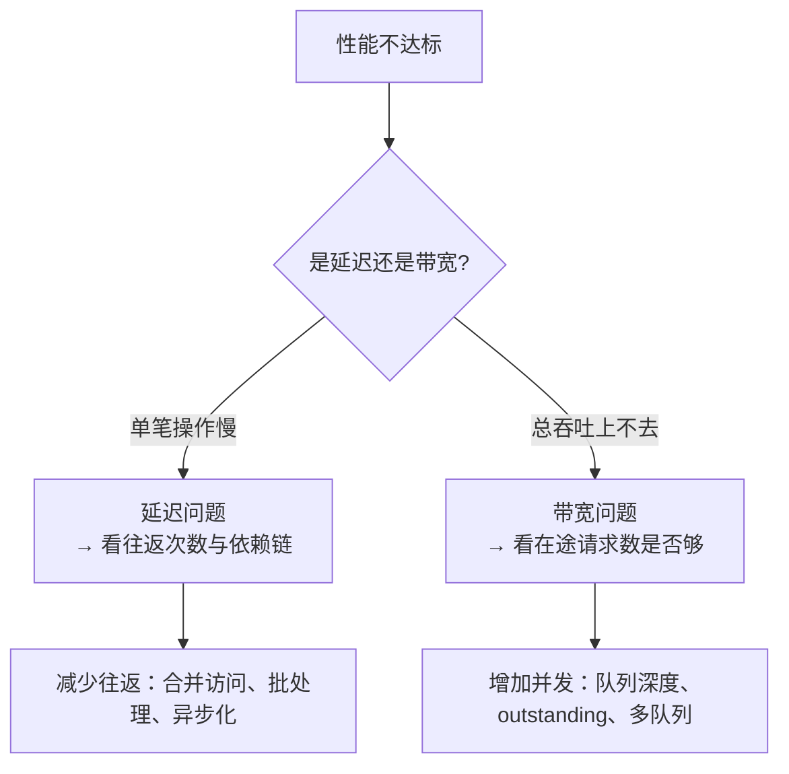

# 延迟与带宽量级

> 性能问题几乎总能化成一个问题：**在途请求够不够多？**

::: warning 关于数字
本页数字都是**量级**，用于建立直觉，不是规格承诺。实际值取决于工艺、拓扑、软件栈与负载。
:::

## 1. 延迟量级：从寄存器到网络

| 访问路径 | 延迟量级 | 主导因素 |
| --- | --- | --- |
| CPU L1 / L2 / L3 | ~1 ns / 数 ns / 数十 ns | 缓存层级 |
| CPU 访问本地 DRAM | ~60–100 ns | 内存控制器 |
| 片内 Infinity Fabric | 数十 ns | 片内网络 |
| GPU 本地显存 / L2 | 数百 ns | 显存与 SM |
| **PCIe MMIO 寄存器读** | **数百 ns ~ 1 µs** | Non-Posted 往返 + RC |
| **PCIe DMA 读（小）** | **~0.5–1 µs** | 往返 + 设备处理 |
| **NVLink peer GPU load** | **亚 µs** | 链路 + peer 显存 |
| **Infinity Fabric 跨 socket** | **百 ns 量级** | xGMI |
| **RDMA Read（IB / RoCE）** | **~1–3 µs** | 网卡 + 网络 RTT |
| **NVMe 读（含软件）** | **~10–100 µs** | 介质访问主导 |
| **NVMe-oF 读** | **~50–200 µs** | 网络 + 介质 |
| **UFS 读** | **~50–200 µs** | 介质 + 队列 |
| 同机架网络 RTT | ~2–10 µs | 交换与光模块 |
| 跨地域 RTT | ~ms | 光速 + 路由 |

## 2. 带宽量级

| 链路 / 协议 | 单向带宽量级 | 备注 |
| --- | --- | --- |
| PCIe Gen5 x16 | ~63 GB/s | 编码后理论值 |
| PCIe Gen6 x16 | ~126 GB/s | PAM4 + FLIT |
| NVLink（单 GPU 双向） | 数百 GB/s ~ 1.8 TB/s | 代次差异大 |
| 100 GbE | ~12.5 GB/s | 线速 |
| IB / RoCE NDR 400 Gbps | ~50 GB/s | 单端口 |
| IB XDR 800 Gbps | ~100 GB/s | 单端口 |
| 本地 NVMe（Gen5） | 数 GB/s ~ 14 GB/s | 单盘 |
| UFS HS-G5 多 lane | 数 GB/s | 移动端 |
| UCIe 每 lane | 数 Gbps ~ 数十 Gbps | 能效优先 |
| DDR5 单通道 | ~数十 GB/s | 内存侧参照 |

## 3. 一次读的延迟预算


| 协议 | 主导段 | 优化抓手 |
| --- | --- | --- |
| PCIe DMA | ② 往返 | 增加 outstanding、增大 MRRS |
| RDMA | ② 网络往返 | 提高 QP 并发、换更快的网络 |
| NVMe | ③ 介质 | 增加队列深度、开轮询、用更快的盘 |
| NVMe-oF | ② + ③ | 网络与介质各占一半，要分别优化 |
| UFS | ③ 介质 + 队列 | 提升 CQ 深度与 Gear |
| NVLink / IF | ① 软件 + ② 链路 | 减少 fence、提高并发 |

## 4. 用 Little 定律估算所需并发

这是本页最有用的一个公式。设需要达到的吞吐为 $B$、访问延迟为 $L$，则所需在途请求数为

$$
N = B \times L
$$

### 例 1：PCIe Gen5 x16 想跑满带宽

已知：带宽 ≈ 63 GB/s，一次读往返 ≈ 500 ns。

```text
在途数据量 = 63 GB/s × 500 ns ≈ 31.5 KB
若 MPS = 256 B，则需要的在途读请求 ≈ 31.5 KB / 256 B ≈ 123 个
```

**结论**：如果 Tag 只有 32 个（默认 5 位）且没有别的在途机制，**单靠读根本跑不满 Gen5 x16**。这就是 FPGA 设计中必须开 Extended Tag、并实现多个 outstanding 读的原因。

### 例 2：RDMA 400 Gbps 想跑满

已知：带宽 ≈ 50 GB/s，小消息 RTT ≈ 2 µs。

```text
在途数据量 = 50 GB/s × 2 µs = 100 KB
```

需要用多 QP、增大 SQ 深度或提高消息大小来填满。

### 例 3：NVMe 达到 100 万 IOPS

```text
所需队列深度 = IOPS × 延迟 = 1,000,000 × 20 µs = 20
```

也就是说，延迟 20 µs 时，队列深度 20 左右就能到百万 IOPS —— 这也解释了 NVMe 为什么把队列做这么深：深度就是吞吐。

## 5. 延迟 vs 带宽：两种不同的瓶颈



| 症状 | 说明 | 典型错解 |
| --- | --- | --- |
| 单次读慢 | 延迟问题，往返次数太多 | 加大带宽没用 |
| 大块传输吞吐低 | 在途请求不足 | 换更宽链路也没用 |
| 小块传输 IOPS 低 | 每笔都要软件参与 | 只加队列深度不够，要减少软件路径 |
| 尾延迟高 | 排队或拥塞 | 平均带宽看着正常 |

## 6. 常见误区

- **"链路带宽翻倍，性能就翻倍"**：如果瓶颈在 outstanding 数或软件路径，链路再宽也没用。
- **"延迟低就吞吐高"**：吞吐 = 在途 / 延迟，还要看在途够不够。
- **"内存语义就一定快"**：NVLink 的 load 仍要走一次远端访问，和本地显存不是一个量级。
- **"完成通知不重要"**：中断开销在高 IOPS 下会主导，轮询（polling）在吞吐场景里常常更快，代价是占 CPU。
- **"网络存储就是慢"**：NVMe-oF 的延迟主要是往返，随网络 RTT 变化，同机架可以做到接近本地盘。

## 7. 要点速记

- 延迟量级：片内 ns → 板级数百 ns → 网络 µs → 存储数十 µs。
- 吞吐上限 ≈ 在途请求数 × 单次数据量 / 延迟。
- PCIe 想跑满带宽，outstanding 数往往先成为瓶颈。
- 队列深度就是吞吐：NVMe 的多队列设计正是为此。
- 先判断是延迟问题还是带宽问题，再谈优化。

继续：[选型速查](/compare/choosing)。
