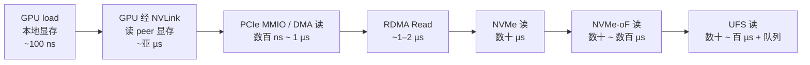
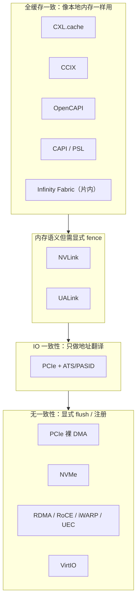

# 总览矩阵

> 一张表看完全部 19 个协议。**先看"请求单位"和"一致性"两列**，其余列会自然串起来。

## 1. 主矩阵

| 协议 | 领域 / 距离 | 请求单位 | Posted 的东西 | Non-Posted 的东西 | 完成/同步 | 一致性 | 典型延迟量级 | 带宽量级 |
| --- | --- | --- | --- | --- | --- | --- | --- | --- |
| **PCIe** | 板级 | TLP | MWr、Msg | MRd、Cfg、Atomic | `CplD` + Tag | 无 | 数百 ns | 每 lane ~4 GB/s (Gen5)，x16 ~63 GB/s |
| **CXL** | 板级 | 缓存行 / 内存事务 | 写回、写 | 读、RFO、缓存行填充 | snoop 响应 / `CplD` | 缓存一致（.cache） | 百 ns 量级 | 随 PCIe Gen 升级，Gen6 更高 |
| **CCIX** | 板级 | 一致性事务 | 写 | 读 | 监听 / 响应 | 缓存一致 | 数百 ns | 25–100 Gbps / lane |
| **OpenCAPI** | 板级 | 一致性内存事务 | 写 | 读 | 响应 | 缓存一致 | 低（低于 PCIe） | 25 Gbps / lane |
| **NVMe** | 设备命令层 | 命令 / 完成项 | 提交命令、门铃写 | —（数据由设备 DMA） | 完成项写 CQ + MSI-X | 无 | 数十 µs | 随 PCIe，数 GB/s ~ 14 GB/s |
| **NVMe-oF** | 跨节点 | command capsule | capsule 发送 | 数据/响应等待 | Response capsule + CQ | 无 | 数十 ~ 数百 µs | 受网络：100–400 Gbps |
| **UFS** | 设备命令层 | UPIU（SCSI 命令） | 命令 UPIU | 读数据 | Response UPIU | 无 | 数十 ~ 百 µs | HS-G4/G5 每 lane ~11.6/23.2 Gbps |
| **InfiniBand** | 跨节点 | Work Request | `RDMA_WRITE`、`SEND` | `RDMA_READ`、Atomic | CQE | 无 | ~1–2 µs | 100–400 Gbps / 端口 |
| **RoCE** | 跨节点 | Work Request | `RDMA_WRITE`、`SEND` | `RDMA_READ`、Atomic | CQE | 无 | ~1–3 µs | 100–400 Gbps |
| **iWARP** | 跨节点 | Work Request | `RDMA_WRITE`、`SEND` | `RDMA_READ` | CQE | 无 | 数 µs（含 TCP） | 10–100 Gbps |
| **UEC** | 跨节点 | 传输报文 | write 语义操作 | read / 消息 | 完成事件 | 无 | 目标亚 µs 级 | 目标 800 Gbps ~ 1.6 Tbps |
| **NVLink** | 加速器互连 | 内存事务 | store | load | fence / 原子 | 内存语义（非透明一致） | 亚 µs | 每 GPU 数百 GB/s ~ 1.8 TB/s（双向） |
| **Infinity Fabric** | 片内 / 片间 | 内存事务 | store | load | fence / xGMI | 片内一致 | 片内数十 ns，跨 socket 百 ns | 高（与内存通道同量级） |
| **UALink** | 加速器互连 | 内存语义事务 | write | read | 完成 + fence | 内存语义 | 亚 µs | 每通道 200 Gbps，聚合高 |
| **UCIe** | 封装内 D2D | Flit | 由上层决定 | 由上层决定 | 由上层决定 | 由上层决定 | 几 ns 量级 | 每 lane 数 Gbps ~ 数十 Gbps，能效优先 |
| **BoW** | 封装内 D2D | 字节流 / bunch | 上层定义 | 上层定义 | 上层定义 | 无（物理接口） | ns 量级 | 每线数 Gbps，低功耗 |
| **AIB** | 封装内 D2D | 并行字节流 | 上层定义 | 上层定义 | 上层定义 | 无（物理接口） | ns 量级 | 每 lane 数 Gbps |
| **VirtIO** | 软件抽象 | Descriptor | driver 写 avail ring + kick | device 写 used ring | 中断 / 轮询 | 无 | µs 量级 | 受后端实现限制 |
| **CAPI / PSL** | 加速器互连 | 加速器事务 | 写 | 读 | PSL 响应 | 缓存一致 | 百 ns 量级 | 与互连（如 OpenCAPI / 25 Gbps）相关 |

## 2. 按"读的代价"排序

同样一次"读"，代价差别巨大：

::: tip 读的成本 = 一次往返 + 目标处理时间
- **往返**由距离决定（片内 < 板级 < 网络）；
- **目标处理**由介质与设备决定（DRAM < SSD < 网络存储）。
- 两者叠加，就决定了一个协议"读"的延迟下限。
:::

## 3. 按一致性强度排序

**一致性越强，软件越省心，硬件越复杂、越难扩展。** 这也是为什么跨节点协议（RDMA、UEC）一律选择"无一致性 + 显式注册"，而只在机箱内（CXL、NVLink）才敢做内存语义甚至缓存一致。

## 4. 按"谁在等谁"排序

| 模型 | 特征 | 代表 |
| --- | --- | --- |
| **完全异步（Posted-only）** | 只管发，不关心何时到 | 设备 DMA 写、RDMA Write、doorbell、MSI-X |
| **请求-响应（读必须等）** | 有明确的完成点 | PCIe MRd、RDMA Read、NVMe 命令 |
| **推拉结合** | 一侧 post，另一侧 poll/中断收 | NVMe SQ/CQ、VirtIO virtqueue |
| **共享内存语义** | 无显式消息，靠 fence 保序 | NVLink、Infinity Fabric、UALink |

## 5. 一眼选型（粗筛）

| 你的需求 | 首选 | 备选 | 不要用 |
| --- | --- | --- | --- |
| 板级通用互连 / 加设备 | PCIe | — | NVLink |
| 内存扩展 / 池化 | CXL.mem | — | 裸 PCIe |
| 设备要缓存主机内存 | CXL.cache | CCIX / OpenCAPI | PCIe |
| 本地高性能块存储 | NVMe | — | UFS |
| 跨机存储 / 解耦 | NVMe-oF | — | 本地 NVMe |
| 移动 / 嵌入式存储 | UFS | eMMC | NVMe |
| 低延迟跨节点（HPC/AI） | InfiniBand | RoCEv2 | iWARP（若可部署无损） |
| 复用现有以太网 | RoCEv2（无损） | iWARP（可路由、无需无损） | IB（需专用网络） |
| 超大规模 AI 网络 | UEC（演进中）+ RoCEv2 | IB | iWARP |
| GPU 间高带宽 | NVLink / NVSwitch | UALink（开放） | PCIe（带宽不足） |
| 加速器开放互连 | UALink | CXL | 私有协议 |
| Chiplet 互连 | UCIe | BoW / AIB | 把 D2D 当 PCIe 用 |
| 虚拟机 I/O | VirtIO（+ SR-IOV 直通） | — | 软件模拟 |

详见[选型速查](/compare/choosing)。

## 6. 要点速记

- 所有协议都能用"请求单位 / posted / 完成 / 一致性"四列描述。
- 读的代价 = 一次往返 + 目标处理时间；距离越远，往返越贵。
- 一致性强度与距离成反比：越远越只能"无一致性 + 显式注册"。
- 物理层协议（UCIe/BoW/AIB）不定义语义，语义永远来自上层。

继续：[请求模型对比](/compare/request-models)、[一致性与内存语义](/compare/coherency)、[延迟与带宽量级](/compare/latency-bandwidth)。
