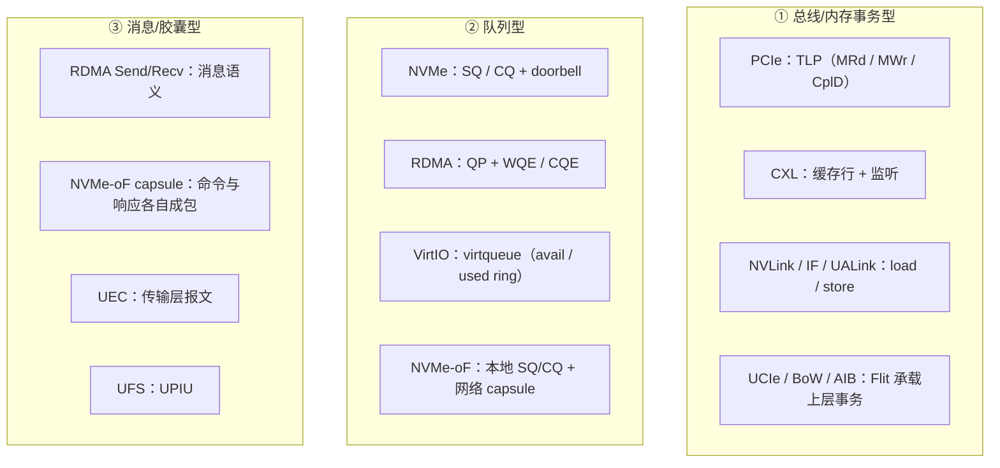

# 请求模型对比

> 19 个协议其实只有**三种请求模型**。认清自己用的是哪一种，剩下都是细节。

## 1. 三种请求模型

| 模型 | 请求的表达方式 | 谁分配缓冲 | 适合的场景 |
| --- | --- | --- | --- |
| 总线/内存事务型 | 地址 + 长度 | 请求者直接指定地址 | 通用互连、与 CPU 内存语义最接近 |
| 队列型 | 往队列里放一个描述符 | 由软件预注册/预分配 | 高并发设备、需要批量与乱序完成 |
| 消息型 | 一段带元信息的数据包 | 接收方通常要先 post 缓冲 | 跨节点、可靠性要求高 |

## 2. 队列型的统一结构：门铃 + 完成队列

这是本页最有价值的发现：**NVMe、RDMA、VirtIO 三个相隔很远的协议，用的是同一套骨架。**

| 协议 | 提交结构 | 完成结构 | 通知设备（doorbell） | 通知软件 |
| --- | --- | --- | --- | --- |
| **NVMe** | Submission Queue | Completion Queue（Phase Tag） | 写 SQ Tail Doorbell | MSI-X / 轮询 |
| **RDMA** | Send Queue + Receive Queue | Completion Queue（CQE） | 写 Doorbell 寄存器 | 中断 / 轮询 |
| **VirtIO** | Available Ring | Used Ring | Kick（写寄存器触发 VM exit） | 中断 / 轮询 |
| **NVMe-oF** | 本地 SQ | 本地 CQ | 网络 capsule | Response + CQ |

**统一规律**：

1. 提交侧是 **Posted 写**（写队列、写门铃），软件发完就走，不等待；
2. 完成侧是设备**写回内存**（CQ / used ring），再发一个 **Posted 写中断**；
3. 软件获得完成的方式二选一：**中断**或**轮询**；
4. 真正的"同步点"是**完成项被软件观察到**，而不是命令被提交。

::: tip 为什么门铃也是 Posted 写
门铃只是"告诉设备有新活"，设备迟早会看到。用 Posted 写可以让 CPU 不阻塞。代价是：写完门铃后，CPU 并不知道设备是否、何时开始处理。要确认就用 Non-Posted 读回一个寄存器。
:::

## 3. posted 语义横向对照

| 协议 | Posted 操作 | 为什么是 Posted | Non-Posted 操作 | 完成点 |
| --- | --- | --- | --- | --- |
| PCIe | MWr、Msg、MSI-X | 单向下行，无需应答 | MRd、Cfg、Atomic | `CplD` 返回 |
| NVMe | 写 SQ、写 doorbell | 只是投递任务 | — | 完成项出现在 CQ |
| RDMA Write | `RDMA_WRITE` | 单向搬运，远端不参与 | `RDMA_READ`、Atomic | CQE（本地） |
| RDMA Send | `SEND`（投递到对端 RQ） | 单方向投递 | 等待对端 CQE | 双方各有 CQE |
| NVLink / IF | store | 单向下发 | load | fence / 屏障 |
| VirtIO | driver 写 avail ring + kick | 单向下发 | device 写 used ring | 中断 / 轮询 |
| MSI-X | 中断消息 | 单向下发 | — | 无（不确认） |

**关键差异**：RDMA Write 是 Posted，但软件仍能拿到一个 **CQE**。这是"本地完成通知"与"远端执行确认"的区别 —— **CQE 到达 ≠ 远端内存已经能被别人看到**，后者需要额外的 `RDMA_READ` 回读或 fence。

## 4. 并发与 outstanding

并发能力决定能否掩盖延迟。各协议的"并发单位"和上限概念：

| 协议 | 并发单位 | 上限来自 | 放大并发的办法 |
| --- | --- | --- | --- |
| PCIe | Tag（Non-Posted 事务） | Tag 位数（32/256）、信用 | 开 Extended Tag、启用多个 outstanding 读 |
| NVMe | 队列条目 | 队列数（最多 64K）× 深度（最多 64K） | 多队列 + 多线程绑定队列 |
| RDMA | QP + WQE | QP 数、SQ/RQ 深度、CQ 深度 | 多 QP、共享 CQ |
| UFS | 命令队列条目 | CQ 深度（通常 32） | 有限，移动端够用 |
| NVMe-oF | 队列 + 网络窗口 | 队列深度、credit、网络 RTT | 多队列、多路径 |
| VirtIO | ring 条目 | 队列大小、vq 数量 | 多队列 + 多 vq |
| NVLink | 在途请求数 | 硬件实现 | 靠硬件流水线 |
| UCIe | Flit 窗口 | 链路层 credit | 加深缓冲 |

::: warning 一个通用瓶颈
**可达到的吞吐 ≈ 在途请求数 × 单次数据量 / 往返时间。**
当链路带宽很大、RTT 不小时，"在途请求数"几乎总是先成为瓶颈。这就是为什么所有高性能协议都在疯狂增加队列深度与 outstanding 上限。
:::

## 5. one-sided 与 two-sided

这是 RDMA 引入、但值得推广到所有协议的分类：

| 模型 | 对端是否参与 | 例子 | 优点 | 缺点 |
| --- | --- | --- | --- | --- |
| **One-sided** | 不参与（远端 CPU 完全不知道） | `RDMA_READ`、`RDMA_WRITE`、PCIe DMA | 延迟低、CPU 开销为零 | 需要预先注册内存、需要权限模型 |
| **Two-sided** | 参与（要有 Recv 缓冲） | `SEND`/`RECV`、消息队列、NVMe 命令 | 灵活、可传递控制信息 | 对端要 post 缓冲，有额外开销 |

NVMe 本质上是 **two-sided**（设备要"准备"命令），PCIe DMA 是 **one-sided**，CXL.cache 更像"共享内存"而非消息。**判断标准：对端是否需要为这次传输预留/参与。**

## 6. 错误与超时

| 协议 | Posted 出错怎么办 | Non-Posted 出错怎么办 | 超时机制 |
| --- | --- | --- | --- |
| PCIe | 静默，靠 AER / Poisoned / 超时 | `CplD` Status 为 `UR`/`CA` | Completion Timeout |
| NVMe | 由完成项携带状态码 | 设备内部处理，用完成项回报 | 命令超时（软件） |
| RDMA | 由 CQE 的 status 回报；不可靠 QP 会丢 | 同上 | retry / timeout |
| NVLink | 机器检查 / 系统错误 | 同左 | 硬件 |
| VirtIO | device 写 used ring 带长度 | 同左 | 后端处理 |

## 7. 主线视角：三种模型里读写如何共存

| 模型 | 读进行时写会怎样 |
| --- | --- |
| **总线事务型** | PCIe 允许 Posted 写越过挂起的读（防死锁）；读不能越过写（强序）。CXL.cache 由一致性协议决定 |
| **队列型** | 读写命令可以同时躺在同一个 SQ 里，设备内部调度；顺序只由队列语义与屏障命令（FUA/Flush/fence verb）保证。**队列型天然并发** |
| **消息型** | 读写是两笔独立消息，本就可并发；顺序靠传输层（如 RC QP 的保序）或应用保证 |

> 队列型协议之所以能大规模并发读写，正是因为它**把 PCIe 的"读写并发困难"这个问题，转移到了内存里的两个环形队列上**。队列本质上是软件用内存实现的一层解耦 —— 这也是它成为 NVMe/RDMA/VirtIO 共同选择的原因。

## 8. 要点速记

- 三种请求模型：总线事务型、队列型、消息型。
- 队列型的统一骨架：提交队列 + 门铃（Posted 写）+ 完成队列 + 中断/轮询。
- Posted 一律是"单向投递"，完成点才是真正的同步点。
- CQE 到达 ≠ 远端可见；需要回读或 fence。
- 吞吐瓶颈通常是"在途请求数"，而非链路带宽。
- one-sided = 对端不参与；two-sided = 对端要预留缓冲。

继续：[一致性与内存语义](/compare/coherency)。
