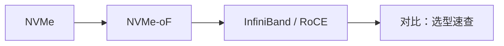
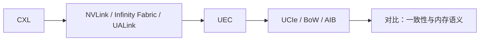
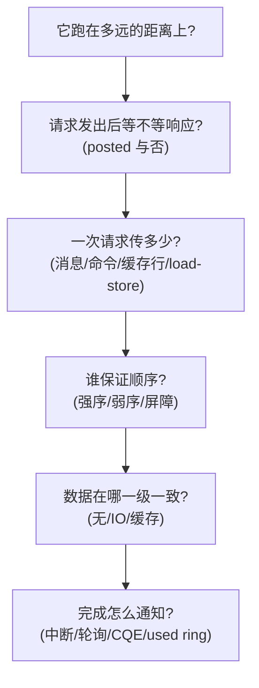

# 如何阅读本图谱

## 1. 每个协议页的固定骨架

为了能横向对照，所有"协议详解"页面都使用同一套结构：

| 章节 | 回答的问题 |
| --- | --- |
| 1. 它解决什么问题 | 这个协议为什么被发明出来 |
| 2. 协议栈与分层位置 | 它站在哪一层，依赖谁、被谁依赖 |
| 3. 请求模型 | 请求/完成都有哪些类型，谁 posted |
| 4. 关键机制 | 最核心的 3–5 个设计 |
| 5. 队列 / 传输结构 | 并发是怎么组织起来的 |
| 6. 一致性语义 | 无 / IO / 全缓存一致 |
| 7. **主线视角：读进行时，写会怎样** | 回到全站主线 |
| 8. 性能特性与典型实现 | 延迟/带宽量级、生态现状 |
| 9. 要点速记 | 一屏读完的要点 |

**只关心主线**的读者，可以只读每页的第 3、6、7 章。

## 2. 页面约定

- 表格里的 **"是 / 否"** 统一表示"是否允许超过"，与 PCIe 排序表一致。
- 涉及数字时，不确定精确规格的地方一律给**量级**（如"百纳秒量级"），并注明是量级而非规格值。规格以官方最新文档为准。
- 缓存一致 IO 一致 无一致 三种徽章表示一致性强度。
- 代码块中的 `mermaid` 会自动渲染为图；`math` 公式用 `$...$`。
- 术语首次出现时保留英文原写，便于检索规格书。

## 3. 三条推荐阅读路径

### 路径 A：我想搞懂"读为什么慢、怎么变快"

适合做驱动、FPGA、存储性能优化的人。重点抓：outstanding 数、MRRS/MPS、读放大、屏障。

### 路径 B：我要为存储/数据库选一条路

重点抓：队列深度、完成模型、网络往返对 IOPS 的影响、延迟预算怎么分配。

### 路径 C：我在做 AI 集群 / 芯片架构

重点抓：一致性强度、内存语义 vs DMA 语义、扩展性与功耗。

## 4. 术语速查表

| 术语 | 中文 | 一句话解释 |
| --- | --- | --- |
| **TLP** | 事务层包 | PCIe 事务层的基本传输单位 |
| **DLLP** | 数据链路层包 | 链路层用，负责 ACK/NAK 与流控，不上送事务层 |
| **Flit** | 流控制单元 | 链路层的定长传输单位，CXL/UCIe 常用 |
| **Posted / Non-Posted** | 张贴 / 非张贴 | 发出即结束 / 必须等完成 |
| **Completion** | 完成包 | 对 Non-Posted 请求的应答，带 Tag 配对 |
| **Tag** | 标签 | 配对请求与完成；数量决定 outstanding 上限 |
| **MRRS / MPS** | 最大读请求 / 最大载荷 | 一次读能请求多少 / 单包装多少字节 |
| **RCB** | 读完成边界 | 完成包的对齐规则（64/128 B） |
| **RO / IDO** | 松弛顺序 / 按 ID 保序 | 两个放松强序的属性位 |
| **TC** | 流量类别 | 不同 TC 之间无顺序保证，用于 QoS |
| **SR-IOV** | 单根 I/O 虚拟化 | 一个物理功能虚拟出多个 VF |
| **ATS / PASID** | 地址转换服务 / 进程地址空间 ID | 设备侧地址翻译与进程隔离 |
| **MSI-X** | 扩展消息信号中断 | 用 Posted 写（Msg）做中断，支持多向量 |
| **Doorbell** | 门铃 | 设备寄存器，写它表示"队列有新条目"，属于 Posted 写 |
| **SQ / CQ** | 提交队列 / 完成队列 | NVMe 的命令与完成环形缓冲 |
| **PRP / SGL** | 物理区域页 / 散聚列表 | NVMe 两种数据指针格式 |
| **QP** | 队列对 | RDMA 的 SQ+RQ 组合，是 RDMA 的并发单位 |
| **WQE / CQE** | 工作队列元素 / 完成队列元素 | RDMA 的任务描述与完成通知 |
| **MR / PD / lkey / rkey** | 内存区域 / 保护域 / 本地与远端密钥 | RDMA 的内存注册与访问保护 |
| **HCA** | 主机通道适配器 | InfiniBand 网卡 |
| **Snoop** | 监听 | 缓存一致性协议里向其它缓存发出的询问 |
| **MESI** | 四态缓存协议 | Modified/Exclusive/Shared/Invalid |
| **HDM** | 主机管理设备内存 | CXL.mem 里主机可访问的设备内存 |
| **Bias** | 偏置 | CXL 里缓存行归属主机还是设备的状态模式 |
| **AFU / PSL** | 加速器功能单元 / 处理器服务层 | CAPI 里加速器逻辑与协议转换层 |
| **virtqueue** | 虚拟队列 | VirtIO 的共享内存环形队列 |
| **Kick** | 通知 | driver 通知 device 有新请求（写寄存器） |
| **UPIU** | 通用协议信息单元 | UFS 的传输层报文 |
| **M-PHY / UniPro** | 物理层 / 统一协议 | UFS 依赖的 MIPI 链路层与物理层 |
| **Bump / D2D / FDI** | 凸点 / 芯片到芯片 / Flit 接口 | Chiplet 互连的关键词 |
| **DMA** | 直接内存访问 | 设备不经 CPU 直接读写内存 |
| **One-sided / Two-sided** | 单边 / 双边 | RDMA 里对端是否需参与（Read/Write vs Send/Recv） |

## 5. 一条判断心法

遇到一个没见过的协议，按这个顺序问：

问完这五个问题，你对这个协议的理解就已经超过读一遍规格书摘要了。

---

准备好了吗？从[导读](/guide/intro)重读一遍主线，或者直接跳到 [PCIe](/protocols/pcie)。
