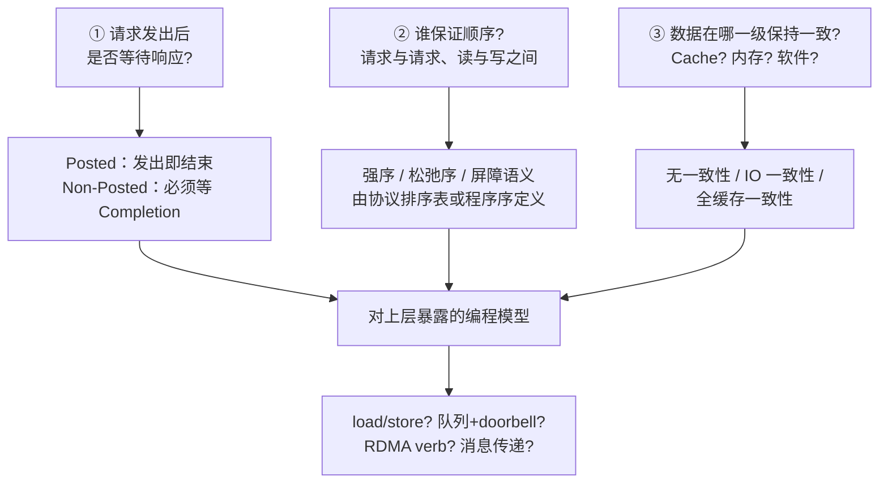
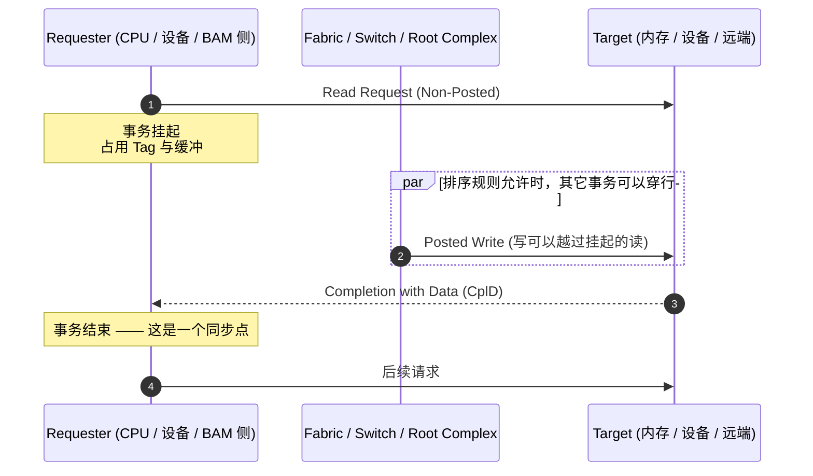

# 为什么读这些协议

> 如果把 PCIe、CXL、NVMe、RDMA、NVLink、UCIe 当成一张名词表去背，很快就会被规格书淹没。
> 它们其实是同一道题的不同解法：**当一次请求发出之后，谁在等谁？**

## 1. 一个具体的观察

先看这句话：

> 在 PCIe 上完成一次读请求的过程中，不会同时存在一条正在进行的写请求。

这句话里有三个隐含前提，值得逐个拆开：

| 说法 | 更准确的理解 |
| --- | --- |
| "读请求" | 在 PCIe 里，读是 **Non-Posted** 事务：请求发出后并未结束，必须等带数据的 **Completion (CplD)** 返回 |
| "进行中" | 指事务处于 **outstanding（挂起）** 状态，等待完成包。这段时间是可观测的、会占用缓冲与 Tag 资源 |
| "不会同时存在写" | 这不是 PCIe 规范的普遍强制，而是**特定实现/使用方式**的结果 —— 它可能来自软件串行、来自 outstanding 限制，也可能来自把读当成屏障 |

所以这个观察真正的价值不是"PCIe 不允许读写并行"，而是它让人意识到：

**每一次 I/O 请求都有一个明确的"开始"和"结束"，而"结束"是一个同步点。**

谁定义这个同步点、谁能越过它、越过之后数据还不一致怎么办 —— 这些问题的答案，构成了从 PCIe 到 RDMA 到 GPU 互连的全部差异。

## 2. 三个必须回答的问题

任何一套 I/O 协议，无论跑在板级总线、封装内、还是网络上，都要回答同一组问题：

- **问题① 决定延迟的下限**。Posted 请求不用等回程，理论延迟只有单向；Non-Posted 读必须吃一个完整往返（RTT），于是"读放大"和"outstanding 数量"成了吞吐的关键。
- **问题② 决定并发能不能被利用**。允许穿行才有流水线；不允许穿行就只能串行等待。几乎所有性能调优都在"放宽顺序以换吞吐"和"收紧顺序以保正确"之间取舍。
- **问题③ 决定编程模型的天花板**。没有一致性，就必须显式 flush/fence/DMA；有缓存一致性，才能像访问本地内存一样访问远端。

## 3. 主线：请求生命周期

把上面的问题按时间展开，就得到本站贯穿始终的主线。

这条主线里，最容易被忽略的是中间那个 `par` 块：**读挂起的时候，写到底能不能走？**

- 如果完全不能走：一条慢读就能阻塞整条链路，吞吐崩塌。
- 如果随便走：写可能超过读、覆盖读要读的数据，产生"读到旧值"。

PCIe 的解法是一张**排序表**（详见[顺序、一致性与屏障](/guide/ordering)），其中最关键的一条是：**Posted 写允许越过 Non-Posted 读**。这条规则不是为了性能，而是为了**避免死锁** —— 设备可能只有在收到读的数据之后才会腾出资源处理写，如果读被写堵住、写又在等读，系统就锁死了。

这也解释了前面的观察：既然规范允许写越过读，"读进行中没有写"就必然是**上层选择**或**实现限制**。常见原因有三类：

1. **同一 Requester 的软件串行**：驱动把"读-判断-写"写成了顺序代码，或在读写之间插了屏障。
2. **Outstanding 资源受限**：只有 1 个可用 Tag / 1 个读缓冲，读没回来就发不出下一个事务。
3. **把读当作排序点**：需要确保"读到的一定包含之前所有写的效果"，于是先等读完成。

本站的每个协议章节，最后都会回到这个问题：**在你这个协议里，读在进行时，写会发生什么？**

## 4. 从这七层往下看

同一套请求语义，在不同距离上会换上不同的外衣：

| 距离 | 协议家族 | 请求的单位 | "读"长什么样 |
| --- | --- | --- | --- |
| 封装内 (Die-to-Die) | UCIe / BoW / AIB | 物理层 Flit / 字节流 | 由上层决定，通常透传 PCIe/CXL 或纯 Streaming |
| 板级 (芯片间) | PCIe / CXL / CCIX / OpenCAPI | TLP | Memory Read + CplD；CXL 里变成缓存行填充 |
| 设备命令层 | NVMe / UFS | Command + Completion | 提交命令到 SQ，从 CQ 取完成 |
| 跨节点 | IB / RoCE / iWARP / UEC | Work Request / Packet | RDMA Read，或 Send/Recv 消息 |
| 加速器互连 | NVLink / IF / UALink | 内存事务 / 加载存储 | GPU load，可能触发远端显存访问 |
| 宿主机抽象 | VirtIO / CAPI | Descriptor + Ring | 写入 virtqueue，等待 used ring |

于是本图谱的六大领域划分出现了：**不是按名词分组，而是按"这段距离上，请求语义被改成了什么"分组。**

## 5. 你会得到什么

读完这份图谱，你应该能够：

- 拿到任意一个 I/O 协议，**先问出它的 posted/一致性/排序模型**，而不是先翻寄存器手册；
- 解释为什么 PCIe 读的延迟约等于一个往返、为什么 MRRS/MPS 会影响吞吐；
- 说清 CXL.cache、NVLink、RDMA Read 分别在"一致性"这根轴上处于什么位置；
- 在"要低延迟""要一致性""要跨机柜""要省功耗"这几类需求下，快速把候选协议缩到两三个；
- 看懂为什么一个"读进行中没有写"的观察，能一路解释到内存屏障和门铃（doorbell）机制。

下一站：[主线：一次读请求的一生](/guide/request-lifecycle)。
