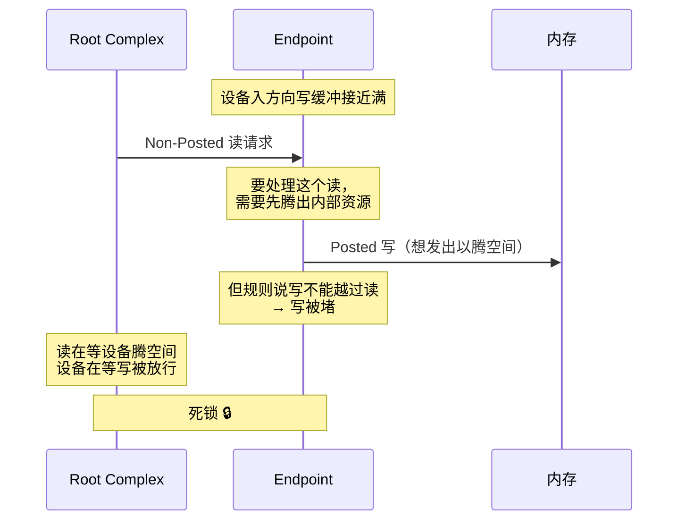
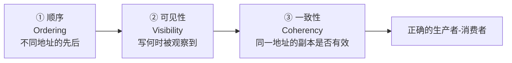
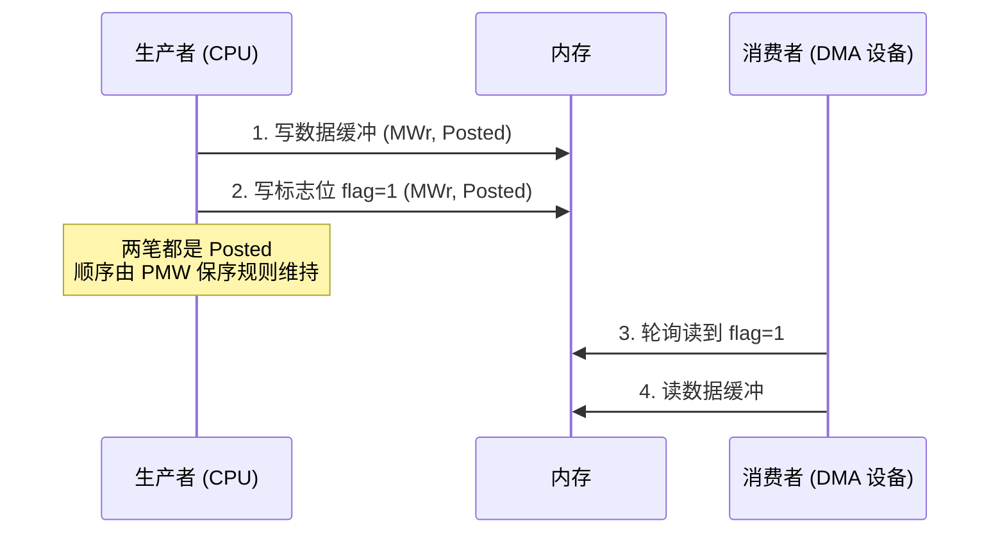

# 顺序、一致性与屏障

> 上一页说"写发出即结束"，这一页要回答：**那它到底什么时候能被别人看到？**

## 1. 先把两个概念分开

很多人把"一致性"和"顺序"混为一谈，它们是两个正交的问题：

| 问题 | 名字 | 问的是 |
| --- | --- | --- |
| **Which value?** | 一致性（Coherency） | 同一地址的多个副本，哪一个/哪些是有效的？缓存会不会读到旧副本？ |
| **In what order?** | 顺序（Ordering） | 对**不同**地址的多次访问，其他观察者看到的顺序与我发出的顺序一致吗？ |

- **一致性**是"同一地址的真相之争"，需要监听（snoop）、目录（directory）、状态机（MESI 等）。
- **顺序**是"不同地址的先后之争"，只需要排序规则和屏障。

CXL.cache 解决的是前者，PCIe 排序表解决的是后者。一个设备可以做到缓存一致（永远读到"最新值"），却仍然不保证不同地址之间的写入顺序。

## 2. PCIe 的默认强序表

PCIe 默认是**强序（Strong Ordering）**。下表是简化版（同一 Traffic Class 内）：

**行 = 后到的事务，列 = 已经排在前面的事务；"否"表示不能超过，"是"表示可以超过。**

| 后到 ↓ / 先到 → | Posted 写 | Non-Posted 读 | Completion |
| --- | :---: | :---: | :---: |
| **Posted 写** | 否 | 是 | 是 |
| **Non-Posted 读** | 否 | 是 | 是 |
| **Completion** | 否 | 是 | 是 |

读出的结论：

1. **写不能超过写** —— PMW 之间必须保持顺序。这是生产者-消费者模型的地基。
2. **写可以超过读** —— 关键的死锁规避规则，下面单独讲。
3. **读不能超过写** —— 保证"先写后读"能看到写的结果（但注意 Posted 完成的局限）。
4. **完成包不能超过写** —— 否则读结果可能先于它依赖的写到达。
5. **读、完成包之间可以互相超过** —— 不同地址的访问本就没有依赖，放开以换吞吐。

::: warning 这只是简化版
PCIe 规范里的排序表还有更细的行列（区分同一/不同地址、ID-based 等），并且不同 Traffic Class 之间**没有任何顺序保证**。写文档/写驱动时不要背这张表，要背"我需要保证什么顺序，然后用什么屏障去换"。
:::

## 3. 那条"写可以超过读"的规则为什么必须存在

假设反过来规定：**Posted 写不能超过它之前挂起的 Non-Posted 读**。看会发生什么：

打开这个环的办法就是**允许 Posted 写越过挂起的 Non-Posted 读**。这条规则不是为了性能，是**正确性**要求。

它直接回答了本站在首页提出的观察：既然规范允许写越过读，"读进行中没有写请求"就不可能是规范强制的普适现象。

## 4. 想放松顺序：RO 与 IDO

强序太贵（写不能超过写，读不能超过写），于是 PCIe 提供了两个"后门"属性位：

| 机制 | 位置 | 效果 |
| --- | --- | --- |
| **Relaxed Ordering (RO)** | TLP Attributes 字段 | 允许该请求打破部分"否"格，主要是让请求越过先前的 Posted 写 |
| **ID-Based Ordering (IDO)** | TLP Attributes 字段 | 只对同一 Requester ID 的事务保序，不同 ID 之间放开 |
| **Traffic Class (TC)** | TLP 头部 | 不同 TC 之间**本来就不保证顺序**，用于 QoS |

开启 RO 的思路是：**如果软件知道这两笔访问没有依赖（比如访问完全无关的两个缓冲区），就没必要强序，放开可以显著提升吞吐。** 代价是软件必须自己保证正确性。

这就是 PCIe 版本的内存模型：**默认强序 + 可选的弱序**。

## 5. 一致性与顺序之外，还有"可见性"

即使顺序对了，还有一个陷阱：**缓存**。PCIe 的排序规则管不到 CPU 缓存和设备的内部缓存。所以完整的正确性需要三道锁：

- **顺序**：靠 PCIe 排序规则 / 屏障指令。
- **可见性**：靠"读回"、fence、或者 Non-Posted 读的完成点。
- **一致性**：靠 snoop/目录；没有一致性就必须显式 flush/invalidate。

## 6. 一个经典的生产者-消费者场景

这里依赖的是 **"写不能超过写"** 这一格。如果开了 RO 且两笔写都标了 RO，就可能出现 flag 先到、数据后到 —— 消费者读到 flag=1 却拿到旧数据。

- 设备侧对应的是 `dma_wmb()`（写屏障）；
- CPU 侧是 `smp_wmb()`；
- 反过来，消费者读完数据要 `dma_rmb()`。

## 7. 各协议的排序模型一览

主线在这里最好用：**换成任何一个协议，都问同样三个问题。**

| 协议 | 顺序粒度 | 默认强度 | 放松机制 | 同步原语 |
| --- | --- | --- | --- | --- |
| PCIe | TLP / TC | 强序 | RO、IDO | 排序表、读回 |
| CXL.io | 同 PCIe | 强序 | RO | 同 PCIe |
| CXL.cache/.mem | 缓存行事务 | 由一致性协议定义 | — | snoop 响应即顺序点 |
| NVMe | 队列内 | 提交顺序 | 队列间无顺序 | FUA、Flush、门铃写 + 读回 |
| RDMA (IB/RoCE) | QP 内 | 由 verb 语义定义 | 多 QP 并行 | Completion 队列、fence verb |
| NVLink / IF | 内存语义 | 弱序 + 显式 fence | `fence` / `membar` | GPU 屏障、原子 |
| UCIe / BoW / AIB | Flit/链路 | 由上层协议决定 | 上层决定 | 上层协议 |
| VirtIO | virtqueue | 由内存屏障 + notification 定义 | 多队列 | `virtio_mb()`、kick/中断 |

一句总结：**任何"把控制信息写在一个地址、把数据写在另一个地址"的协议，都必须明确回答这两笔写的顺序，以及读的一侧怎么确认。**

## 8. 要点速记

- 一致性（同一地址哪个值）和顺序（不同地址谁先谁后）是两个正交问题。
- PCIe 默认强序；核心两格是"写不能超过写""写可以超过读（防死锁）"。
- 强序换来正确性，RO/IDO 用来在确认安全时换回吞吐。
- 顺序对了还不够，还要处理可见性与缓存一致性。
- 生产者-消费者是检验任何排序模型的最好例子：先写数据、再写标志、对端读到标志后才能读数据。

剥完了这三层（posted、顺序、一致性），就可以进入协议地图了：[六大领域与分层地图](/guide/taxonomy)。
