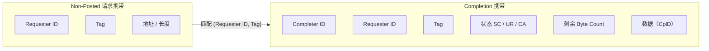
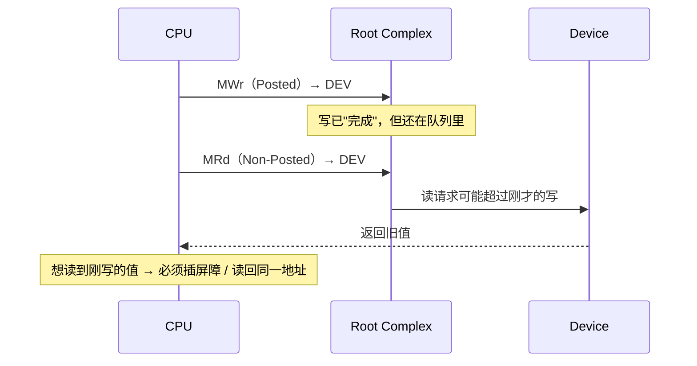

# Posted 与 Non-Posted

> **Posted = 发出即结束；Non-Posted = 必须等一个 Completion。**
> 这两个词决定了延迟下限、并发上限，以及"写到底什么时候算写完"。

## 1. 一句话定义

| 类别 | 定义 | 是否产生完成包 | 发起者能否立刻继续 |
| --- | --- | --- | --- |
| **Posted** | 单向事务，发出即视为结束 | 否 | 能 |
| **Non-Posted** | 双向事务，必须等完成包才算结束 | 是 | 不能，要等 Completion |
| **Completion** | 对 Non-Posted 请求的应答 | — | — |

## 2. 为什么这样分？

这不是随手规定，而是由**数据流向**逼出来的：

- **写**：数据从 Requester 流向 Target。包发出去，数据就走了，Requester 不再需要对方回什么 —— 所以做成 Posted，性能最好。
- **读**：数据从 Target 流向 Requester。Requester 必须拿到数据才能继续，所以它**只能**做成 Non-Posted，否则拿什么继续？

于是有意思的角落出现了：**配置空间写、I/O 空间写**这类操作，虽然叫"写"，却是 **Non-Posted**。原因是它们的语义要求"确认对方收到了"（比如改配置寄存器后要确认生效），所以宁可付出一个往返的代价也要一个 Completion（不带数据）。

## 3. PCIe 事务类型全表

| TLP 类型 | 中文 | 类别 | 完成包 | 备注 |
| --- | --- | --- | --- | --- |
| `MRd` | 内存读 | Non-Posted | `CplD`（带数据） | 一次请求可产生多个 CplD |
| `MWr` | 内存写 | **Posted** | 无 | 最常用的设备 DMA |
| `CfgRd0/1` | 配置读 | Non-Posted | `CplD` | 枚举与配置空间访问 |
| `CfgWr0/1` | 配置写 | Non-Posted | `Cpl`（无数据） | 要确认生效 |
| `IORd` | I/O 读 | Non-Posted | `CplD` | 传统 I/O 空间，逐步淘汰 |
| `IOWr` | I/O 写 | Non-Posted | `Cpl` | 同上 |
| `Msg` / `MsgD` | 消息 | **Posted** | 无 | MSI/MSI-X 中断就走这里 |
| `AtomicOp` | 原子操作 | Non-Posted | `CplD` | FetchAdd / Swap / CAS |
| `Cpl` / `CplD` | 完成 | Completion | — | 带 Tag 用于配对 |

::: tip 一个反直觉但重要的推论
**中断（MSI/MSI-X）和门铃（doorbell）都是 Posted 写。**
它们发出去就算完，不保证对方已处理。这也解释了为什么设备写完 doorbell 之后，如果要确认设备真的看到了，往往得再读一个寄存器 —— 用 Non-Posted 读来"追平" Posted 写。
:::

## 4. 完成包带什么

- **Status**：`SC` 成功、`UR` 不支持、`CA` 配置中止。读失败不会像写那样"静默"。
- **Byte Count**：还剩多少字节。多包完成时用来判断是否收齐。
- **Completer ID**：谁回的，用于诊断。

## 5. Posted 的代价：没人告诉你出错了

Posted 的最大隐患是**错误不可即时感知**：

| 问题 | Posted 写 | Non-Posted 读 |
| --- | --- | --- |
| 目标不存在 | 静默丢弃，靠超时/毒化上报 | 立刻返回 `UR` |
| 数据损坏 | 依赖 LCRC/ECRC + AER | 同左，但还有 Status |
| 完成时间 | 无定义，异步 | 明确（或超时） |
| 可观测性 | 弱 | 强 |

所以 PCIe 需要一整套配套机制：`AER`（高级错误报告）、`Completion Timeout`、`Poisoned TLP`、`ECRC`。**Posted 换来的性能，是用可观测性买的单。**

## 6. 从这一层看内存模型

Posted 写还有一个深远影响：**"写完成"不等于"写可见"**。

这是生产者-消费者正确性的核心。PCIe 的默认强序缓解了大部分问题，但它**不延伸到 CPU 缓存层**，也不覆盖设备内部。所以：

- 驱动里常见 `writel(); readl(same address);` 的"读回"惯用法 —— 用 Non-Posted 读逼 Posted 写落地；
- DMA 完成后用 `dma_rmb()/dma_wmb()` 之类的屏障；
- 设备侧用 fence / release-acquire 语义。

## 7. 同一个概念在其他协议里的化身

这是本站主线最有用的一张表：**posted/non-posted 的二分在每个协议里都换了个名字。**

| 协议 | "Posted" 的东西 | "Non-Posted" 的东西 | 配对/同步机制 |
| --- | --- | --- | --- |
| PCIe | Memory Write、Message、MSI-X | Memory Read、Config、Atomic | `CplD` + Tag |
| CXL.io | 同 PCIe | 同 PCIe | `CplD` + Tag |
| CXL.cache / .mem | 写回、写无效（部分） | 缓存行填充、读 | 监听（snoop）+ 响应 |
| NVMe | 提交命令（写 SQ）、写 doorbell | — | 完成写 CQ + 中断 |
| NVMe-oF | 发送 capsule（写入 SQ） | — | Response capsule + CQ |
| RDMA Write | `RDMA_WRITE`（发出即完成，仅 CQE 通知） | — | CQE（本地完成的确认） |
| RDMA Read | — | `RDMA_READ`（等远端响应） | Response + CQE |
| Send/Recv | — | 双向（等对端 Recv 缓冲） | CQE + ACK 逻辑 |
| NVLink / IF | GPU 的 store | GPU 的 load（需等数据） | fence、原子、系统屏障 |
| UCIe | 取决于上层协议（PCIe/CXL/Streaming） | 同上层 | Flit + CRC/重传 |
| VirtIO | driver 写 avail ring + kick | device 写 used ring | 中断 / 轮询 |

看出规律了吗？

- **Posted 的那一栏都是"单向、可流水、丢出去就不管"的操作**；
- **Non-Posted 的那一栏都是"必须知道结果"的操作**；
- **每个协议都要额外发明一个"同步机制"**：Completion、CQE、used ring 中断、fence。

## 8. 要点速记

- Posted = 发出即结束（写、消息、中断、doorbell）；Non-Posted = 必须等完成（读、配置、原子）。
- 读的延迟下限 = 一个完整往返；写可以流水化，因此读通常比写贵。
- Posted 写的"完成"是本地概念，不等于全局可见 —— 这是内存屏障存在的理由。
- 配置写、I/O 写虽是"写"却非 Posted，因为它们需要确认。
- 每个协议都在用不同的名字重演同一套 posted / non-posted 二分。

下一站：[顺序、一致性与屏障](/guide/ordering)。
