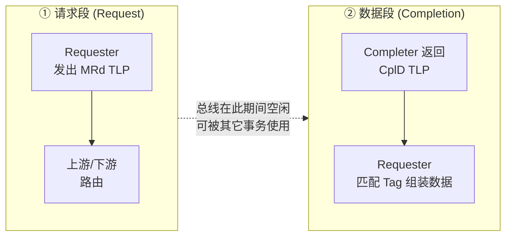
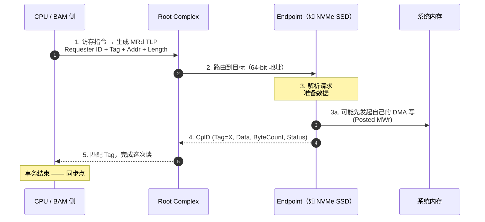
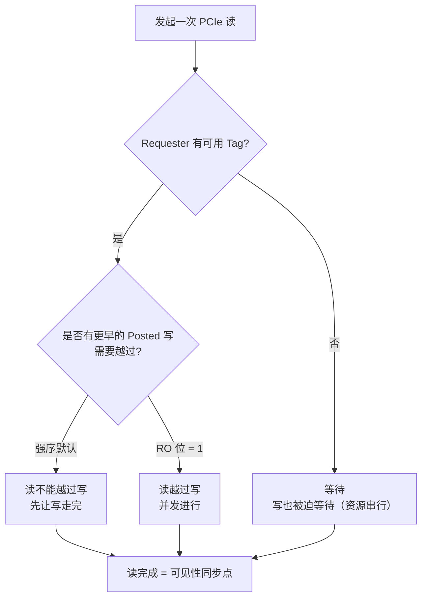

# 主线：一次读请求的一生

> 这一页是全站的锚。把 PCIe 上一次读请求从头到尾走一遍，
> 后面所有协议都只是在这一套骨架上做取舍。

## 1. 从"阻塞式总线"到"拆分事务"

早期 PCI 是**阻塞式**的：主设备发起一次读，整条总线被占用，直到数据回来。总线利用率因此很低，仲裁开销大。

PCIe 换成了**拆分事务（split transaction）**：一次读被拆成两段。

拆开之后，链路上同时可以有大量事务在飞，吞吐上去了。代价是：

- 每个未完成的 Non-Posted 请求都要一个 **Tag** 来配对，Tag 数量就是并发上限之一；
- 完成包可能乱序返回、可能被拆成多个，Requester 必须重组；
- "写到内存了"和"读看到了它"之间不再自动成立，需要排序规则兜底。

## 2. 一次读的完整时序

关键点逐条：

| 环节 | 发生了什么 | 为什么重要 |
| --- | --- | --- |
| 1. 发出请求 | Requester 分配一个 Tag，记录长度 | Tag 用尽就必须等，这是天然的限流点 |
| 2. 路由 | 按地址空间路由（Memory / Config / I/O） | 不同空间用不同事务类型 |
| 3. 目标处理 | Completer 可能要等内部资源 | 这段等待就是读延迟的主体 |
| 4. 返回 CplD | 带 Requester ID + Tag + Status + ByteCount | Status 可为 SC（成功）/ UR（不支持）/ CA（配置中止） |
| 5. 匹配完成 | Requester 用 Tag 找回首包 | 一次读可能对应**多个** CplD |

## 3. 完成包为什么不只一个

读的长度可以远大于单包上限，于是被切成多包：

- **MRRS**（Max_Read_Request_Size，128 B – 4096 B）：Requester 一次能请求多少。
- **MPS**（Max_Payload_Size，128 B – 4096 B）：单个 TLP 最多带多少字节。
- **RCB**（Read Completion Boundary，64 B 或 128 B）：完成包的边界对齐规则。

一次 4 KB 读、MPS=256 B 时，可能返回 16 个 CplD。每个完成包里的 `Byte Count` 表示**还剩多少字节**，最后一个的 Byte Count 为 0。Requester 必须按 `(Requester ID, Tag)` 把同一事务的完成包收集齐。

::: tip 这也是"读放大"
同样传 4 KB，写只需要约 16 个 MWr；读除了 16 个 CplD，还要额外承受请求头、Tag 配对和乱序重组。加上读必须等一个往返，**读通常比写贵**。
:::

## 4. Outstanding 与 Tag 资源

| 概念 | 含义 | 典型量级 |
| --- | --- | --- |
| Outstanding request | 已发出、未完成的 Non-Posted 请求 | 受 Tag 数限制 |
| Tag 字段 | 配对请求与完成 | 默认 5 位 → 32 个/function；Extended Tag 8 位 → 256 个 |
| 多个 outstanding 读 | 用并发掩盖往返延迟 | 是带宽的关键：`吞吐 ≈ outstanding × 包大小 / 往返时间` |
| Completion 缓冲 | 存放收到的完成包 | 溢出会反压/丢弃 |

这条公式解释了为什么 FPGA/加速器上做 PCIe 读时，"能挂多少个读"往往比"单次读多大"更重要。想跑满带宽，就得有足够的 outstanding 数来覆盖 RTT。

## 5. 回到观察：读进行时，写会怎样？

现在可以精确回答最初那句话了。要分三层看：

### 5.1 规范层面：写**可以**越过读

PCIe 默认强序，但排序表里有一条关键豁免：**Posted 写允许越过 Non-Posted 读**。所以硬件上完全可能出现"读还挂着、写已经发出去"的情况。这条规则是为了防死锁（详见[顺序、一致性与屏障](/guide/ordering)）。

### 5.2 实现层面：可能被迫串行

如果 Requester 只有 1 个可用 Tag、或读缓冲只有一份，那么读没回来之前它发不出下一个事务 —— 包括写。这时"读进行中没有写"只是资源限制的副产品。

### 5.3 语义层面：把读当同步点

还有一种情况是**故意的**：软件需要"读到的一定包含此前所有写的效果"。由于 Posted 写的完成不等于全局可见，最省事的做法就是：先发写，再发读，然后**等读完成** —— 读的完成点同时充当了写的可见点。这正是 `read-back` / `read-after-write` 惯用法的由来。

> 所以"读进行中没有写"是一个**结果**，不是一条**规则**。
> 它可能来自串行软件、受限资源，也可能来自把读当屏障的刻意设计。
> 判断属于哪一类，要看你的实现里 Tag 有多少、是否开了 Relaxed Ordering、以及软件有没有插屏障。

## 6. 一张图总结三条路径

- **写被读挡住**：强序下 Non-Posted 读不能越过 Posted 写。
- **读被写挡住**：不允许，否则死锁；写必须能越过挂起的读。
- **读完成作为同步点**：这是软件最依赖的性质。

下一步：[Posted 与 Non-Posted](/guide/posted-non-posted)，把这两个词彻底讲透。
