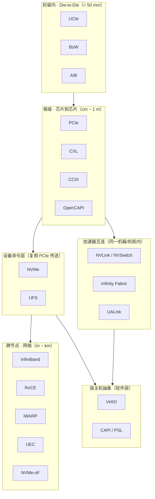
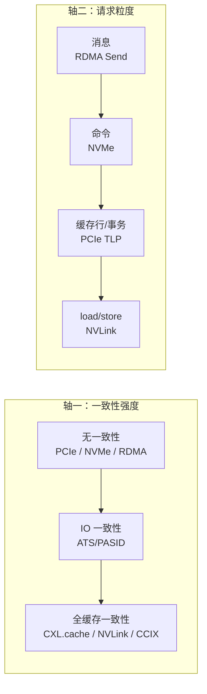

# 六大领域与分层地图

> 分组不按厂商、不按年代，而按**这段距离上请求语义被改成了什么**。

## 1. 按距离分层

**距离越长，请求语义越"粗"**：`load/store` → `TLP` → `命令 + 完成` → `Work Request` → `消息`。这不是巧合，而是延迟与故障模型决定的：

- 距离短、延迟低 → 可以保留细粒度内存语义（load/store）；
- 距离长、故障多 → 必须打包成"请求-响应"并加重传、CRC、序号。

## 2. 六大领域

  <a class="p-card" href="/protocols/pcie">
    
① PCIe 原生与总线扩展

    
定义 TLP 事务、Posted/Non-Posted、排序表、SR-IOV、ATS/PASID。是所有板级协议的语法基础。

    
PCIe · CXL · CCIX · OpenCAPI

  </a>
  <a class="p-card" href="/protocols/nvme">
    
② 存储与块设备

    
把 PCIe 事务包装成"命令 + 完成队列"，用多队列与门铃把并行度拉满。

    
NVMe · NVMe-oF · UFS

  </a>
  <a class="p-card" href="/protocols/infiniband">
    
③ 网络与内核绕过

    
RDMA 用 one-sided verb 把"远端内存读"直接暴露给应用，用完成队列替代逐包中断。

    
InfiniBand · RoCE · iWARP · UEC

  </a>
  <a class="p-card" href="/protocols/nvlink">
    
④ GPU 与加速器互连

    
从 DMA 语义走向内存语义：GPU 之间像访问本地显存一样 load/store。

    
NVLink · Infinity Fabric · UALink

  </a>
  <a class="p-card" href="/protocols/ucie">
    
⑤ 封装级 / Chiplet

    
只保留物理层 + 适配层，把协议语义留给上层（PCIe / CXL / Streaming）。

    
UCIe · BoW · AIB

  </a>
  <a class="p-card" href="/protocols/virtio">
    
⑥ 虚拟化与系统抽象

    
在软件里重建同一套请求/完成模型：共享内存环形队列 + 通知。

    
VirtIO · CAPI / PSL

  </a>

## 3. 用三个问题扫一遍全部协议

把主线的问题套到每个协议上，就能看出谁和谁是"同族"：

| 协议 | 请求单位 | Posted 的东西 | Non-Posted 的东西 | 完成/同步 | 一致性 |
| --- | --- | --- | --- | --- | --- |
| **PCIe** | TLP | MWr、Message | MRd、Config、Atomic | `CplD` + Tag | 无（仅总线排序） |
| **CXL.io** | TLP | 同 PCIe | 同 PCIe | `CplD` | 无 |
| **CXL.cache** | 缓存行 + 监听 | 写回 | 读、RFO | snoop 响应 | 缓存一致（设备缓存主机内存） |
| **CXL.mem** | 内存事务 | 写 | 读 | 完成 + 顺序点 | 主机访问设备内存，HDM |
| **CCIX** | 一致性事务 | 写 | 读 | 监听/响应 | 缓存一致（加速器为主） |
| **OpenCAPI** | 一致性内存事务 | 写 | 读 | 响应 | 缓存一致（低延迟） |
| **NVMe** | 命令 (SQ) | 提交命令、门铃 | — | 完成项写 CQ + 中断 | 无（靠 Flush/FUA） |
| **NVMe-oF** | 命令 capsule | capsule 发送 | — | Response capsule | 无 |
| **UFS** | UPIU / SCSI 命令 | 命令 UPIU | 读数据 | Response UPIU | 无 |
| **InfiniBand** | Work Request | `RDMA_WRITE`、`SEND` | `RDMA_READ`、Atomic | CQE | 无（远端内存显式注册） |
| **RoCE** | 同上（UDP 封装） | 同上 | 同上 | CQE | 无 |
| **iWARP** | 同上（TCP 封装） | 同上 | 同上 | CQE | 无 |
| **UEC** | 传输层报文 | write 语义 | read/消息 | 完成事件 | 无 |
| **NVLink** | 内存事务 | store | load | fence / 原子 | 弱序 + 显式屏障 |
| **Infinity Fabric** | 内存事务 | store | load | fence | 片内一致，跨 socket 经 xGMI |
| **UALink** | 内存语义事务 | write | read | 完成 + fence | 加速器间内存语义 |
| **UCIe** | Flit | 由上层决定 | 由上层决定 | 由上层决定 | 由上层决定（PCIe/CXL/Streaming） |
| **BoW** | 字节流/bunch | 由上层决定 | 由上层决定 | 由上层决定 | 无（纯物理接口） |
| **AIB** | 并行字节流 | 由上层决定 | 由上层决定 | 由上层决定 | 无（纯物理接口） |
| **VirtIO** | Descriptor | driver 写 avail ring + kick | device 写 used ring | 中断 / kick | 无（靠屏障） |
| **CAPI / PSL** | 加速器事务 | 写 | 读 | PSL 响应 | 缓存一致（POWER 一致性域） |

::: tip 读法
先看"Posted 的东西"一列。凡是只能写 `RDMA_WRITE` / `MWr` 的，就是**单向、可流水**的协议；凡是存在必须等响应的读操作的，它的延迟下限就是一个往返。
:::

## 4. 两条正交的演化轴

19 个协议其实沿着两条轴在演化：

- **一致性越强，编程越简单，硬件越贵。** CXL.cache 让设备像 CPU 一样参与缓存一致性，代价是要实现完整的状态机与监听。
- **粒度越细，延迟越低，扩展性越差。** load/store 语义在片内/机箱内很好，一旦拉到机柜之外就不可行。

多数新协议的定位，都是在两条轴上找一个新的甜点：

| 协议 | 在轴一的位置 | 在轴二的位置 | 定位 |
| --- | --- | --- | --- |
| CXL | 强（可选 .cache） | 缓存行 | 内存扩展 + 池化 |
| UALink | 中（内存语义，非缓存一致） | load/store + DMA | 开放加速器互连 |
| UEC | 无 | 消息 + write | 超大规模 AI 网络 |
| UCIe | 取决于上层 | Flit | 芯片内 Die-to-Die |

## 5. 要点速记

- 六大领域 = 六段距离，越远语义越粗。
- 19 个协议都能用"请求单位 / posted / 完成 / 一致性"四列描述。
- 一致性强度与请求粒度是两条正交轴，新协议都在找甜点。
- 物理层协议（UCIe/BoW/AIB）本身不定义请求语义，语义由上层决定。

下一步：[如何阅读本图谱](/guide/how-to-read)。
