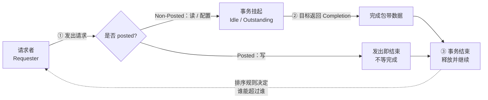

## 这个站点在讲什么

这份图谱的起点是一个具体的观察：

> 在 PCIe 上完成一次**读请求**的过程中，不会同时存在一条正在进行的**写请求** —— 读要么在等待数据返回，要么已经拿到完成包，而写在这条读事务悬而未决期间并不会与它"并行进行"。

这句话听起来像硬件细节，但它其实是理解整条 I/O 协议谱系的钥匙。它牵出三件事：

1. **PCIe 的读是 Non-Posted 的**：读请求发出后事务并未结束，必须等带数据的 Completion 回来才算完成。写则是 Posted 的，一旦发出去就"完成"，不再需要应答。
2. **请求与响应被拆开了（split transaction）**：总线不再像早期 PCI 那样阻塞式地等数据，而是把一次读拆成"请求 → 若干完成包"两段，中间的时间窗口里，别的请求在排序规则允许时可以穿行。
3. **顺序不是免费的**：一旦允许穿行，就必须回答"谁能超过谁"。PCIe 给出了严格的 Posted / Non-Posted 排序表，而 CXL、NVMe、RDMA、GPU 互连各自在这张表上做加减法。

所以本站不按"名词表"组织，而按**请求生命周期**组织：

读一读[《为什么读这些协议》](/guide/intro)和[《主线：一次读请求的一生》](/guide/request-lifecycle)，再挑你最关心的那一类协议深入。

## 六大领域

  <a class="p-card" href="/protocols/pcie">
    
PCIe 原生与总线扩展

    
一切的地基：分层协议栈、TLP 事务、Posted/Non-Posted、SR-IOV、ATS/PASID。

    
PCIe · CXL · CCIX · OpenCAPI

  </a>
  <a class="p-card" href="/protocols/nvme">
    
存储与块设备

    
把 PCIe 事务封装成命令与完成队列，用多队列把并行度拉满。

    
NVMe · NVMe-oF · UFS

  </a>
  <a class="p-card" href="/protocols/infiniband">
    
网络与内核绕过

    
RDMA 把"读"做成了远端内存的直接搬运，用完成队列替代中断。

    
IB · RoCE · iWARP · UEC

  </a>
  <a class="p-card" href="/protocols/nvlink">
    
GPU 与加速器互连

    
从 DMA 语义走向内存语义：GPU 之间像访问本地显存一样访问对方。

    
NVLink · Infinity Fabric · UALink

  </a>
  <a class="p-card" href="/protocols/ucie">
    
封装级 / Chiplet

    
Die 与 Die 之间只有几毫米，协议被剥到只剩物理层与适配层。

    
UCIe · BoW · AIB

  </a>
  <a class="p-card" href="/protocols/virtio">
    
虚拟化与系统抽象

    
半虚拟化在软件层重建了同一套请求/完成模型，把队列交给共享内存。

    
VirtIO · CAPI / PSL

  </a>

## 怎么用

- **想知道"读为什么慢"**：从 [Posted 与 Non-Posted](/guide/posted-non-posted) 和 [顺序、一致性与屏障](/guide/ordering) 入手。
- **想横向比协议**：去 [总览矩阵](/compare/overview) 与 [请求模型对比](/compare/request-models)。
- **要选型**：看 [选型速查](/compare/choosing)。
- **想确认某个协议细节**：直接在左侧"协议详解"里找，或按 <kbd>/</kbd> 搜索。
