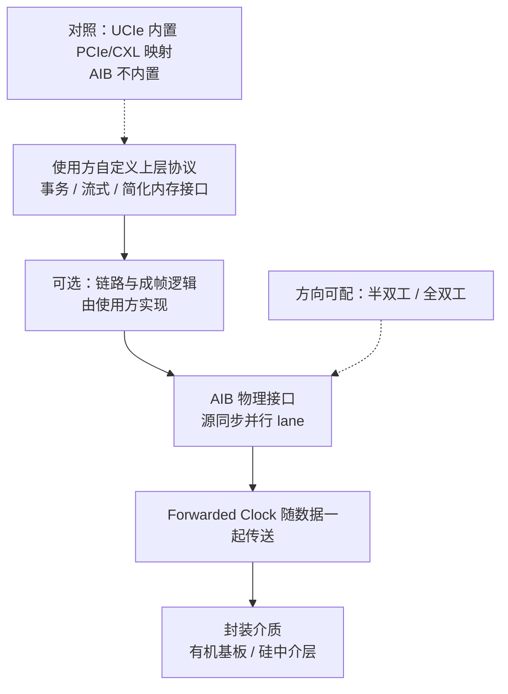

# AIB（Advanced Interface Bus）

> **一句话定位**：AIB（Advanced Interface Bus）是 Intel 提出并开放的开源 **Die-to-Die 并行接口**，采用源同步（source-synchronous）信号与 Forwarded Clock，方向与位宽可配置——和 BoW 一样，它主要定义**物理层接口**，事务协议由上层决定。

## 1. 它解决什么问题

在 AIB 出现的年代，chiplet 互连还缺少开放标准，尤其是想在**低成本有机基板**上把多个 die 拼起来的产品：

1. **私有 D2D 接口壁垒**：每个厂商各有一套，芯粒无法复用，IP 生态无法形成。
2. **高速 SerDes 不划算**：封装内几毫米距离，SerDes 的均衡/编解码开销过大，功耗与面积不经济。
3. **需要可配置性**：不同产品对带宽、功耗、方向（读多写多）的需求不同，接口应能按需裁剪。
4. **需要成熟可实现**：接口要能落到 FPGA/ASIC 上，验证成本可控。
5. **需要开放授权**：希望有一个可自由实现、无授权费的接口。

AIB 的解法：**定义一套可扩展的并行 D2D 物理接口**，用源同步时钟、可配置 lane、可选方向，让芯粒能像"接排线"一样互连。它由 Intel 提出，后作为 ODSA 生态的一部分开放。

## 2. 协议栈与分层位置

AIB 的栈同样很薄，核心是**物理接口**。协议层不在它的职责范围内。

层次要点：

- **物理接口**：并行数据 lane + **Forwarded Clock（前向时钟）**，属于源同步设计。
- **方向可配置**：同一组 lane 可配置为发送/接收，支持半双工或全双工使用方式（取决于实现与配置）。
- **无强制协议层**：AIB 不定义读/写事务、不定义一致性；**上层自定义**。
- **可选链路能力**：可靠性机制（校验、成帧）由使用方按需添加，类似 BoW 的可选思路。

## 3. 请求模型

AIB 自身没有事务概念，因此请求模型同样分"上层"与"物理"两层：

| 事务 / 请求类型 | 是否 Posted | 完成方式 | 数据单位 |
| --- | --- | --- | --- |
| 上层自定义读 | 由上层决定 | 由上层返回数据 | 由上层定义 |
| 上层自定义写 | 由上层决定 | 由上层定义可见性 | 由上层定义 |
| 流式数据推送 | 通常 Posted | 单向推送，无逐笔应答 | 字节流 / 字 |
| 可选成帧 / 校验 | 由实现决定 | CRC / 握手（若实现） | 成帧单位 |
| 物理层并行传输 | 无事务语义 | 随 Forwarded Clock 采样送达 | 多位并行数据 |

结论与 BoW 相同：**AIB 不回答"读进行时写会怎样"，它把这个语义问题整个留给上层协议。**

## 4. 关键机制

### 4.1 源同步与 Forwarded Clock

- **源同步（source-synchronous）**：数据与时钟一起由发送端发出，接收端用随路时钟采样。
- **Forwarded Clock** 让接收端无需从数据里恢复时钟（不像 SerDes 需要 CDR），大幅简化 PHY。
- 代价是**时钟与数据必须做等长/匹配布线**，且接收侧要处理时钟-数据偏斜（skew）。
- 这也是 AIB 能在短距离上做到低延迟、低功耗的关键：**没有 SerDes，没有复杂均衡**。

### 4.2 方向可配：半双工 / 全双工

- AIB 的 lane 可以配置方向：把一部分 lane 划给发送、一部分划给接收，即**全双工**；也可以在时间上分时复用，即**半双工**。
- 这种灵活性让同一个 IP 能适配"上行多/下行少"或对等的流量模式。
- 方向配置的具体粒度与规则以 AIB 规范为准。

### 4.3 Bump pitch 与速率

- AIB 面向 **bump pitch 与基板工艺**的约束设计：有机基板上 bump pitch 较大，硅中介层上更小更密。
- **每 lane 速率量级为数 Gbps**（随工艺、bump pitch、线长变化），聚合带宽由 lane 数决定。
- 与 UCIe 的对比：AIB 更早、更偏物理层；UCIe 在速率、协议完整度和生态上更进一步。

### 4.4 AIB 2.0 的改进

- **AIB 2.0** 在 1.0 基础上提升了速率与密度方向的能力，并扩展了配置选项。
- 具体指标（每 lane 速率、bump pitch 支持范围、功耗）**以 AIB 官方规范为准**，本页只给量级。
- 演进方向与 BoW/UCIe 类似：更高的每 lane 速率、更好的能效、更适配先进封装。

### 4.5 与 UCIe / BoW 的对照

| 接口 | 信号方式 | 时钟 | 协议层 | 定位 |
| --- | --- | --- | --- | --- |
| **AIB** | 源同步并行 | **Forwarded Clock** | 上层自定义 | 开源物理接口，可配置方向 |
| BoW | 单端并行 | 随 bunch 形态定义 | 上层自定义 / 可选极简 | 极简、省钱、短距离 |
| UCIe | 视封装 | 标准 PHY | **内置 PCIe/CXL/Streaming** | 开放完整 D2D |

三者常常并列讨论，但**只有 UCIe 内置了标准事务协议**；AIB 与 BoW 都停在"物理接口 + 可选链路"这一层。

## 5. 一致性语义

| 层级 | AIB 的态度 | 说明 |
| --- | --- | --- |
| 无一致性 | **默认** | AIB 不提供缓存一致性 |
| IO 一致性 | 可实现但非规范定义 | 取决于上层 |
| 全缓存一致性 | 不由 AIB 提供 | 需上层实现或映射 CXL 等协议 |

- AIB 只是**并行信号与时钟**的规范，**没有一致性语义**。
- 在 AIB 上实现多 die 共享内存，必须由上层协议显式定义同步与可见性规则。
- 这与 BoW 相同、与 UCIe + CXL 形成对照：**是否一致，取决于你在上面放了什么。**

## 6. 主线视角：读进行时，写会怎样？

分两层：

**物理层（AIB 自身）：**

- 若配置为**全双工**（部分 lane 发、部分 lane 收），则**读写可以物理上同时进行**，互不阻塞。
- 若配置为**半双工**，同一批 lane 需要分时复用，读写会**争用链路**，但这属于带宽调度，不是语义排序。
- AIB **不做任何事务级读写排序**，也没有 outstanding / 完成包的概念——它只管把并行数据按 Forwarded Clock 送出去。

**上层：**

- "读挂起时写能否走"完全取决于上层协议。若上层是自定义内存接口，需自行定义 outstanding、fence 和可见性。
- 若希望借用 PCIe/CXL 语义，需要在 AIB 之上自行实现协议映射（AIB 不内置）。

一句话：**AIB 在物理上可按全双工配置实现读写并行，但不对读写顺序做任何承诺；主线第三问由上层协议回答——这是它与 UCIe 最本质的差别。**

## 7. 性能特性与典型实现

量级描述，**精确数值以 AIB 官方规范为准**。

| 维度 | 量级 / 特点 | 备注 |
| --- | --- | --- |
| 每 lane 速率 | 数 Gbps 量级（AIB 2.0 更高） | 随工艺/bump pitch/线长变化 |
| 信号与时钟 | 源同步 + Forwarded Clock | 无需 CDR，PHY 简单 |
| 方向 | 半双工 / 全双工可配 | 按流量模式裁剪 |
| 单跳延迟 | 纳秒到数十纳秒量级 | 层级薄，延迟低 |
| 能效 | 低（目标个位数 pJ/bit 量级） | 无 SerDes 开销 |
| bump pitch | 有机基板到硅中介层范围 | 与基板工艺相关 |
| 协议层 | 上层自定义 | AIB 不内置 |

生态现状：

- **Intel 主导、开源开放**：AIB 由 Intel 提出并开放，降低了芯粒互连的实现门槛，早期在 FPGA/ASIC chiplet 与混合基板方案中有实际应用。
- **与 ODSA 生态的关系**：AIB 与 BoW 同属开放 D2D 讨论空间，都是"轻量物理接口"路线；UCIe 出现后，行业重心明显向 UCIe 倾斜。
- **落地场景**：需要**低成本、可配置、短距离**的封装内互连，且愿意自己定义上层协议的产品。
- **选型提示**：若需要标准 PCIe/CXL 语义，优先看 **UCIe**；若只要最省事最省电的连线，AIB/BoW 值得评估；**具体 IP 与工具链支持需向供应商确认**。

## 8. 要点速记

- AIB 是 **Intel 提出的开源 D2D 并行接口**，核心是**物理层**。
- 采用**源同步 + Forwarded Clock**：无需 SerDes/CDR，PHY 简单、延迟低、功耗低。
- **方向可配（半双工/全双工）**，lane 数与 bump pitch 随封装工艺伸缩。
- **不定义事务协议，不提供缓存一致性**，上层协议自定义。
- **AIB 2.0** 在速率、密度与配置能力上改进，**精确指标以官方规范为准**。
- 与 **BoW**（单端极简）、**UCIe**（内置 PCIe/CXL）形成三档对照；**只有 UCIe 内置标准事务协议**。
- 典型应用：FPGA/ASIC chiplet、混合基板、低功耗短距离 D2D。
- 主线复述：**全双工配置下读写可物理并行，但无排序与一致性承诺，语义由上层决定**。
