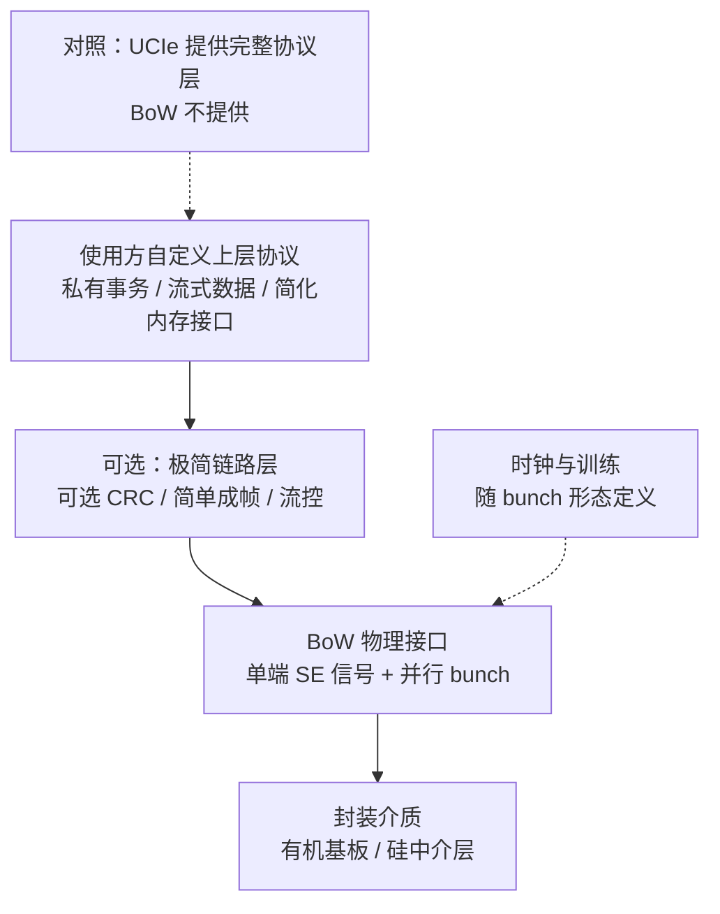

# BoW（Bunch of Wires）

> **一句话定位**：BoW（Bunch of Wires）是 OCP ODSA 项目下的**开源 Die-to-Die 并行接口**，用最简单的单端并行连线实现短距离、低功耗、低延迟的芯粒互连——它更像"物理接口 + 可选极简链路"，上层协议由使用方自定义。

## 1. 它解决什么问题

不是所有 chiplet 场景都需要 UCIe 那样完整的分层与协议映射。很多场景只要求"把两块 die 用最短、最省电的线连起来"：

1. **成本**：先进封装（硅中介层）昂贵，很多产品只在有机基板上做 D2D。
2. **功耗**：SerDes 的均衡、时钟恢复、编码开销在几毫米距离上是浪费；简单单端并行线更省。
3. **延迟**：越简单的链路，握手与编解码层级越少，延迟越低。
4. **开放性**：希望有一个无授权费、可自由实现的接口，避免被单一厂商的私有 D2D 锁定。
5. **够用就好**：很多场景不需要 PCIe/CXL 的完整事务语义，只要一个可靠的字节/Flit 通道。

BoW 的定位是：**为短距离、低成本、低功耗的 D2D 提供一套开放的信号与接口定义，把复杂度降到最低。**

- 它是 **OCP ODSA（Open Domain-Specific Architecture）** 项目下的开放规范。
- 它**刻意不定义复杂协议栈**：主要是物理接口（并行连线、单端信号）与可选的极简链路能力。
- 它强调 **bump 利用率、线长约束、功耗**，而不是像 UCIe 那样绑定 PCIe/CXL。

## 2. 协议栈与分层位置

BoW 的"栈"很薄。它定义的是**物理接口与可选的简单链路**，往上就交给使用方。

关键结构性特征：

- **Bunch 形态**：BoW 定义多种 "bunch" 配置（常被称为 A/B/C/D 等形态），对应不同的信号数量、方向配置与速率，以适应不同封装与带宽需求。
- **单端（SE）信号**：与差分 SerDes 不同，BoW 用单端并行线，牺牲一部分信号完整性换取密度与功耗。
- **可选链路层**：规范允许只做物理连线，也允许加一层非常简单的可靠性机制；**可靠性到什么程度由实现决定**。
- **没有标准事务层**：不像 UCIe 直接映射 PCIe/CXL，BoW 明确把协议留给上层。

## 3. 请求模型

BoW 自身**没有"读/写事务"的概念**，因此请求模型是"上层自定义 + 物理层传输"两层：

| 事务 / 请求类型 | 是否 Posted | 完成方式 | 数据单位 |
| --- | --- | --- | --- |
| 上层自定义读 | 由上层决定 | 由上层协议返回数据 | 由上层定义（字/行/包） |
| 上层自定义写 | 由上层决定 | 由上层协议定义可见性 | 由上层定义 |
| 简单流式传输 | 通常 Posted | 单向推送，无逐笔应答 | 字节流 / 字 |
| 可选链路成帧 | 链路层可靠交付 | 可选 CRC / 重传（若有） | 成帧单位 |
| 物理层并行传输 | 无事务语义 | 由并行线束送达 | 多位并行信号 |

核心结论：**问"BoW 里读进行时写会怎样"，规范本身不会回答**——答案是"看你在上面放了什么协议"。这既是它的自由，也是它的责任。

## 4. 关键机制

### 4.1 多种 Bunch 形态与方向配置

- BoW 定义若干 **bunch** 形态，用不同的线数、方向配比和速率覆盖不同带宽/成本点。
- 方向可以是**单向 bunch 组对**（一束发、一束收）或按形态配置；具体以 ODSA 规范为准。
- 这种模块化让同一个物理接口能适配从低带宽控制连接到高带宽数据通道。

### 4.2 单端信号与 bump 利用率

- 用**单端（SE）信号**而非差分，可显著提高每 bump 的数据位密度。
- 代价是抗噪与共模抑制较弱，因此**线长必须短、参考/回流要设计好**。
- **bump 利用率**是关键指标：同样 bump 数下能塞进多少有效数据位，直接决定面积成本。

### 4.3 线长与封装约束

| 封装介质 | 线长特点 | BoW 适用性 |
| --- | --- | --- |
| 有机基板 | 线长较长、损耗较大 | 适合低速/中速、短距离配置 |
| 硅中介层 | 线短、密度高 | 可跑更高 bunch 配置 |
| 3D 堆叠 | 距离最短 | 视具体实现，热与工艺受限 |

- **短距离是 BoW 的前提**：单端并行线越长，信号完整性越差，速率与可靠性越难保证。
- 因此 BoW 通常用在"同一封装内、几毫米到十几毫米"的 die-to-die 场景。

### 4.4 可选极简链路

- 与 UCIe 强制的 D2D Adapter（CRC/重传/FDI）不同，BoW 的链路增强是**可选、可裁剪**的。
- 可以只做"裸连线 + 上层自己的校验"，也可以加一层简单 CRC/流控。
- 这让实现者能按可靠性需求权衡面积、功耗与复杂度。

### 4.5 与 UCIe / AIB 的关系

| 接口 | 定位 | 协议层 | 信号 | 典型取舍 |
| --- | --- | --- | --- | --- |
| **BoW** | 开源极简 D2D | 可选、极简 | 单端并行 | 省钱、低延迟、短距离 |
| UCIe | 开放完整 D2D | PCIe/CXL/Streaming | 视封装 | 生态广、功能全 |
| AIB | 开源并行 D2D | 上层定义 | 源同步并行（Forwarded Clock） | 可配置、成熟 FPGA 生态 |

BoW 与 AIB 都在"我只想连起来"这一档，UCIe 在"我要标准协议"这一档。

## 5. 一致性语义

| 层级 | BoW 的态度 | 说明 |
| --- | --- | --- |
| 无一致性 | **默认** | BoW 不提供任何缓存一致性 |
| IO 一致性 | 可实现，但非规范定义 | 取决于上层 |
| 全缓存一致性 | 不由 BoW 提供 | 需要上层自己实现或映射别的协议 |

- **BoW 没有一致性语义**：它只搬比特。谁保证"写后读"正确，是上层协议的责任。
- 因此在 BoW 上做多 die 共享内存时，必须显式设计同步（fence、屏障、握手信号或软件协议）。
- 这也是它轻量的代价：省下的复杂度，被转移到了系统设计者身上。

## 6. 主线视角：读进行时，写会怎样？

分两层回答：

**链路层（BoW 自身）：**

- BoW 只定义**并行信号如何传输**，可选的极简链路层最多保证"这一帧有没有传错"。
- 若发/收方向是**独立的 bunch**，则物理上读写可以**双向同时进行**（全双工或半双工取决于形态配置；半双工形态下同一束线要轮流使用）。
- 它**不对读与写做任何排序承诺**：没有 PCIe 那样的排序表，也没有一致性 snoop。

**上层：**

- "读挂起时写能否走"完全由上层协议定义。如果上层是自定义内存接口，就要自己规定 outstanding、fence 与可见性。
- 若上层想借用 PCIe/CXL 语义，则需要额外实现（BoW 不像 UCIe 那样内置协议映射）。

一句话：**BoW 在物理上允许多方向并行传输，但不保证任何读写顺序；主线第三问在这里完全交给使用方，这正是它"极简换自由"的本质。**

## 7. 性能特性与典型实现

量级描述，**具体数值以 OCP ODSA 发布的 BoW 规范为准**。

| 维度 | 量级 / 特点 | 备注 |
| --- | --- | --- |
| 每 lane 速率 | 数 Gbps 量级 | 单端并行，随 bunch 形态变化 |
| Bunch 形态 | A/B/C/D 等多种配置 | 线数、方向、速率不同 |
| 信号方式 | 单端（SE） | 密度高、抗噪弱、线长受限 |
| 单跳延迟 | 纳秒到数十纳秒量级 | 层级薄，延迟低 |
| 能效 | 低（目标个位数 pJ/bit 量级） | 无复杂 SerDes 开销 |
| 线长约束 | 短（同封装内） | 有机基板 / 硅中介层 |
| 协议层 | 无 / 可选极简 | 上层自定义 |

生态现状：

- **开源免费**：BoW 属于 OCP ODSA，无授权费，便于中小设计团队自建 chiplet。
- **定位细分**：与 UCIe 不是简单竞争，而是覆盖"不需要标准协议、只要省钱省电"的场景。
- **实现门槛低**：没有强制链路层与协议层，IP 面积与验证成本相对低。
- **生态成熟度**：相比 UCIe 的大厂联盟，BoW 生态相对小众，**大规模商业落地案例有限**；选型时需自行评估 IP 与工具链支持。

## 8. 要点速记

- BoW 是 **OCP ODSA 下的开源 D2D 并行接口**，核心是**极简**。
- 定义多种 **bunch 形态（A/B/C/D 等）** 与**单端（SE）信号**。
- **没有标准事务层**：它更像"物理接口 + 可选极简链路"，**上层协议自定义**。
- 目标场景：**短距离、低成本、低功耗、低延迟**的芯粒互连。
- **不提供任何缓存一致性**，正确性由上层负责。
- 关键约束：**bump 利用率、线长、功耗**；单端信号要求线短。
- 与 **UCIe（完整协议）**、**AIB（源同步并行）** 形成对照，三者定位不同。
- 主线复述：**物理上可多方向并行，但不保证读写顺序，语义完全交给使用方**。
- 精确规格以 **OCP ODSA 官方规范**为准。
