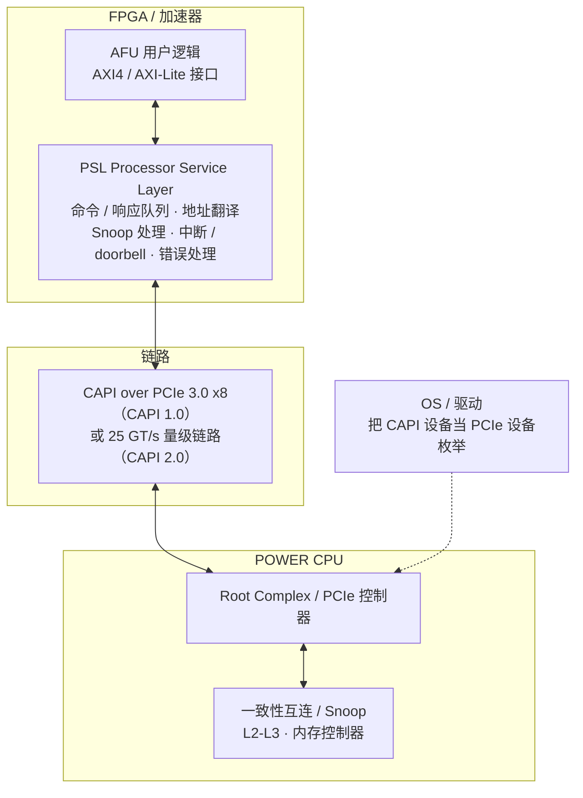
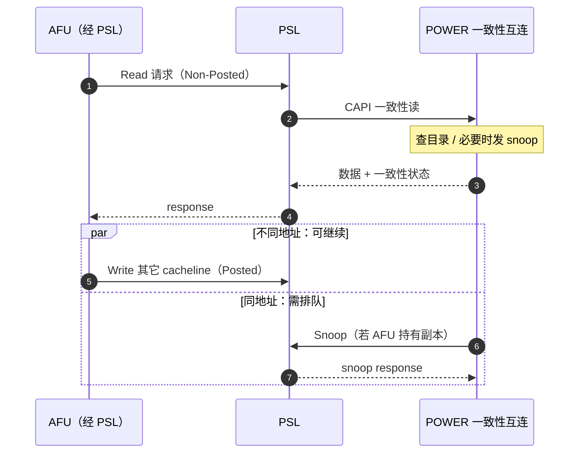

# CAPI / PSL

> **一句话定位**：CAPI（Coherent Accelerator Processor Interface）是 IBM POWER 把 CPU 一致性互连开放给 FPGA 的接口，PSL（Processor Service Layer）则是跑在 FPGA 上、负责在 AFU 用户逻辑与 POWER 一致性互连之间转换的那层协议逻辑 —— 没有 PSL，AFU 就无法"像访问本地内存一样"访问主机内存。

## 1. 它解决什么问题

2014 年 POWER8 引入 CAPI，动机很直接：**让 FPGA 加速器告别 PCIe DMA 的繁琐模型**。传统 PCIe 加速器要把数据从主机内存搬到设备侧，再算完搬回去，中间依赖描述符、doorbell、轮询与中断，软件路径长、延迟高。CAPI 把 POWER 的缓存一致性互连直接引到 FPGA：加速器用自己的缓存参与一致性协议，用 load/store 访问主机内存，省掉搬运。

代价是接口与 IBM 平台强绑定。CAPI 复用 PCIe 的物理层，但**事务层是自定义的**：CAPI 链路对操作系统表现为一个 PCIe 设备（用于枚举与驱动），而实际的加速器事务走 CAPI 私有协议，普通 PCIe 设备无法理解。因此 CAPI 只能连接同样支持 CAPI 的 POWER 主机。

CAPI 与 PSL 是一对概念：**CAPI 是接口与协议规范，PSL 是该协议在 FPGA 上的实现层**。CAPI 1.0 用于 POWER8，CAPI 2.0 用于 POWER9 并支持 25 GT/s 与 OpenCAPI 方向；PSL 版本随 CAPI 一同演进。

需要明确排除一个常见误解：**CAPI / PSL 与 VirtIO 无关**。VirtIO 是虚拟化里的半虚拟化 I/O 抽象，用共享内存环形队列做请求 / 完成；CAPI 是硬件一致性加速器接口。两者只是都被归类到"系统 I/O 抽象"领域，机制与目标完全不同。

## 2. 协议栈与分层位置

CAPI 复用 PCIe 物理层，但用自定义事务层承载一致性事务；PSL 与 AFU 都实现在 FPGA 内：

与 PCIe 对照：CAPI 把 PCIe 的物理层与链路层留下、**替换事务层**，把加速器接进一致性域；设备在软件侧仍以 PCIe 设备身份出现，这是"PCIe 的外壳 + 一致性的事务内核"。

## 3. 请求模型

CAPI 事务由 PSL 在 AFU 与主机之间转换，对 AFU 暴露的是命令 / 响应接口：

| 事务 / 命令 | 方向 | 是否 Posted | 完成方式 | 数据单位 |
| --- | --- | --- | --- | --- |
| Read（一致性读） | AFU → 主机内存 | 否 | response 带数据与状态 | cacheline（POWER 128 B） |
| Write | AFU → 主机内存 | 是（可 Posted） | 无完成 | cacheline |
| Atomic | AFU → 主机内存 | 否 | response | 数据字 |
| Snoop | 主机 → AFU 缓存 | 否（需响应） | snoop response | cacheline |
| Interrupt | AFU → 主机 | 是 | 由驱动处理 | 中断消息 |
| Command / Response | AFU ↔ PSL | 由实现决定 | doorbell + 队列 | 描述符 |
| AFU 配置读写 | 主机 → AFU | 是 | 无（AXI-Lite） | 寄存器字 |

一致性读是 Non-Posted、必须等数据与状态；写默认 Posted；snoop 需要 AFU 侧回响应，因此是"反向的等待"。

## 4. 关键机制

### 4.1 PSL：协议层的职责边界

PSL 是 CAPI 的核心实现层，负责：

- 把 AFU 发出的读 / 写 / 原子请求翻译成 CAPI 一致性事务；
- 维护 AFU 缓存的目录与状态，响应主机发来的 snoop；
- 完成地址翻译（AFU 侧 TLB / 地址转换缓存），把有效地址映射到主机物理地址；
- 生成与接收中断、处理 doorbell 与命令 / 响应队列；
- 检测与上报链路与一致性错误。

AFU 只看到一组 AXI 风格的接口与一个"内存语义"窗口，不需要理解 CAPI 的线协议。

### 4.2 AFU：用户逻辑与接口

AFU 是用户用 HDL / HLS 实现的加速内核。它与 PSL 的接口通常包括：控制寄存器（AXI-Lite）、数据请求 / 响应通道、以及可选的缓存接口。AFU 的算法在本地处理数据，靠 PSL 访问主机内存；AFU 的缓存可以持有主机 cacheline，其一致性由 PSL 参与维护，形成"类缓存一致性"语义。

### 4.3 CAPI 1.0 与 CAPI 2.0

- **CAPI 1.0（POWER8，2014）**：运行在 PCIe 3.0 x8 物理层上，自定义事务层，给出一致性加速器模型，PSL 1.0。
- **CAPI 2.0（POWER9，2017）**：链路速率提升到 25 GT/s 量级，增强原子操作与带宽，并朝 OpenCAPI 方向对齐；PSL 2.0 支持更大规模的 AFU 与更丰富的事务类型。

CAPI 2.0 与 OpenCAPI 的关系：二者是并行演进的兄弟接口 —— CAPI 更偏"PCIe 外壳 + 一致性内核"的既有生态，OpenCAPI 是重新设计的开放链路。POWER9 同时支持两者。

### 4.4 内存语义而不是消息传递

CAPI 对 AFU 暴露的是内存语义：读一段地址、写一段地址、做原子操作，而不是发送 / 接收消息。这意味着 AFU 的算法可以直接读写主机数据结构，省去数据搬运与格式转换。代价是 AFU 必须遵守一致性协议对访问顺序与对齐的要求，不能随意假设"我读到的就是最新的"，缓存副本可能被 snoop 失效。

### 4.5 设备枚举与软件模型

对操作系统而言，CAPI 设备首先是一个 PCIe 设备：有配置空间、BAR、MSI-X 中断，驱动按 PCIe 流程加载。真正的加速事务通过 CAPI 私有通路进行，由 PSL 固件与主机侧配合。这种"外壳 + 内核"的设计让 CAPI 能融入现有 PCIe 驱动框架，而不必发明全新的总线枚举机制。

## 5. 一致性语义

CAPI 提供**全缓存一致性（类缓存一致性）**：AFU 可以作为一致性域内的缓存代理持有主机数据副本，主机 snoop 会到达 PSL，由 PSL 维护 AFU 缓存的状态。一致性粒度是 POWER 平台的 128 B cacheline。

要点：

- **一致性覆盖主机内存访问**，由硬件维护；设备侧的 DMA 式搬运不受此保护，需软件同步。
- **AFU 缓存不是无条件的**：AFU 不能假设自己缓存的数据一直有效，必须响应 snoop。
- **与 CXL.cache 的定位相似**，但平台绑定在 POWER，cacheline 粒度也不同（128 B vs 64 B）。

## 6. 主线视角：读进行时，写会怎样？

CAPI 的读同样是 Non-Posted、必须等响应。读进行时的写：

- **不同地址**：写可以继续，PSL 与主机互连按地址独立处理，读不会阻塞无关写。
- **同一地址**：写会被主机侧排序点串行化在未完成的读之后，或先经 snoop 协调状态，避免读到旧值。
- **AFU 缓存持有独占副本时**：主机要写该地址，会向 AFU 发 snoop，PSL 必须回写或失效后这次写才完成 —— 此时是写反过来等 snoop 响应。

因此"CAPI 里读进行中没有写"只发生在同一 cacheline；跨 cacheline 读写重叠。读要等一个完整往返，outstanding 数与 snoop 延迟决定吞吐上限。

## 7. 性能特性与典型实现

| 项目 | CAPI 1.0 | CAPI 2.0 |
| --- | --- | --- |
| 平台 | POWER8 | POWER9 |
| 物理层 | PCIe 3.0 x8 量级 | 25 GT/s 量级链路 |
| 事务层 | CAPI 自定义 | CAPI 2.0，向 OpenCAPI 对齐 |
| 一致性 | 全缓存一致性（128 B cacheline） | 同左，事务类型与带宽增强 |
| 延迟量级 | 数百纳秒量级一致性访问 | 数百纳秒量级 |
| 协议层 | PSL 1.0 | PSL 2.0 |

| 角色 | 代表实现 / 平台 |
| --- | --- |
| CPU | IBM POWER8 / POWER9 |
| 加速器 | AMD（Xilinx）Altera FPGA 上的 CAPI / PSL IP |
| 软件 | Linux on POWER 的 CAPI 驱动、`cxl` 之外的自有堆栈 |
| 兄弟接口 | OpenCAPI（开放链路），二者在 POWER9 并存 |
| 现状 | 未离开 POWER 生态，工业界主流转向 CXL / UALink |

没有 CAPI 时，POWER 上的 FPGA 只能用 PCIe DMA 搬运数据；有 CAPI 后，AFU 可以直接一致访问主机内存，但可移植性被锁在 POWER 平台。

## 8. 要点速记

- CAPI = POWER 的一致性加速器接口；**PSL 是它在 FPGA 上的协议实现层**。
- CAPI 复用 PCIe 物理层 / 链路层，**自定义事务层**，设备对 OS 仍表现为 PCIe 设备。
- AFU 是用户逻辑，经 AXI 风格接口与 PSL 交互；一致性、翻译、中断、队列都由 PSL 承担。
- 提供**全缓存一致性**，AFU 缓存持有主机数据副本并响应 snoop，粒度 128 B cacheline。
- CAPI 1.0 对应 POWER8 / PCIe 3.0 x8；CAPI 2.0 对应 POWER9 / 25 GT/s 并支持 OpenCAPI 方向。
- 读是 Non-Posted，写默认 Posted；同地址读写由主机排序点串行化，AFU 持独占副本时写要等 snoop。
- 内存语义而非消息传递，省掉 DMA 搬运与软件同步。
- **与 VirtIO 无关**：VirtIO 是虚拟化 I/O 抽象，CAPI 是硬件一致性加速器接口。
