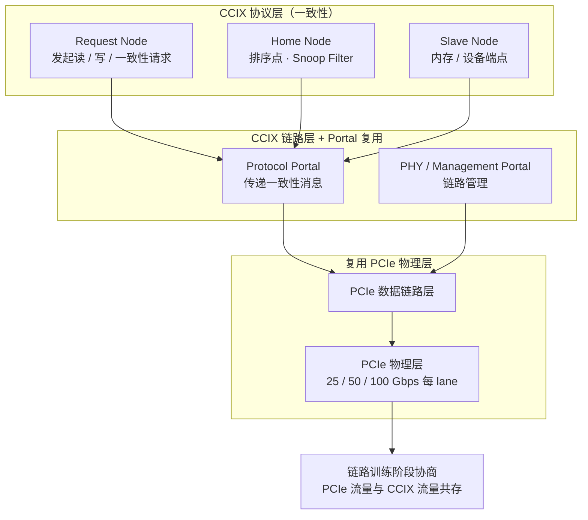
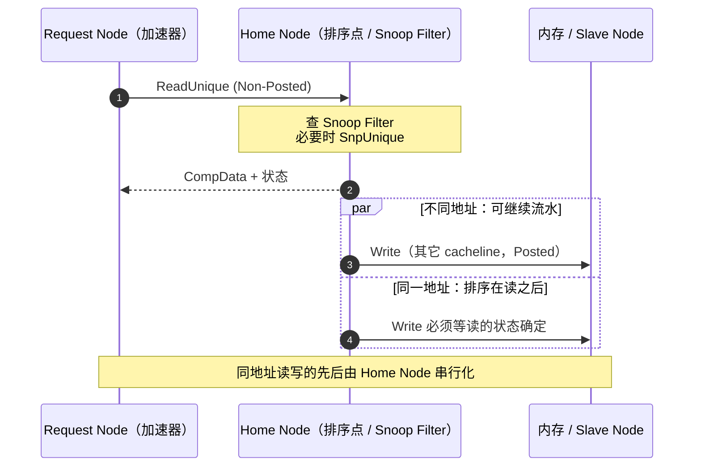

# CCIX

> **一句话定位**：CCIX 想在 PCIe 的物理层上再长出一套缓存一致性协议，让加速器与 CPU 共享同一份虚拟地址空间、用一致的 load/store 直接访问对方缓存 —— 它比 CXL 更早提出，但最终在生态竞争中输给了 CXL。

## 1. 它解决什么问题

PCIe 提供了 ATS / PASID，可以让设备共享 CPU 的虚拟地址（SVM），但只有**地址翻译共享**，没有**缓存一致性**：设备持有的主机数据副本一旦被缓存，就需要软件维护，否则会读到旧值。对需要频繁、细粒度访问主机数据的加速器来说，这层软件开销抵消了 SVM 的价值。

2016 年，AMD、Arm、Huawei、IBM、Mellanox、Qualcomm、Xilinx 等发起 CCIX（Cache Coherent Interconnect for Accelerators）联盟，目标是在 PCIe 物理层之上定义一层缓存一致性协议，使加速器、CPU、其它设备之间可以互相监听缓存、共享数据，而不必把数据拷来拷去。

CCIX 的历史位置很特殊：它是**最早把"一致性"和"PCIe"绑在一起**的开放方案，直接启发了后来的 CXL。但 CCIX 只在协议层做加法，没有像 CXL 那样把内存扩展、内存池化、switch 等系统能力一并定义，且联盟成员各自投入有限，最终被 CXL 取代，新设计基本不再选择 CCIX。

与 PCIe 的关系：CCIX **复用 PCIe 物理层与链路训练**，但事务层与一致性层是自定义的，因此 CCIX 流量与 PCIe 流量可以在同一链路上共存，却**不能在事务层直接兼容** —— 链路两端必须都支持 CCIX 才能启用一致性通路。

CCIX 想回答的其实是"内存语义还是消息语义"这道题：PCIe DMA 是搬运模型，设备看到的是描述符与数据缓冲区；CCIX 让加速器直接持有主机内存的 load/store 语义，把"谁负责搬运、谁负责同步"从软件交给硬件。这是它相对 PCIe 的本质跃迁，也是它必须付出"生态必须两端支持"这一代价的原因。

## 2. 协议栈与分层位置

CCIX 的一致性协议借鉴 AMBA 5 CHI 的代理模型，位于 PCIe 物理层之上，通过 Portal 与 PCIe 流量分复用：

与 PCIe 栈对照：PCIe 的**事务层被 CCIX 协议层替换**，数据链路层与物理层复用。因此 CCIX 可以用标准 PCIe 连接器、走标准参考时钟，设备在只做 PCIe 时链路照常可用。

## 3. 请求模型

CCIX 的一致性消息是一等公民，PCIe 事务则通过 PCIe Portal 透传：

| 事务 / 命令 | 是否 Posted | 完成方式 | 数据单位 |
| --- | --- | --- | --- |
| ReadShared / ReadUnique | 否 | CompData（带数据与状态） | cacheline |
| MakeUnique / CleanUnique | 否 | Comp（通常不带数据） | cacheline 状态 |
| WriteBack / WriteCleanFull | 是（可 Posted）或需 Comp | 可选 Comp | cacheline |
| ReadNoSnp | 否 | CompData | cacheline |
| SnpShared / SnpUnique（Home 发起） | 否（需响应） | Snoop response | cacheline |
| PCIe Memory Read（Portal 透传） | 否 | CplD | DW |
| PCIe Memory Write（Portal 透传） | 是 | 无 | DW |
| ATS Address Translation Request | 否 | Translation Completion | 页表项 |
| PASID 携带的地址请求 | 视请求而定 | 由 DoS 决定 | 页表项 / 数据 |

读（ReadShared、ReadUnique、ReadNoSnp）都是 Non-Posted，必须等完成；写默认 Posted，但在需要状态转移时可要求响应。

## 4. 关键机制

### 4.1 PCIe 物理层复用与 Portal

CCIX 把链路资源划分成多个 Portal：管理用途的 PHY Portal、透传 PCIe 事务的 PCIe Portal、以及承载一致性消息的 Protocol Portal。链路训练沿用 PCIe 的 equalization 与协商流程，训练完成后按 Portal 分配带宽。这种设计让 CCIX 设备"平时是 PCIe 设备、需要时切到一致性模式"。

### 4.2 代理模型与 Home Agent

CCIX 协议层采用与 CHI 类似的代理结构：**Request Node** 发起请求，**Home Node** 是某段地址的一致性排序点，**Slave Node** 是内存或端点。一次读若在其它代理处命中，Home Node 会发 snoop 把最新数据取回或转发。Home Node 内部可部署 snoop filter 以缩小监听范围，避免广播式 snoop。

### 4.3 ATS / PASID 与共享虚拟内存

CCIX 直接复用 PCIe 的 ATS 与 PASID：设备通过 ATS 请求地址翻译并获得 TLB 填充，通过 PASID 在一个物理设备内区分多个进程地址空间。二者叠加后，加速器可以用与 CPU 相同的虚拟地址访问数据，配合 CCIX 的一致性协议，缓存副本由硬件而非软件维护。

### 4.4 25 / 50 / 100 Gbps 的 lane 速率演进

CCIX 的物理层速率随 PCIe 电气一同演进，规范覆盖 25 / 50 / 100 Gbps 每 lane 量级，使单条链路的带宽可以随 GPU、FPGA 的带宽需求同步放大。x16 链路在这些速率下的单向原始带宽从数十 GB/s 到接近两百 GB/s 量级。

### 4.5 与 PCIe 共存而非兼容

CCIX 与 PCIe 共享电气与链路层，但一致性协议是私有的，一个支持 CCIX 的设备如果对端只支持 PCIe，就只能在 PCIe Portal 上工作。这使 CCIX 的部署依赖两端都支持，生态门槛高于"插上即可用"的 PCIe，是它竞争失利的原因之一。

### 4.6 版本演进与范围

CCIX 规范从 1.0 起步，后续版本提升了 lane 速率并补充了一致性事务类型，但始终围绕"加速器一致性访问"这一条主线，没有向内存池化、fabric 扩展、设备内存映射等系统能力延伸。对比 CXL 从 1.1 到 3.0 的路线图，CCIX 的功能集在很早就趋于稳定，也失去了继续吸引生态的抓手。它能进入的，主要是 Arm 服务器与 FPGA 加速卡这两个场景。

## 5. 一致性语义

CCIX 提供的是**全缓存一致性**：设备可以作为 caching agent 持有主机内存的副本，状态被 Home Node 跟踪，读写都会触发必要的 snoop。它的语义接近 CPU 之间的多核一致性协议，只是把"核"换成了加速器。

与 CXL 的差异在于覆盖范围：CXL 用 CXL.cache / CXL.mem 把"设备缓存主机"和"主机访问设备内存"分开，并额外定义了内存池化、共享与 bias；CCIX 主要解决**设备与主机之间的一致性访问**，对设备内存如何进入主机地址空间、如何池化，定义得远不如 CXL 完整。这也是为什么 CXL 能承接内存扩展场景，而 CCIX 停留在加速器一致性。

| 维度 | CCIX | CXL |
| --- | --- | --- |
| 一致性覆盖 | 设备与主机之间的缓存一致性 | CXL.cache 覆盖设备缓存主机，CXL.mem 覆盖主机访问设备内存 |
| 内存扩展 / 池化 | 定义薄弱 | 2.0 池化、3.0 共享，系统能力完整 |
| 一致性粒度 | cacheline | 64 B cacheline |
| 设备侧能力 | 主要是一致性访问 | 可选 caching agent，含 bias / BISnp |
| 生态 | 联盟成员有限，新设计罕见 | CPU / 内存器件 / switch 全面支持 |

## 6. 主线视角：读进行时，写会怎样？

在 CCIX 的一致性域内，读（ReadShared / ReadUnique）是 Non-Posted，必须等 CompData 返回。读进行时写能否继续，同样由地址决定：

- **不同地址**：写可以继续流水，CCIX 的一致性层按 cacheline 独立排序，未命中的读不会阻塞无关地址的写。
- **同一地址**：写会被 Home Node 排序在未完成的读之后，或在 snoop 协同时更新状态序列，避免出现"读到旧值"与状态机竞争。
- **通过 PCIe Portal 的流量**：完全遵守 PCIe 排序表，Posted 写可以越过 Non-Posted 读（为避免死锁而保留的规则）。

也就是说，CCIX 里"读进行中没有写"只发生在同一 cacheline 上；跨 cacheline 的读写是重叠的。由于读仍要等一个完整的一致性往返，outstanding 请求数与 Home Node 的 snoop 延迟决定了链路利用率的实际上限。

## 7. 性能特性与典型实现

| 项目 | 量级 | 说明 |
| --- | --- | --- |
| 单 lane 速率 | 25 / 50 / 100 Gbps | 随 PCIe 电气代际演进 |
| x16 单向带宽 | 数十至近两百 GB/s 量级 | 随 lane 速率变化 |
| 一致性往返延迟 | 数百纳秒量级 | 含 snoop 与 Home Node 处理 |
| 与 PCIe 的带宽关系 | 共享同一物理链路 | Portal 划分带宽 |
| 一致性粒度 | cacheline | 读写均可能触发 snoop |
| 适用距离 | 板级 / 机箱内 | 依赖 PCIe 电气可达范围 |

| 角色 | 代表实现 / 平台 |
| --- | --- |
| CPU | Arm Neoverse 平台、IBM POWER9（早期）、Huawei Kunpeng |
| 加速器 | Xilinx（AMD）FPGA 上的 CCIX 子系统 |
| 发起方 | AMD、Arm、Huawei、IBM、Mellanox 等联盟成员 |
| 后续 | 工业界转向 CXL；CCIX 新设计罕见 |

没有 CCIX 时，加速器要么用 PCIe DMA + 软件同步，要么走私有互连；有 CCIX 后，理论上可以做到细粒度一致访问，但生态可选项远少于 CXL。

## 8. 要点速记

- CCIX = **PCIe 物理层 / 链路层 + 自定义一致性协议层**，与 PCIe 共存但不事务层兼容。
- 目标：给加速器提供缓存一致性，而不只是 ATS / PASID 的地址翻译共享。
- 代理模型：Request Node / Home Node / Slave Node，借鉴 AMBA 5 CHI，一致性粒度是 cacheline。
- lane 速率覆盖 25 / 50 / 100 Gbps 量级，复用 PCIe 电气与训练。
- 通过 Portal 把链路管理、PCIe 流量、一致性消息分开复用。
- 一致性级别为**全缓存一致性**，读写都可能触发 snoop。
- 读进行时的写：跨地址并行，同地址由 Home Node 串行化；PCIe Portal 上仍允许 Posted 写越过 Non-Posted 读。
- 现状：被 CXL 取代，是 CXL 的直接前身与反面教材。
