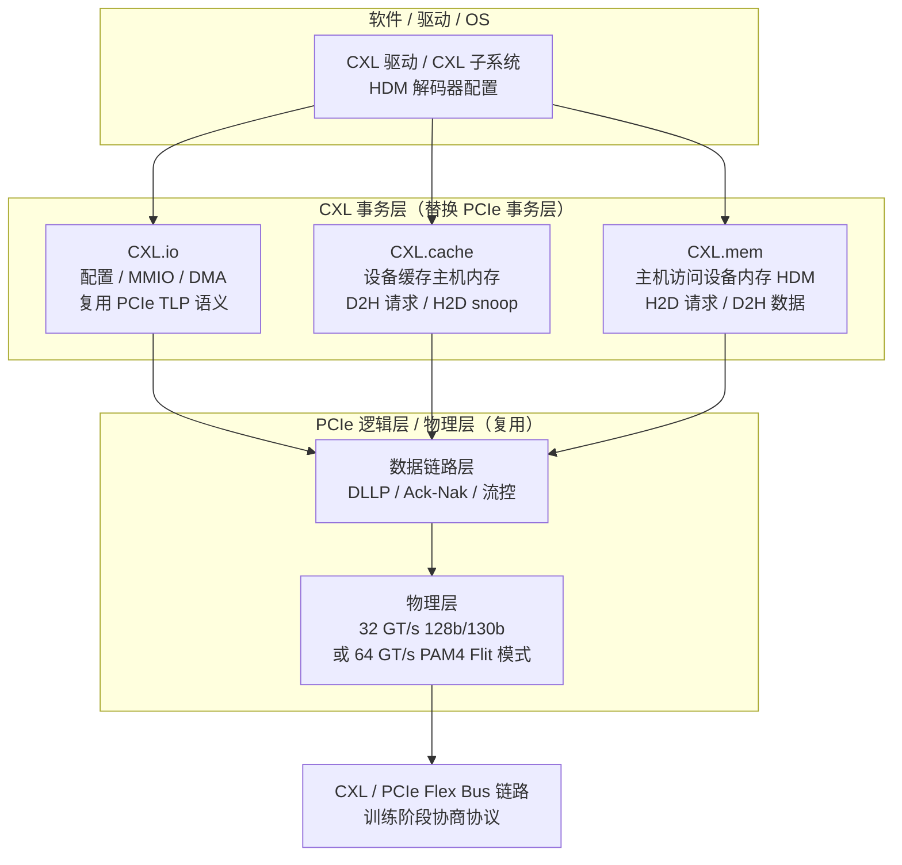
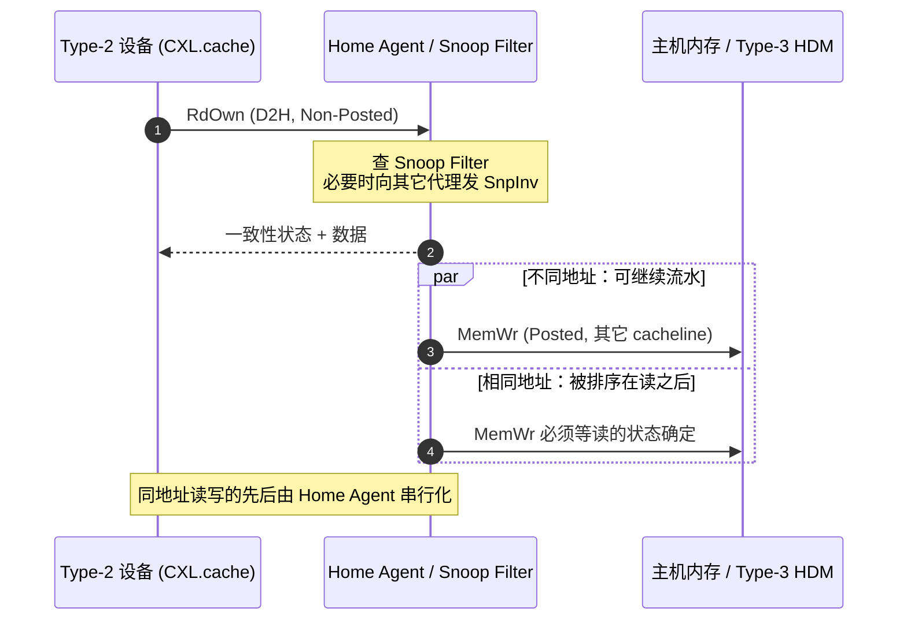

# CXL

> **一句话定位**：CXL 把 PCIe 的物理层原样留下、只替换事务层，让设备既能像 DMA 一样访问主机内存，又能与 CPU 共享缓存一致性，还能把设备内存挂进主机地址空间 —— 它要解决的是 CPU 内存带宽与容量增速落后于算力的"内存墙"。

## 1. 它解决什么问题

CPU 的 core 数量与主频增长快，但每个 socket 能挂的 DDR 通道数受封装引脚与 DIMM slot 限制。算力每两三年翻倍，内存带宽与容量的增长速度明显更慢，于是大量应用卡在"内存不够宽、不够大"上。传统解法只有加内存通道，代价是引脚、主板层数与功耗，无法线性扩展。

PCIe 本来可以挂设备，但它的事务语义是**非一致性**的：设备只能 DMA，读写主机内存要靠软件显式 flush / fence，设备无法缓存主机数据；反过来主机也无法把设备上的内存当作普通内存寻址。加速器想访问主机数据，只能拷贝或迁移，付出额外延迟和带宽。

2019 年前后，Intel 牵头提出 CXL（Compute Express Link），思路是**复用 PCIe 5.0 的电气与链路训练，另起一套事务层**。于是同一条链路可以在训练阶段协商跑 PCIe 还是 CXL（这就是 Flex Bus）：设备即使最终按普通 PCIe 用，链路也不浪费。这一点直接降低了服务器 OEM 的采纳门槛，也是 CXL 后来压过 CCIX / Gen-Z 的关键原因之一。

CXL 与 PCIe 不是替代关系而是叠加关系：**CXL.io 就是 PCIe 语义的子集**，负责发现、配置、MMIO 和 DMA；真正新增的是 CXL.cache 与 CXL.mem 两个内存语义子协议，它们才是一致性与内存扩展的载体。

## 2. 协议栈与分层位置

CXL 在 PCIe 的物理层 / 逻辑层之上，用三个并列的子协议替换了 PCIe 事务层：

关键点：CXL.cache / CXL.mem 走的是 **Flit**（定长帧）而不是 PCIe 的 TLP；CXL.io 仍然走 TLP。二者共享同一套物理编码、加扰与链路管理。

## 3. 请求模型

| 事务 / 命令 | 所属子协议 | 是否 Posted | 完成方式 | 数据单位 |
| --- | --- | --- | --- | --- |
| Memory Read (MRd) | CXL.io | 否（Non-Posted） | Completion with Data (CplD) | 1–4 DW 的 TLP |
| Memory Write (MWr) | CXL.io | 是 | 无完成 | 1–4 DW 的 TLP |
| Config Read / Write | CXL.io | 均非 Posted（读回数据 / 写需确认） | CplD / Cpl（无数据） | DW |
| RdShared / RdOwn / RdAny | CXL.cache (D2H) | 否 | H2D 数据 + 一致性状态 | 64 B cacheline（可带 Metadata） |
| RdCurr / CLFlush | CXL.cache (D2H) | 否 | H2D 完成（CLFlush 无数据） | cacheline / 无 |
| SnpData / SnpInv / SnpCur | CXL.cache (H2D) | 否（需响应） | D2H Rsp（+ 可选数据） | cacheline |
| MemRd / MemRdData | CXL.mem (H2D) | 否 | MemData 返回 | 64 B |
| MemWr / MemWrPtl | CXL.mem (H2D) | 是（可 Posted） | 无完成（UIO 下放宽） | 64 B |
| BISnp（Back-Invalidate Snoop） | CXL.cache (D2H，3.0) | 否 | H2D BIRsp | cacheline |
| 设备中断 / Mailbox | CXL.io | 是 | 无 | MMIO / MSI-X |

读（RdOwn、MemRd）都保留 Non-Posted 语义：必须等数据回来才算完成，这一点与 PCIe 读同源；写则默认 Posted，除非协议显式要求响应。

## 4. 关键机制

### 4.1 Flex Bus：同一条链路，两种协议

链路训练时由双方通过 PCIe 的 alternate protocol negotiation 决定本次跑 PCIe 还是 CXL；一旦进入 CXL，还可按设备能力选择启用 CXL.io / CXL.cache / CXL.mem 的哪些组合。Flex Bus 复用了 PCIe 的电气参数（lane 数、速率、参考时钟），所以 CXL 设备可以插在标准 PCIe slot 上，靠协商降级为 PCIe 设备。

### 4.2 三种子协议与三类设备

- **CXL.io**：配置空间、MMIO、DMA、中断，等价于 PCIe 的 I/O 通路，用于枚举与驱动。
- **CXL.cache**：设备侧缓存主机内存。设备作为 caching agent 向主机发 D2H 请求，主机侧 home agent 用 H2D snoop 维持一致。
- **CXL.mem**：主机访问设备挂载的内存（HDM）。主机发 H2D 的 MemRd / MemWr，设备返回数据。

对应三类设备：

| 设备类型 | 启用子协议 | 典型形态 | 设备内有内存? |
| --- | --- | --- | --- |
| Type-1 | CXL.io + CXL.cache | 网卡、无本地内存的加速器 | 否 |
| Type-2 | CXL.io + CXL.cache + CXL.mem | GPU、带显存的 SmartNIC | 是（可作为 HDM） |
| Type-3 | CXL.io + CXL.mem | 内存扩展卡 / 内存模组 | 是（纯内存） |

### 4.3 Flit 模式与延迟优化

CXL 1.1 / 2.0 在 PCIe 5.0 的 128b/130b 路径上使用 **68 字节 Flit**，Flit 内再切成 H2D / D2H 的槽位，实现读写双向流水。针对 CXL.mem 延迟敏感的特点，规范还定义了 latency-optimized 的路径以减少 header 开销。CXL 3.0 改用 PCIe 6.0 的 **Flit 模式与 256 字节 Flit**，配合 PAM4 把单 lane 速率提到 64 GT/s。Flit 的定长特性让物理层无需再等变长 TLP 组包，是 CXL 能把内存访问延迟压到"数百纳秒"的基础。

### 4.4 HDM 解码器与内存池化 / 共享

设备内存以 **HDM（Host-managed Device Memory）** 的形式映射进主机物理地址空间，由 HDM decoder 做地址窗口与 interleave 配置，因此主机可以用普通的 load/store 访问，并支持跨多个设备条带化以提升带宽。

- CXL 2.0 引入 **switch** 与 **内存池化**：多台主机通过 switch 连接到内存资源池，但任一时刻一块内存只归属一台主机，主机故障时可重新分配（MLD，Multi-Logical Device 把一张卡切成多个逻辑设备分给不同主机）。
- CXL 3.0 引入**多级 switch 与内存共享**：多个主机可同时访问同一段内存，一致性由 fabric 与 home agent 协同保证，这才从"池化"走到真正的"共享"。

### 4.5 Snoop Filter 与一致性状态机

主机侧 home agent 维护 **snoop filter**，记录每个 cacheline 被哪些 caching agent 以何种状态持有。CXL.cache 采用 MESI 类状态（Modified / Exclusive / Shared / Invalid）：读共享发 RdShared，读独占发 RdOwn；命中则只回数据，未命中则由 home agent 向其它代理发 snoop。

对 Type-2 设备的 HDM，CXL 2.0 引入 **bias**：host bias 下主机缓存为主、设备需响应 snoop；device bias 下设备独占该区域、主机访问会触发回推。CXL 3.0 进一步引入 **BISnp（back-invalidate snoop）**：设备持有某行的独占副本时，可反过来要求主机侧失效其缓存，从而让设备在不频繁打扰主机的情况下长期拥有数据，降低 snoop 流量。

## 5. 一致性语义

CXL 不是单一的一致性等级，而是三档并存：

| 子协议 | 一致性级别 | 由谁保证 |
| --- | --- | --- |
| CXL.io | 无一致性 | 软件，需显式 flush / fence / DMA 同步 |
| CXL.cache | 全缓存一致性 | 硬件：设备 caching agent + 主机 home agent + snoop filter |
| CXL.mem（Type-3 默认） | 主机侧 IO 一致性 | 主机对 HDM 的访问由 home agent 排序；设备不缓存主机内存 |
| CXL.mem + CXL.cache / BISnp（3.0） | 全缓存一致性 | 设备可缓存主机内存，通过 bias 与 BISnp 协同 |

需要强调：**能"像本地内存一样访问"的是 CXL.mem 的地址映射能力，而"缓存一致"来自 CXL.cache**。Type-3 内存扩展卡默认不带一致性缓存，是主机在一致性域外管理的一段内存；只有当设备具备 caching agent 能力（如带 CXL.cache 的 Type-2 或 3.0 的共享场景）时，一致性才真正覆盖到设备侧。

## 6. 主线视角：读进行时，写会怎样？

CXL 的答案是**按子协议分层回答**的：

- **CXL.io 上**：完全继承 PCIe 的排序表 —— Posted 写可以越过 Non-Posted 读。这是为避免死锁而保留的规则：设备可能要先收到读数据才腾得出资源处理写，若读被写堵住两边就锁死。
- **CXL.cache / CXL.mem 上**：读写是否并行取决于**地址**。不同 cacheline / 不同地址的写可以继续流水；**同一地址**的写会被 home agent 或设备内存控制器串行化在未完成的读之后，否则会出现"读到旧值"或状态机竞争。

所以在 CXL 里，"读进行中没有写"只可能出现在**同一地址**上；跨地址时读与写是流水重叠的，这正是 CXL 相比 PCIe DMA 提升利用率的来源。读本身仍是非 Posted、必须等完成，因此 outstanding 数量与 Flit 缓冲深度依旧决定吞吐上限。

## 7. 性能特性与典型实现

| 项目 | 量级 | 说明 |
| --- | --- | --- |
| 链路速率 | 32 GT/s（CXL 1.1 / 2.0，PCIe 5.0）· 64 GT/s PAM4（CXL 3.x，PCIe 6.0） | 单 lane |
| x16 单向带宽 | 约 60 GB/s（5.0）· 约 120 GB/s（6.0） | 扣编码后的量级 |
| CXL.mem 访问延迟 | 数百纳秒量级 | 约为本地 DRAM 的 1.5–3 倍，取决于 fabric 层级 |
| CXL.cache 一致性往返 | 数百纳秒量级 | 含 snoop 与状态更新 |
| 扩展能力 | 单机内存容量 / 带宽可成倍扩展 | 受 switch 层级与链路带宽限制 |

| 角色 | 代表实现 |
| --- | --- |
| CPU | Intel Sapphire Rapids（CXL 1.1）、AMD EPYC Genoa / Turin、Arm 服务器平台 |
| 内存器件 | Samsung / Micron / SK hynix 的 CXL DDR5 模组与控制器 |
| 控制器 / Retimer | Astera Labs Leo、Microchip、Montage 等 |
| Switch | XConn、Astera Labs 等 CXL switch |
| OS | Linux CXL 子系统与 `drivers/cxl`，支持 HDM decoder、region、memdev |

没有 CXL 时，内存扩展只能靠加 DDR 通道或把远端内存当块设备用，跨主机共享内存基本不存在；有 CXL 后，内存成为可池化、可共享、可按需分配的 fabric 资源，并可与内存分层（tiering）策略配合。

## 8. 要点速记

- CXL = **PCIe 物理层 + 新事务层**，三者并列：CXL.io（PCIe 语义）、CXL.cache（设备缓存主机内存）、CXL.mem（主机访问设备内存）。
- 版本主线：1.1 三类设备 → 2.0 switch / 池化 / MLD / IDE → 3.0 Fabric / 多级 switch / 内存共享 / UIO / BISnp。
- 设备类型：Type-1 只缓存、Type-2 缓存 + 本地内存、Type-3 纯内存扩展。
- CXL.io / CXL.cache / CXL.mem 分别对应**无一致性 / 全缓存一致性 / IO 一致性**三档语义。
- 读仍是 Non-Posted，必须等完成；写默认 Posted，靠 Flit 与 UIO 换取流水重叠。
- 读进行时的写：跨地址可并行，同地址由 home agent 串行化。
- 一致性状态为 MESI 类，主机侧靠 snoop filter，设备侧靠 bias 与 BISnp 减少 snoop。
- 生态已收敛到 CXL：CPU、内存器件、控制器、switch、Linux 子系统齐备，是当前内存扩展的事实标准。
