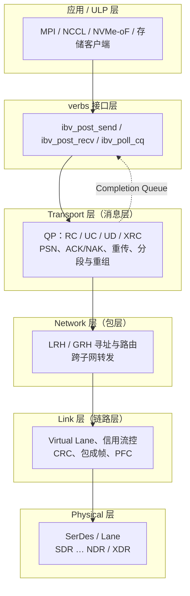
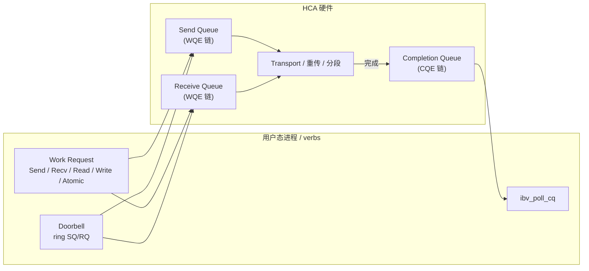

# InfiniBand

> **一句话定位**：InfiniBand（IB）是一套从物理层到传输层全自研的高性能网络，用 HCA + QP + 完成队列把"访问远端内存"抽象成异步的 work request；其中 RDMA Read 是请求-响应型、必须等数据返回，而 RDMA Write 是 posted 型、发出即对本地完成，只靠 CQE 通知。

## 1. 它解决什么问题

传统 socket 网络在 HPC / 分布式存储场景里有几笔固定开销：

- **内核协议栈**：每次收发都要走系统调用、协议处理、软中断；
- **内存拷贝**：用户缓冲 → 内核缓冲 → 网卡，来回搬运；
- **CPU 参与**：远端要有一个进程或内核线程配合应答，CPU 一直在做搬运工。

IB 的目标就是把这三点一起拿掉：

1. **内核绕过（kernel bypass）**：数据通路在用户态直接驱动 HCA（Host Channel Adapter），系统调用只发生在建连和注册内存等控制面；
2. **零拷贝 / 单边操作（one-sided）**：发起端可以直接读写远端进程的内存，远端 CPU 完全不参与，也不需要远端投递 receive；
3. **CPU 卸载**：可靠传输、重传、分段重组由 HCA 硬件完成，CPU 只负责"投递请求、收割完成"。

它服务的典型负载是 MPI 集合通信、分布式存储后端、分布式数据库与 AI 训练的参数同步 —— 这些都要求微秒级延迟、线速带宽，且尽可能不占用计算核。

## 2. 协议栈与分层位置

IB 的协议栈是自成一体的五层结构，动词层（verbs）之上才是应用：

分层职责可以概括为：

| 层 | 关键对象 | 职责 |
| --- | --- | --- |
| Physical | Lane / SerDes | 位流传输与链路速率 |
| Link | Virtual Lane、信用 | 流控、CRC、包边界、无损保证 |
| Network | LRH / GRH | 子网内与跨子网寻址路由 |
| Transport | QP、PSN | 可靠性、顺序、分段重组、服务类型 |
| Upper / verbs | WQE、CQE | 对上暴露 work request 与完成语义 |

> 记忆锚点：** verbs 之上的应用只看见"提交请求 / 收割完成"，可靠性、重传、乱序处理全部被 transport 层藏起来。**

## 3. 请求模型

IB 把操作分成 **two-sided（Send/Recv）** 与 **one-sided（RDMA Read / RDMA Write / Atomic）** 两大类。核心区别在于远端是否要参与、以及发起端要不要等响应。

| 操作 / verb 类型 | 是否 Posted | 完成方式 | 数据单位 |
| --- | --- | --- | --- |
| `RDMA Write` | 是（发出即对本地完成） | 仅发起端产生 CQE，远端无 CQE | 消息（可含多包），写入由 `rkey` 指定的远端 MR |
| `RDMA Write with Immediate` | 是 | 发起端 CQE + 远端 Receive WQE 被消耗产生 CQE | 数据 + 一个 32-bit immediate 值 |
| `RDMA Read` | 否（请求-响应型） | 发起端必须等远端 read response，之后才产生 CQE | 读取 `rkey` 指定 MR，响应可拆成多个包 |
| `Send`（two-sided） | 是 | 发起端 CQE + 远端 Receive WQE 匹配并产生 CQE | 消息，远端缓冲由 RQ 上的 WQE 预先指定 |
| `Receive`（预投递 WQE） | 不适用（预先挂在 RQ） | 被 Send / Write-with-Imm 匹配后产生 CQE | 接收缓冲，长度由 WQE 声明 |
| `Atomic`（FetchAdd / CmpSwap） | 否（请求-响应型） | 发起端等远端原子响应后产生 CQE | 单个 8 字节原子操作，读-改-写不可分 |
| `Masked Atomic` / 扩展原子 | 否 | 同上 | 按操作数宽度，量级为单字 / 双字 |

三条容易混淆的边界：

- **"全部 WQE 都是 posted 到 SQ 的"**：这里的 posted 指 work request 被门铃提交。上表的 posted 指的是**语义上是否需要对端响应**：`RDMA Write` 的完成只代表本地 HCA 已把数据发出并保证可靠交付，**不经过远端 CPU**；`RDMA Read` 必须等远端返回数据，等价于一次远端往返。
- **CQE 的时机**：`RDMA Write` 的 CQE 表示传输层已完成（RC 下意味着对端已 ACK 或已本地入队），不是对端内存立即可见。
- **two-sided 必须预投递**：`Send` 若找不到匹配的 Receive WQE，会触发 `RNR NAK`（Receiver Not Ready），这是 polling 型应用要小心处理的路径。

## 4. 关键机制

### 4.1 传输类型与服务语义（RC / UC / UD / XRC）

QP（Queue Pair）的服务类型决定了可靠性与连接性，这是 IB 与普通以太网最大的语义差异来源。

| 类型 | 连接性 | 可靠性 / 顺序 | 典型用途 |
| --- | --- | --- | --- |
| RC（Reliable Connection） | 一对一 | 可靠、按序、有 ACK/NAK 与重传 | 需要严格语义的 RDMA Read/Write、存储后端 |
| UC（Unreliable Connection） | 一对一 | 不保证可靠，但保持连接与按序发送 | 对丢失不敏感、想省重传开销的场景 |
| UD（Unreliable Datagram） | 一对多 | 不可靠、不保证顺序，单包消息 | 小消息路由、发现、部分 MPI 控制面 |
| XRC（eXtended RC） | 一对多（共享接收） | 可靠、按序 | 多进程共享一个接收端，减少 QP 数量 |
| RD（Reliable Datagram） | 一对多 | 可靠数据报 | 规范定义，实际生态较少使用 |

RC 是最常用的"标准 RDMA"语义：每个 QP 维护独立的 PSN（Packet Sequence Number）空间，接收端发现空洞或被跳过的 PSN 时返回 NAK，发送端回退重传。因为顺序按 QP 隔离，**QP 既是隔离单元，也是排序单元**：同一条 RC 上的消息保持顺序，不同 QP 之间没有顺序保证。

### 4.2 内存注册：MR、PD、lkey / rkey

RDMA 的零拷贝不是"随便指向一段虚拟地址"，而是先把内存**钉住并登记**：

- **MR（Memory Region）**：向内核注册一段虚拟内存，HCA 拿到其物理页翻译（MTT），并保证它不被换出；
- **PD（Protection Domain）**：MR 与 QP 都归属于 PD，只有同 PD 的 QP 才能访问该 MR，形成隔离边界；
- **lkey / rkey**：每次注册返回两个 key。**lkey** 用于本地 WQE 指定源 / 目的缓冲（证明"这段内存归我"）；**rkey** 交给对端，用于远端 RDMA Read/Write/Atomic 的鉴权（证明"允许你访问"）；
- **权限位**：MR 注册时声明 `LOCAL_WRITE` / `REMOTE_READ` / `REMOTE_WRITE` / `ATOMIC` 等，远端能否读、能否写由这些位决定。

由此也埋下一致性伏笔：**MR 是物理内存的直接映射，HCA 的读写不走 CPU cache**，所以与 CPU 之间的可见性需要显式 fence / 屏障来兜底（详见第 6 节）。

### 4.3 可靠性与 ACK / NAK

Transport 层的可靠性由三件东西支撑：

1. **PSN 与序号窗口**：发送端为每个包编号，接收端据此检测丢包、重复与乱序；
2. **ACK / NAK**：接收端可回 ACK，也可回 NAK 表示"期望的 PSN 没收到"（可重传）或"资源不足"（RNR）；
3. **超时与 Go-Back-N 重传**：发送端维护重传计时器，窗口内未确认则回退重发。

这套机制对上层不可见：应用看到的只是 CQE 上的成功或错误状态。代价是 HCA 需要维护大量 per-QP 状态，这也解释了为什么连接数一多（数十万 QP）时缓存与内存会成为瓶颈 —— 后来 XRC、DCT 等机制正是为削减 per-QP 状态而生。

### 4.4 SHARP 网络内计算

SHARP（Scalable Hierarchical Aggregation and Reduction Protocol）把集合操作从端点搬到交换机里做：

- 传统 MPI allreduce 是 `N` 个端点两两收发，流量随节点数增长；
- SHARP 在交换机（如 NVIDIA Quantum 系列）内建聚合树，各端点只把数据发到交换机，由交换机完成求和 / 归约后再分发；
- 效果是把 allreduce 的流量与延迟从"随节点数增长"压到接近树高，尤其利好大规模 AI 训练。

SHARP 依赖支持聚合的交换 ASIC 与对应 verbs / 集合库（如 NCCL、HPC-X）配合，属于"网络内计算"的早期落地形态，也是后来 UEC 等新协议强调的演进方向的前身。

### 4.5 链路速率演进

IB 每代以"每 lane 信号速率"翻倍演进，链路可聚合成 4x / 8x / 12x 宽端口：

| 代际 | 每 lane 量级 | 典型 4x 端口量级 | 备注 |
| --- | --- | --- | --- |
| SDR | ~2.5 Gbps | ~10 Gbps | 早期 |
| DDR | ~5 Gbps | ~20 Gbps | — |
| QDR | ~10 Gbps | ~40 Gbps | — |
| FDR | ~14 Gbps | ~56 Gbps | — |
| EDR | ~25 Gbps | ~100 Gbps | — |
| HDR | ~50 Gbps | ~200 Gbps | 100G/200G 生态 |
| NDR | ~100 Gbps | ~400 Gbps | 400G 端口 |
| XDR | ~200 Gbps | ~800 Gbps 量级 | 新一代 |

（上表为量级与代际关系，实际可用带宽还受编码、协议开销与端口宽度影响。）

## 5. 队列与传输结构（QP / WQE / CQE）

verbs 编程模型的骨架是四类对象：**QP、SQ、RQ、CQ**。

- **QP（Queue Pair）**：一对 SQ + RQ，是连接与排序的基本单位。QP 有状态机 `RESET → INIT → RTR → RTS`，只有进入 RTS 才能收发；状态的每一步都在设置对端信息、rkey 权限、MTU、PSN 等参数。
- **Work Request → WQE**：`ibv_post_send` / `ibv_post_recv` 把 work request 转换成硬件可执行的 WQE（Work Queue Element）挂到 SQ / RQ 上，然后敲 doorbell 通知 HCA；
- **CQE（Completion Queue Element）**：操作完成后 HCA 往 CQ 里写 CQE，携带 `wr_id`、`status`、`opcode`、`byte_len` 等；应用用 `ibv_poll_cq` 或 completion channel（阻塞 / 事件通知）收割；
- **完成顺序**：可以按 SQ 顺序完成（in-order completion），也可乱序完成（out-of-order completion），由 QP 创建参数决定；
- **一对多**：CQ 可被多个 QP 共享，聚合收割以减少轮询开销；错误时可用 `IBV_WC_WITH_IMM`、`IBV_WC_RECV` 等 opcode 区分来源。

一个完整的发 / 收回合，本质上是 **WR → WQE → 网络包 → 对端 RQ 匹配 → 双端 CQE** 的流水。

## 6. 主线视角：读进行时，写会怎样？

这是全站主线在本协议里的落点。

**RDMA Read 进行时，正常的 posted 型流量（RDMA Write、Send）不会被阻塞。** 原因是：

- 一次 RDMA Read 发起后，本地 HCA 把 read request 发出，随后 QP 进入"等待 read response"状态；这个等待只占住该 QP 的**未完成读名额**（受 `max_rd_atomic` 限制），并不占用链路或对端 CPU；
- RDMA Write 是 posted 的：发起后立刻对本地"完成路径"推进，HCA 可以继续发出后续写；
- 因此同一条 RC QP 上，"先发 Read、后发 Write"在传输层可以有多种交织方式，完成顺序也未必等于提交顺序（取决于 in-order / out-of-order completion 与操作类型）。

需要区分三层"顺序"：

1. **传输顺序**：RC 下同一 QP 的消息按 PSN 有序交付，读响应与写数据如何交织由传输层保证不破坏消息边界；
2. **完成顺序（本地 CQE 顺序）**：Read 的 CQE 必然晚于它依赖的 response；Write 的 CQE 只代表本地已可靠发出；
3. **内存可见性顺序**：这是最容易被忽略的一层 —— **RDMA 操作不提供缓存一致性**。若 CPU 或对端 GPU 直接持有同一缓冲的缓存副本，即使 CQE 已到，读到的仍可能是旧值。

所以工程上的做法是：

- 需要"写完再让对端读到新值"时，用 **Write 后接 Read** 或依赖 RC 的顺序语义，并配合 `ibv_post_send` 的 fence 标志（`IBV_SEND_FENCE`）确保前面的读 / 写先完成；
- 需要在本地 CPU 与 HCA 之间建立可见性时，使用 CPU 内存屏障 + `ibv_wr_complete` / 门铃顺序，而非假设硬件自动同步；
- 需要跨对象排序时，记住**排序边界在 QP**：不同 QP 之间不保证先后，需要显式同步。

一句话总结：**IB 里读不会"锁"住写，posted 写可以正常穿行；真正要小心的是完成顺序与内存可见性这两件事，它们不属于传输层的职责。**

## 7. 性能特性与典型实现

IB 的性能特征是"低且稳定的延迟 + 高线速带宽"，量级如下：

| 指标 | 量级 | 说明 |
| --- | --- | --- |
| 小消息延迟 | 亚微秒 ~ 数微秒 | 内核绕过、零拷贝；比 socket 低一个数量级以上 |
| 单端口带宽 | 100G ~ 400G，新一代 800G 量级 | NDR / XDR 端口 |
| 消息速率 | 每秒上千万次操作量级 | 小消息受 HCA 与 PCIe 带宽约束 |
| 扩展规模 | 单子网 数万节点量级 | 依赖子网管理器与交换机层级 |
| 尾延迟 | 相对稳定 | 无损链路 + 硬件卸载，抖动小于拥塞型以太网 |

生态现状：

- **HCA 与交换机**：NVIDIA（Mellanox）ConnectX 系列网卡、Quantum / Spectrum 系列交换机是事实上的主流；也可通过 `rdma-core` 用户态库与 `libibverbs` 使用；
- **软件栈**：`libibverbs` / `librdmacm` 提供 verbs 与连接管理，上层有 MPI（OpenMPI、MPICH）、NCCL、NVMe-oF、UCX 等；
- **与以太网的边界**：IB 自研链路在延迟与无损保证上更纯粹，但需要专用交换机与线缆，成本与生态绑定更深 —— 这正是 RoCE 想用"verbs 语义 + 以太网链路"替代它的动因。

## 8. 要点速记

- **定位**：原生 RDMA 集群网络，全栈自研，verbs 是统一入口。
- **分层**：Physical / Link / Network / Transport / Upper，可靠性在 Transport 层。
- **操作两类**：two-sided（Send/Recv，远端要参与）与 one-sided（RDMA Read / Write / Atomic，远端 CPU 不参与）。
- **Posted 分界**：`RDMA Write` posted，发出即对本地完成；`RDMA Read`、`Atomic` 请求-响应，必须等对端返回。
- **四件套**：QP（SQ+RQ）、WQE、CQE、MR（lkey / rkey / PD）。
- **服务类型**：RC 最常用（可靠按序），UC/UD/XRC 各有取舍。
- **主线答案**：读进行时 posted 写可以穿行；顺序边界在 QP；RDMA 不提供缓存一致性，可见性要自己管。
- **增强**：SHARP 把归约下沉到交换机；速率按 SDR→…→NDR / XDR 每代翻倍。
- **对比锚点**：RoCE = 同样的 verbs，跑在以太网上；iWARP = 同样的 verbs，跑在 TCP 上。
