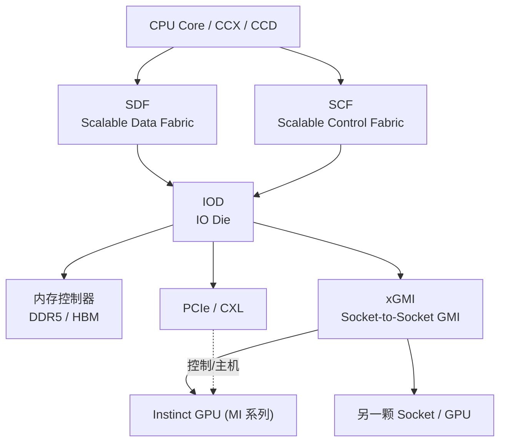

# Infinity Fabric

> **一句话定位**：Infinity Fabric（IF）是 AMD 的模块化互连架构，片内连接 CCD 与 IOD、纵向连接内存控制器，跨 socket 用 xGMI 携带缓存一致性，在 EPYC 与 Instinct 里既当"总线"又当"网络"。

## 1. 它解决什么问题

当一颗 CPU/GPU 从"单 die"走向"多 die / 多 chiplet"时，问题从"怎么算得更快"变成了"怎么把许多块硅拼成一个逻辑上像单芯片的系统"：

1. **片内距离**：CCD（Core Complex Die，计算芯粒）与 IOD（IO Die，IO 芯粒）之间要来回搬运 cache line、内存请求与一致性消息。
2. **内存通道的连接**：内存控制器通常集中在 IOD，计算芯粒要访问远端内存，延迟与带宽远超片上缓存。
3. **跨 socket 扩展**：多路服务器里，CPU0 要访问 CPU1 的内存，既要带宽，又要**缓存一致性**，否则软件成本爆炸。
4. **异构扩展**：EPYC 与 Instinct（MI 系列）要在同一套 fabric 语言下把 CPU、GPU、内存连起来。

Infinity Fabric 的解法是：**用同一套模块化 fabric 覆盖从片内到跨 socket 的全部距离**，按连接对象拆分出不同子 fabric。

## 2. 协议栈与分层位置

IF 不是一个单一协议，而是"**数据 fabric + 控制 fabric + 可插拔物理层**"的组合。常见的两分法是：

- **SDF（Scalable Data Fabric）**：承载数据、内存请求与一致性流量。
- **SCF（Scalable Control Fabric）**：承载配置、管理、电源/时钟、发现等控制流量。

在跨 socket 时，数据 fabric 由 **xGMI（Socket-to-Socket Global Memory Interconnect）** 承担。

几个容易混淆的点：

- **IF 既是片内互连，也是片间互连**。同一个名字覆盖"CCD↔IOD"和"CPU↔CPU"两种距离。
- **xGMI 是 IF 的跨 socket 形态**，它要携带**缓存一致性**，而不只是搬运原始字节。
- **内存通道也是 IF 的一部分**：内存控制器挂在 fabric 上，核访问内存本身就要穿过 fabric。
- **与 PCIe 并存**：PCIe 仍然是通用设备/外设/主机内扩展的通道；IF/xGMI 是"AMD 生态内部"的高带宽低延迟路径。

## 3. 请求模型

IF 是"把请求与一致性消息打包在 fabric 上"的架构，而不是像 PCIe 那样定义 TLP 类型表。下面按主线三问给出对齐视角：

| 事务 / 请求类型 | 是否 Posted | 完成方式 | 数据单位 |
| --- | --- | --- | --- |
| 本地/片内 Load | Non-Posted | 必须取回数据才能完成 | cache line（如 64B） |
| 本地/片内 Store | 语义上 Posted | 写入后靠一致性协议维护可见性 | cache line |
| 跨 socket Load（经 xGMI） | Non-Posted | 远端内存/缓存返回数据 | cache line |
| 跨 socket Store（经 xGMI） | 语义上 Posted | 由一致性协议处理失效/回写 | cache line |
| 一致性消息（Probe/Snoop/Inv） | 控制事务 | 需要响应（如 Ack / 数据） | 控制消息 |
| 内存控制器访问 | Non-Posted（读）/ Posted（写） | 由 DRAM 时序决定 | burst / cache line |

要点：

- **片内与跨 socket 的事务语义基本一致，差别在延迟、带宽和一致性域边界**。
- xGMI 上的事务**携带一致性**，所以跨 socket 的一组核仍能维持统一的内存视图（在 AMD 的缓存一致模型内）。
- 具体协议字段、消息编码属于 AMD 私有实现，**未公开的细节以官方文档为准**。

## 4. 关键机制

### 4.1 CCD 与 IOD 的解耦

- **CCD（Core Complex Die）** 里是计算单元（Core Complex / CCX）与私有 L3 slice。
- **IOD（IO Die）** 里是内存控制器、PCIe/CXL 通道、xGMI 端口、以及大量 IO。
- 用 IF 把两者拼起来，AMD 可以让不同工艺的芯粒各司其职（计算用先进工艺，IO 用成熟工艺），提升良率、降低成本。
- 代价是**跨 die 访问的延迟和带宽受 fabric 限制**，这也是 NUMA-like 行为的来源。

### 4.2 SDF 与 SCF 的分工

- **SDF（Scalable Data Fabric）** 面向带宽与延迟：缓存行传输、内存请求、一致性消息。
- **SCF（Scalable Control Fabric）** 面向可靠性：发现、配置、遥测、时钟/电源控制。
- 两者物理上可能共享部分链路，但逻辑职责分离，便于独立扩展与控制面隔离。

### 4.3 xGMI 与跨 socket 一致性

- **xGMI** 是 socket-to-socket 的 IF 形态，把两颗（或多颗）CPU 连成一个一致性域。
- 它携带**缓存一致性流量**：当本地核访问远端内存或远端缓存行时，需要经过 probe/失效/数据回传流程。
- 结果是一个"**NUMA 但缓存一致**"的机器：远端内存延迟更高，但软件不需要手动 flush 就能正确共享数据。
- 在 Instinct（MI 系列）里，IF/xGMI 也用于连接 GPU 与 GPU / GPU 与 CPU（取决于平台与世代）。

### 4.4 内存通道即 fabric

- 内存控制器不是"fabric 之外的终点"，它**挂在 fabric 上**。
- 因此一次普通的内存访问天然就是一次 fabric 事务：核 → L3 → SDF → 内存控制器 → DRAM。
- 这解释了为什么内存带宽、fabric 带宽、core 数量必须匹配，否则会出现 fabric 拥塞。

### 4.5 与 PCIe 的分工

| 路径 | 承担 | 一致性 |
| --- | --- | --- |
| IF（片内 CCD↔IOD） | 计算↔内存/IO 芯粒 | 缓存一致 |
| xGMI（socket↔socket / GPU） | 跨 socket 内存与 GPU 互连 | 缓存一致 |
| PCIe / CXL | 外设、NVMe、网卡、部分加速器 | 视协议（CXL.cache 才带一致性） |

## 5. 一致性语义

| 层级 | Infinity Fabric 的态度 | 说明 |
| --- | --- | --- |
| 无一致性 | 否 | IF 至少提供片内一致性 |
| IO 一致性 | 是（对内存访问） | 设备/内存访问可见性可管理 |
| 全缓存一致性 | **片内是，跨 socket 也是** | xGMI 携带一致性，形成统一视图 |

- **片内**：CCD 内部与 CCD↔IOD 之间维持缓存一致，实现上属于 **MOESI 类**协议（AMD 未逐条公开状态机）。
- **跨 socket**：xGMI 把一致性域扩展到多颗 CPU；远端的缓存行被访问时会做 probe/失效。
- **与 NVLink 的对比**：NVLink 是内存语义但**非**透明缓存一致，靠软件 fence；xGMI 则**携带一致性**，软件负担更接近普通 SMP。这是两条路线的根本分歧。
- **与 CXL.cache 的对比**：CXL.cache 让设备参与 CPU 的缓存一致域；IF/xGMI 更多是 CPU/GPU 间的私有一致域。

## 6. 主线视角：读进行时，写会怎样？

问题：**一次跨 socket（或跨 die）的读正在进行时，写会怎样？**

- **硬件层面允许并发**：fabric 上有多条虚拟通道与缓冲，读请求挂起时，写请求与一致性消息可以继续穿行。设计上不会让一次读把整条 fabric 堵死。
- **一致性协议负责顺序**：因为 IF/xGMI 携带缓存一致性，硬件会通过 probe/失效/回写保证"读到的一定包含已提交的写"。**这不像 NVLink 那样把同步完全交给 fence**。
- **内存序仍由架构定义**：x86-64 的强内存模型（TSO 风格的 store ordering）约束了跨 socket 场景下写何时对读可见；这属于 CPU 架构层面，fabric 只是忠实执行。
- **NUMA 效应体现在延迟**：远端 socket 的写与读都要跨 xGMI，延迟高于本地；但"写能不能在别人读的同时进行"并不由链路串行化决定，而由一致性域与内存模型决定。
- **资源背压**：如果远端内存控制器或 probe 队列拥塞，写会被推迟——这是性能现象，不是语义禁止。

一句话：**在 IF/xGMI 里，读挂起时写可以穿行，且一致性由硬件携带、内存序由 CPU 架构定义；相比 NVLink，软件几乎不需要手动 fence 跨 socket 的数据共享。**

## 7. 性能特性与典型实现

以下为量级描述，**具体数值随世代、型号、封装与 socket 数变化，以 AMD 官方为准**。

| 路径 | 延迟量级 | 带宽量级 | 备注 |
| --- | --- | --- | --- |
| 片内 L3 / CCD 内 | 数十纳秒 | 极高 | 片上缓存命中 |
| CCD ↔ IOD | 数十纳秒偏高 | 与 fabric 宽度相关 | 跨 die 即换挡 |
| 本地内存（IOD 直连） | 约百纳秒 | 每通道数十 GB/s 量级 | 受 DRAM 时序限制 |
| 跨 socket（xGMI） | 约两百纳秒及以上 | 每 link 数十 GB/s 量级，可多 link 聚合 | 携带一致性 |
| GPU 间（IF/xGMI 路径） | 百纳秒量级 | 与世代/平台相关 | MI 系列平台 |

生态现状：

- **EPYC 服务器**：多 CCD + IOD 的布局让核心数、内存通道、PCIe lane 数可独立扩展；NUMA 拓扑由 firmware/OS 呈现，调度器需 NUMA-aware。
- **Instinct（MI 系列）**：在 GPU 侧也使用 IF 类互连连接 GPU 与 GPU / CPU，配合 ROCm 软件栈；跨厂商机柜级扩展则看向 UALink 等开放方案。
- **软件栈**：ROCm、HIP、以及 NUMA 相关的内核调度与内存策略都要理解 xGMI 拓扑。
- **开放性**：IF 的核心实现为 AMD 私有，**未公开完整规范**；UALink 的动机之一正是提供一条开放替代路线。

## 8. 要点速记

- IF 是 AMD 的**模块化互连架构**，覆盖**片内（CCD↔IOD）**与**跨 socket（xGMI）**两种距离。
- 分为 **SDF（数据）** 与 **SCF（控制）**；跨 socket 的数据路径是 **xGMI**。
- **内存控制器挂在 fabric 上**，所以普通内存访问本身就是 fabric 事务。
- **片内缓存一致**（MOESI 类），**跨 socket 由 xGMI 携带一致性**，形成统一视图。
- 与 NVLink 的根本区别：IF/xGMI **带缓存一致性**，NVLink **靠软件 fence**。
- 与 PCIe **并存分工**：PCIe 管通用外设/主机，IF/xGMI 管 AMD 生态内部的高带宽低延迟。
- 延迟量级：**片内数十纳秒、跨 socket 约两百纳秒及以上**；带宽按 link 与世代扩展。
- NUMA 效应来自跨 die/xGMI 的物理距离，而不是"读写不能并行"。
- 主线复述：**读挂起时写可穿行，一致性由硬件携带、内存序由 CPU 架构定义**。
