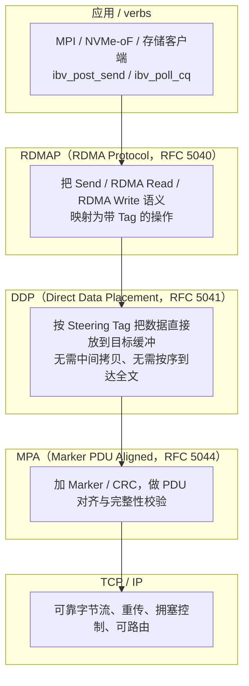

# iWARP

> **一句话定位**：iWARP（Internet Wide Area RDMA Protocol）是 IETF 标准的 RDMA over TCP，把 verbs 的远端内存访问语义通过 RDMAP、DDP、MPA 三层映射到标准 TCP 字节流上；它不需要无损以太网、可跨广域部署，代价是协议栈更重、实现更复杂。

## 1. 它解决什么问题

RoCE 复用了以太网链路，但仍要求网络近乎无损（PFC / ECN），这在大规模、多租户、跨域环境里很难保证。iWARP 换了一条路：

- **能不能让 RDMA 跑在标准 TCP 上？** TCP 本身已经处理了丢包、乱序、重传、拥塞控制，是经过互联网验证的可靠字节流；
- **能不能不改动现有 IP 网络？** 不用 PFC、不用专用无损配置，普通三层网络即可，天然可路由、可广域；
- **能不能保留 verbs 语义？** 远端内存访问仍应是 one-sided 的零拷贝，而不是退回 socket 的消息拷贝。

因此 iWARP 的目标是：**在标准 TCP/IP 之上，重建 IB 那套"零拷贝、单边访问远端内存"的语义。** 它的直接好处是与现有 TCP 基础设施和运维兼容，天然适合广域与混合云；代价是 TCP 的流式、按序、面向字节的特性与 RDMA 的"消息 / 内存"模型并不天然匹配，需要额外的适配层。

## 2. 协议栈与分层位置

iWARP 的分层是把 RDMA 语义"翻译"到 TCP 流的过程，三层各司其职：

三层的分工可以这样记：

| 层 | 角色 | 解决什么 |
| --- | --- | --- |
| RDMAP | 语义层 | 把 RDMA 操作（Send / Read / Write）变成可传输的带 Tag 请求与响应 |
| DDP | 数据放置层 | 靠 Steering Tag 把数据**直接放进目标内存**，实现零拷贝接收 |
| MPA | 成帧层 | 在 TCP 字节流上插入 Marker 与 CRC，保证 PDU 边界可识别、数据可校验 |
| TCP / IP | 传输层 | 提供可靠性、顺序、拥塞控制与路由 |

与 RoCE 的关键分野在这里：**RoCE 把 IB 的可靠性直接压在二层/三层以太网上，并靠 PFC/ECN 硬撑无损；iWARP 则把可靠性交给 TCP，因此不需要无损以太网。**

## 3. 请求模型

iWARP 对上暴露的仍是 verbs 语义，操作分类与 IB / RoCE 一致：two-sided（Send/Recv）与 one-sided（RDMA Read / Write / Atomic）。差别在于这些操作如何在 TCP 流上被承载与完成。

| 操作 / verb 类型 | 是否 Posted | 完成方式 | 数据单位 |
| --- | --- | --- | --- |
| `RDMA Write` | 是（发出即对本地完成） | 仅发起端产生 CQE；数据由 DDP 按 Tag 直接放置 | 由 Tag 指定的目标缓冲，可多 PDU |
| `RDMA Write with Immediate` | 是 | 发起端 CQE + 远端 Receive 事件 / CQE | 数据 + immediate 值 |
| `RDMA Read` | 否（请求-响应型） | 发起端发出 Read，等对端返回数据后才产生 CQE | 读取 Tag 指定的远端缓冲 |
| `Send`（two-sided） | 是 | 双端 CQE，远端 RQ 的 WQE 匹配 | 消息，远端缓冲预先投递 |
| `Receive`（预投递） | 不适用 | 被 Send / Write-with-Imm 匹配后产生 CQE | 接收缓冲 |
| `Atomic` | 否（请求-响应型） | 等远端原子响应后产生 CQE | 单字 / 双字原子操作（受实现支持约束） |

需要强调两点：

- **RDMAP 里"Tag"就是 rkey / lkey 对应的机制**：远端写 / 读要用 **STag（Steering Tag）** 授权并让 DDP 定位到目标缓冲；这等价于 IB 的 rkey，但作用点下沉到了 DDP 层，使数据可以不经 TCP 重组就落到最终内存。
- **DDP 让"顺序"不再是零拷贝的前提**：TCP 可能把数据分成多个 segment，DDP 允许带 Tag 的 PDU 到达后直接放置，而不必先拼成完整消息再拷贝；这正是 iWARP 能在 TCP 上逼近 RDMA 性能的原因。

## 4. 关键机制

### 4.1 DDP：Direct Data Placement

DDP 是 iWARP 区别于"用 TCP 传消息"的核心。它引入了 **Tagged Buffer** 与 **Untagged Buffer** 两类模型：

- **Tagged**：数据带 Steering Tag，接收端据此**直接把 payload 写入应用预先注册的目标内存**，不需要中间缓冲，也不需要 CPU 参与搬运；
- **Untagged**：用于 Send/Recv 这类消息语义，接收端按预先投递的缓冲顺序接收；
- **DDP Segment**：DDP 把一条消息切分成带长度与 Tag 的 segment，接收端可独立放置每个 segment；
- **乱序容忍**：只要有 Tag 信息，segment 可以乱序落到各自的最终位置，减少 TCP 层的队头等待对数据的二次拷贝。

一句话：**DDP 是"把 TCP 字节流重新变成有地址的内存写入"的那一层。**

### 4.2 MPA：Marker PDU Aligned Framing

TCP 是字节流，没有消息边界。MPA 的任务是在其上重建**可识别的 PDU 边界**：

- **Marker**：按固定间隔在 TCP 字节流中插入定位标记，接收端即使 TCP 分段任意，也能快速找到下一个 PDU 的边界；
- **CRC**：为 PDU 提供端到端完整性校验，弥补 TCP 校验只覆盖单段、不覆盖应用层结构的不足；
- **对齐**：让 PDU 边界落在可预测位置，便于硬件解析与 DMA 放置；
- **与 TCP 的关系**：MPA 不改变 TCP 的可靠性，只在其上"打格子"，让 DDP / RDMAP 能在字节流里工作。

MPA 带来的开销是 marker 与 CRC 的额外字节和处理逻辑，这也是 iWARP 相比 RoCE 在纯延迟上常常略逊的原因之一。

### 4.3 把 RDMA 语义映射到 TCP

整个映射关系可以这样理解：

| RDMA 概念 | iWARP 中的对应 |
| --- | --- |
| verbs 请求 | RDMAP 操作（Send / Read / Write / Terminate） |
| rkey / lkey | Steering Tag（STag）+ Tagged Buffer |
| 零拷贝接收 | DDP 直接放置到注册内存 |
| 消息边界 | MPA PDU / Marker |
| 可靠传输、重传、顺序 | 复用 TCP |
| 拥塞控制 | 复用 TCP 的拥塞控制 |
| 完成通知 | CQE（由网卡在操作完成后生成） |

这解释了 iWARP 的能力边界：**TCP 已经保证的事它不再自己做（可靠性、拥塞控制、路由），TCP 做不到的事由 DDP / MPA 补上（内存放置、消息边界）。**

### 4.4 无需无损以太网的部署优势

与 RoCE 相比，iWARP 的部署模型简单得多：

- **不需要 PFC**：丢包由 TCP 重传吸收，不会像 RoCE 那样因丢包导致 RDMA 重传与性能崩塌；
- **不需要 ECN / DCQCN 整定**：拥塞控制由 TCP 承担，参数是成熟的 TCP 生态；
- **可跨广域 / 三层**：天然 IP 可路由，适合园区、广域与混合云；
- **与现有网络设备兼容**：普通以太网交换机即可，不要求支持无损特性。

代价是：**协议栈更重、实现更复杂、生态相对小**，且每次操作的端到端路径要经过 TCP 状态机，纯吞吐与最低延迟通常不如同代 RoCE / IB。

### 4.5 与 RoCE 的对照

| 维度 | iWARP | RoCEv2 |
| --- | --- | --- |
| 承载 | 标准 TCP/IP | IB transport over UDP/IP |
| 可靠性来源 | TCP 重传 | IB transport 的 PSN + ACK/NAK |
| 无损网络需求 | 不需要 | 需要 PFC，配合 ECN/DCQCN |
| 路由 | 天然三层可路由 | 三层可路由（RoCEv2） |
| 消息 / 内存适配 | DDP + MPA | IB transport 原生消息语义 |
| 典型延迟 | 略高，受 TCP 栈影响 | 更低，接近 IB |
| 部署难度 | 低，兼容现有网络 | 高，无损配置是关键 |
| 生态规模 | 相对小 | 大，事实标准 |
| 广域适用性 | 好 | 一般（依赖无损域） |

## 5. 队列与传输结构（QP / WQE / CQE）

对上而言，iWARP 与 IB / RoCE 使用同一套 verbs 队列模型：

- **QP**：仍是 SQ + RQ 的组合，服务类型（RC / UD 等）在 iWARP 实现中可以映射到 TCP 连接上的语义；
- **SQ / RQ / CQ**：`ibv_post_send` 提交 WQE，`ibv_post_recv` 预投递接收，`ibv_poll_cq` 收割 CQE；
- **WQE / CQE**：结构与 IB 类似，携带 `wr_id`、`status`、`opcode`、`byte_len` 等；
- **与 TCP 的映射**：一条 QP 通常对应一条 TCP 连接（或一组连接）；RDMAP 的操作被封装成 MPA PDU 在这条连接上传送；
- **完成语义**：与 IB 相同，`RDMA Write` 完成只代表本地已可靠发送，`RDMA Read` 完成必须等对端返回数据。

差别主要体现在**传输细节**：可靠性、重传、拥塞控制全部委托给 TCP，因此 HCA / RNIC 不需要像 IB 那样维护完整的 per-QP 重传状态，但要多做 MPA 成帧与 DDP 放置的解析。

## 6. 主线视角：读进行时，写会怎样？

iWARP 的答案在语义上与 IB / RoCE 一致，但因为跑在 TCP 上，顺序与可见性的讨论多了一层：

- **语义层**：`RDMA Read` 仍是请求-响应型，发起后必须等对端返回数据，占用该 QP 的未完成读资源；`RDMA Write` 仍是 posted 型，发出即对本地完成路径推进。因此**读进行时，写可以在该 QP 上正常提交与发送**。
- **TCP 层的影响**：同一 TCP 连接内的字节流是**按序**的，所以同一条 QP（同一条连接）上的操作，其线上顺序受 TCP 顺序约束；不同 QP / 不同 TCP 连接之间则没有全局顺序。这意味着 iWARP 的并发度更依赖"多 QP 并行"，单 QP 上读写的交织自由度不如 IB 的包级灵活。
- **队头阻塞**：一条 TCP 连接里若某个 segment 丢失，后续字节都要等重传，**读的响应和写的请求可能被同一个 TCP 队头阻塞一起拖住** —— 这是 iWARP 相比 RoCE 多出来的、TCP 特有的耦合。
- **可见性层**：与所有 RDMA 方案一样，iWARP **不提供缓存一致性**；远端内存的可见性仍需显式同步与屏障。
- **延迟构成**：一次 `RDMA Read` 的延迟 = RDMAP 处理 + TCP 往返 + DDP 放置 + CQE；比 RoCE 多出的部分主要来自 TCP 状态机与 MPA 处理。

一句话总结：**iWARP 同样是"读不阻塞写"的语义，但读与写共享 TCP 的有序字节流，一旦丢包就可能被同一队头事件一起拖慢；它换来的是无需无损网络、可广域部署。**

## 7. 性能特性与典型实现

iWARP 的性能量级与 RoCE 同属一个档次，但曲线形状不同：

| 指标 | 量级 | 说明 |
| --- | --- | --- |
| 小消息延迟 | 数微秒 ~ 十余微秒量级 | 通常高于同代 RoCE / IB，受 TCP 栈影响 |
| 单端口带宽 | 10G ~ 100G，部分实现 200G 量级 | 生态与产品更新速度慢于 RoCE |
| 消息速率 | 每秒数百万 ~ 千万次操作量级 | 受 TCP 连接与成帧开销约束 |
| 扩展规模 | 可跨三层 / 广域 | 不依赖无损域，限制主要来自 TCP 连接数 |
| 尾延迟 | 丢包时为 TCP 重传时间量级 | 无 PFC 死锁风险，但有 TCP 队头阻塞 |

生态现状：

- **标准与规范**：由 IETF 定义，核心 RFC 包括 RDMAP（RFC 5040）、DDP（RFC 5041）、MPA（RFC 5044）以及相关一致性要求；
- **实现与产品**：Chelsio 是主要的 iWARP 网卡供应商，Intel、Broadcom 等在特定代次也提供支持；Linux 侧同样可通过 `rdma-core` / `libibverbs` 使用；
- **上层软件**：MPI、NVMe-oF、部分存储与分布式系统可运行在 iWARP 上，但整体生态明显小于 RoCE；
- **定位变化**：随着 RoCE 无损网络与拥塞控制在数据中心成熟，iWARP 更多出现在**兼容性优先、跨广域、无法改造无损网络**的场景，而非追求极致性能的 AI/HPC 集群。

## 8. 要点速记

- **定位**：IETF 标准 RDMA over TCP，把 verbs 语义映射到标准 TCP 字节流。
- **分层**：RDMAP（语义）+ DDP（直接放置、零拷贝）+ MPA（Marker/CRC、成帧）+ TCP/IP（可靠传输）。
- **关键对象**：STag / Tagged Buffer 对应 rkey 与注册内存；DDP 让数据直接落到目标缓冲。
- **请求模型**：与 IB / RoCE 一致；`RDMA Write` posted，`RDMA Read` / `Atomic` 请求-响应。
- **最大优势**：不需要 PFC / ECN 无损以太网，天然三层可路由，可广域部署。
- **最大代价**：协议栈更重、实现复杂、生态较小，且共享 TCP 有序流带来队头阻塞耦合。
- **主线答案**：读不阻塞写（语义层）；但同一条 TCP 连接上读写共享顺序，丢包会一起被拖住；无缓存一致性。
- **对比锚点**：RoCE = UDP + PFC/ECN；iWARP = TCP + DDP/MPA；两者都复用 IB verbs。
