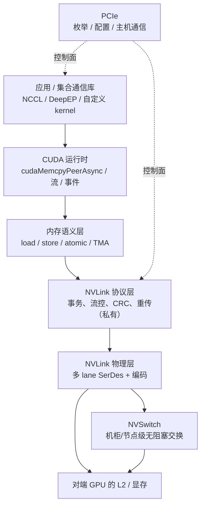

# NVLink / NVSwitch

> **一句话定位**：NVLink 是 NVIDIA 私有的高带宽 GPU 间互连，让一个 GPU 能对 peer GPU 的显存直接发起 load/store；NVSwitch 把它从"点对点"扩展成机柜/节点级的无阻塞交换网络，是 AI 训练集群的数据面。

## 1. 它解决什么问题

PCIe 把 GPU 接进主机，但它从来不是为"几十上百个加速器互相对话"设计的。当模型规模超过单卡显存、训练必须做 all-reduce / all-to-all 时，会遇到三个硬约束：

1. **带宽不够**：PCIe 每代每方向的可用带宽相对 GPU 的计算吞吐长期偏紧，梯度同步会成为瓶颈。
2. **语义绕远**：PCIe 上 GPU 访问 peer 显存通常要走 DMA 或主机代理，编程上不能像本地显存那样直接 `load/store`。
3. **拓扑受限**：PCIe 交换树的带宽收敛比、NUMA 归属和 Root Complex 限制，难以做到所有 GPU 两两之间等价、无阻塞。

NVLink 的定位就是：**把互连从"设备挂在主机总线上"改造成"GPU 之间的一等公民网络"**。

- 它是**内存语义（memory semantic）**的：GPU 可以像访问本地显存一样对 peer GPU 的显存发起 load/store，而不只是提交 DMA 描述符。
- 它是**私有**的：协议细节、编码、链路训练由 NVIDIA 定义，NVIDIA 未公开完整的电气与协议规范，外部无法自行实现兼容端点。
- 它常与 PCIe **并存**：PCIe 负责枚举、配置、主机通信、控制面；NVLink 负责 GPU 之间的高带宽数据面。

一个典型的对照是：

| 维度 | 走 PCIe | 走 NVLink |
| --- | --- | --- |
| 主要用途 | 主机↔设备、控制面、配置 | GPU↔GPU 数据面、集合通信 |
| 访问方式 | DMA / 映射后的有限 P2P | 直接 load/store、atomic |
| 拓扑 | 交换树 / Root Complex | 网状或 NVSwitch 全互联 |
| 带宽量级 | 每代有限，低于 GPU 间需求 | 从数百 GB/s 到数 TB/s 每 GPU |

## 2. 协议栈与分层位置

NVLink 不是一个"跑在 PCIe 上的协议"，而是与 PCIe 平行的另一条路径。从软件到物理介质大致可以这样分层：

要点：

- **NVLink 与 PCIe 是两条路径，不是同一条栈的上下层**。PCIe 提供枚举和主机连接；NVLink 处理 GPU 间流量。
- 在 NVSwitch 机型里，每块 GPU 有若干条 NVLink 连到 NVSwitch，交换芯片把任意 GPU 对连接起来，形成**无阻塞（non-blocking）**的全互联。
- 在只有 NVLink 直连（如双卡桥）的机型里，GPU 之间是点对点或多跳拓扑，没有交换级。

## 3. 请求模型

从主线的三问看，NVLink 最关键的变化是：**"读"变成了内存语义的 load，而不是非内存语义的 DMA 描述符**。

| 事务 / 请求类型 | 是否 Posted | 完成方式 | 数据单位 |
| --- | --- | --- | --- |
| GPU load（读 peer 显存） | Non-Posted | 需要响应数据返回，事务才结束 | cache line / 访存粒度 |
| GPU store（写 peer 显存） | Posted（语义上是 fire-and-forget） | 发出后不要求逐笔应答；可见性靠 fence 保证 | cache line / 写合并 |
| Atomic（atomicAdd 等） | 视实现，通常需要返回结果 | 由原子单元执行并回填 | 4/8 字节等标量 |
| P2P copy（cudaMemcpyPeerAsync） | 触发 DMA / 拷贝引擎 | 完成事件或流同步 | 批量字节 |
| TMA / async copy（SM→SMEM 等） | 异步发起 | mbarrier / 异步完成原语 | tile / 大块 |

需要强调：**"Posted/Non-Posted" 是 PCIe 的词汇，用它类比 NVLink 只是为了对齐主线**。NVLink 真正的语义是"内存访问 + 内存序"，而不是 PCIe 的事务类型表。NVIDIA 未公开 NVLink 的事务层字段细节，具体以官方文档为准。

## 4. 关键机制

### 4.1 内存语义的 load / store

这是 NVLink 与"传统 DMA 互连"最本质的区别。当一个 kernel 里出现对映射到 peer GPU 的指针的解引用时：

- **load** 会在远端显存/L2 产生一次读，并把数据拉回本地；
- **store** 会写向远端，通常先经过本地路径，再由互连送达。

对程序员而言，peer 显存和本地显存在指令层面没有区别，差别在于**延迟更高、且不保证自动的一致性顺序**。

### 4.2 P2P 与地址映射 / Unified Memory

- **P2P（Peer-to-Peer）**：让一个 GPU 直接访问另一个 GPU 的 BAR / 显存窗口，绕开主机内存中转。P2P 是否可用、能否走 NVLink，取决于拓扑、GPU 型号和 IOMMU 配置。
- **地址映射**：CUDA 需要建立"某个虚拟地址 → peer GPU 物理显存"的映射。统一寻址让同一指针在不同 GPU 上有不同物理落点。
- **Unified Memory**：页迁移 / 页面错误 / 按需放置。UM 的正确性依赖运行时插入的同步，而不是硬件透明缓存一致性。

### 4.3 GPUDirect

**GPUDirect** 是一族技术，让数据路径尽量绕开主机 CPU 和系统内存：

- **GPUDirect P2P**：GPU↔GPU 直接搬运。
- **GPUDirect RDMA**：网卡直接读写 GPU 显存，避免 GPU→主机内存→网卡的两跳。
- **GPUDirect Storage**：存储设备直接访问显存。

在 NVLink 机箱里，GPUDirect P2P 与 NVSwitch 结合，才能让 NCCL 把大 all-reduce 打到接近互连峰值。

### 4.4 CUDA async copy / TMA

- **async copy**（`cp.async` 等）允许把全局内存到共享内存的搬运异步化，减少寄存器占用、隐藏延迟。
- **TMA（Tensor Memory Accelerator）** 在更新的架构里成块搬运多维 tile，把地址生成和同步交给硬件。
- 这些机制会**大量并发地发起 load 与 store**，因此对**内存序与 fence** 的依赖比传统拷贝更强。

### 4.5 NVSwitch 与多播 / NVLink SHARP

- **NVSwitch** 提供机柜/节点级的交换，让任意 GPU 对之间的带宽不因拓扑收敛而下降。
- **NVLink SHARP（Scalable Hierarchical Aggregation and Reduction Protocol）** 把部分集合通信的规约（如求和）下沉到交换/网络侧，减少数据往返、降低对端计算压力。多播能力也让一份数据可以同时送达多个目的地。
- 这些能力的开放程度与具体世代相关，**私有细节以 NVIDIA 官方为准**。

### 4.6 fence / atomic / 系统屏障

因为 NVLink 不提供透明缓存一致性，**跨 GPU 的"写后读"必须显式排序**：

- `__threadfence_system()` 一类系统级 fence，用来让本 GPU 的写对其他处理器（包括 peer GPU、主机）可见；
- atomic 操作用来做跨 GPU 的计数、标志位、锁；
- 集合通信库在正确的点插入 fence，才能保证"这个 GPU 算完的梯度，另一个 GPU 读得到"。

## 5. 一致性语义

把一致性放在主线第三问的坐标上，NVLink 的位置是：

| 层级 | NVLink 的态度 | 后果 |
| --- | --- | --- |
| 无一致性 | 否（有可编程访存语义，但无自动缓存一致） | 至少提供内存语义的 load/store |
| IO 一致性 | 部分具备（设备对内存的访问可见性可管理） | 需要 fence 才能定序 |
| 全缓存一致性 | **不是**透明缓存一致 | L2 不自动互相窥探，软件负责同步 |

关键点：

- **内存语义 ≠ 缓存一致**。能 load/store，不等于硬件会自动维护 peer L2 之间的一致性。
- **可见性靠程序序 + fence + atomic**，而不是靠硬件窥探（snoop）。
- 这与 CPU 的多 socket 缓存一致（如 xGMI/UPI 上带一致性）形成鲜明对比：NVLink 把正确性的一部分责任交回给软件（NCCL、CUDA 运行时、用户 kernel）。

## 6. 主线视角：读进行时，写会怎样？

回到主线问题：**当一次 GPU load（读 peer 显存）还在进行、等待数据返回时，写会怎样？**

- 在**微架构层面**，NVLink 是高度并行的链路，读事务挂起期间，链路并不需要停下来等它；**写事务可以继续在链路上传输**，多条 outstanding 读也能同时存在。
- 在**内存序层面**，NVLink 默认更接近**松弛序（relaxed）**：硬件不保证不同地址、不同方向的访问按发射顺序对其他观察者可见。因此"读进行时写能否被允许、以及写何时可见"由**程序里的 fence 与 atomic** 决定，而不是由链路自动串行化。
- 在**对端资源层面**，如果对端的 outstanding 缓冲或目标 L2 端口被占满，写仍可能被背压延迟；但这属于流控，不是"读没回来就不许写"的语义约束。

一句话：**NVLink 允许读挂起时写继续穿行，代价是软件必须自己用 fence/atomic 把"读到的一定包含之前的写"这件事建立起来。**这与 PCIe"Posted 写允许越过 Non-Posted 读以避免死锁"在精神上一致，但 NVLink 少了 PCIe 那张强制的排序表，把更多责任推给了程序员。

## 7. 性能特性与典型实现

下面是量级描述，用于建立直觉；**不给出未经官方确认的精确定值**。

| 维度 | 早期（NVLink 1/2） | 中期（NVLink 3/4） | 较新世代（NVLink 5 及以后，规划/已发布以官方为准） |
| --- | --- | --- | --- |
| 每 GPU 双向聚合带宽 | 数百 GB/s | 千 GB/s 量级 | 数 TB/s 量级 |
| 每 GPU link 数 | 数条 | 十余条 | 更多 link / 更高每 link 速率 |
| 单跳延迟 | 百纳秒量级 | 百纳秒量级 | 仍在百纳秒量级，随手数变化 |
| 交换形态 | 直连 / 桥 | NVSwitch 机柜全互联 | NVSwitch + 更大规模域 |
| 集合通信 | 手工 P2P | NCCL + NVSwitch | NVSwitch + SHARP / 多播增强 |

生态现状：

- **软件栈成熟度高**：CUDA、NCCL、cuDNN/cuBLAS 分布式、训练框架（Megatron、DeepSpeed 等）都对 NVLink 拓扑有专门优化。
- **拓扑感知**：NCCL 会探测 NVLink 域、NVSwitch、PCIe 与 NUMA，自动选择通信算法与路径。
- **纵向封闭、横向开放**：NVLink 的端点/交换由 NVIDIA 提供；跨厂商机柜级互连则要看 UALink、以太网等开放路线（见 [UALink](/protocols/ualink)）。
- **与 PCIe 分工**：PCIe 做控制面与主机通信，NVLink 做数据面，两者在多卡服务器里长期共存。

## 8. 要点速记

- NVLink 是 **GPU-GPU 的内存语义互连**：可以 load/store peer 显存，而不只是 DMA。
- **NVSwitch** 把点对点扩展成机柜/节点级**无阻塞**交换，是训练集群数据面的核心。
- 与 PCIe 是**并行两条路径**：PCIe 管控制和主机，NVLink 管数据。
- 与 PCIe 一致的是"允许穿行以避免阻塞"；不同的是 NVLink **没有 PCIe 那样的强制排序表**。
- **内存语义 ≠ 缓存一致**：跨 GPU 可见性靠 `fence` + `atomic` + 系统屏障，主要由软件负责。
- **GPUDirect** 系列让数据绕开主机内存；**TMA / async copy** 让搬运更异步、更依赖内存序。
- **SHARP / 多播** 把部分规约下沉到网络侧，减少往返。
- 关键数字（带宽世代、延迟、link 数）NVIDIA **未完整公开**，以官方为准；本页只给量级。
- 主线复述：**读挂起时写可以穿行，但可见性由软件用 fence 显式建立**。
