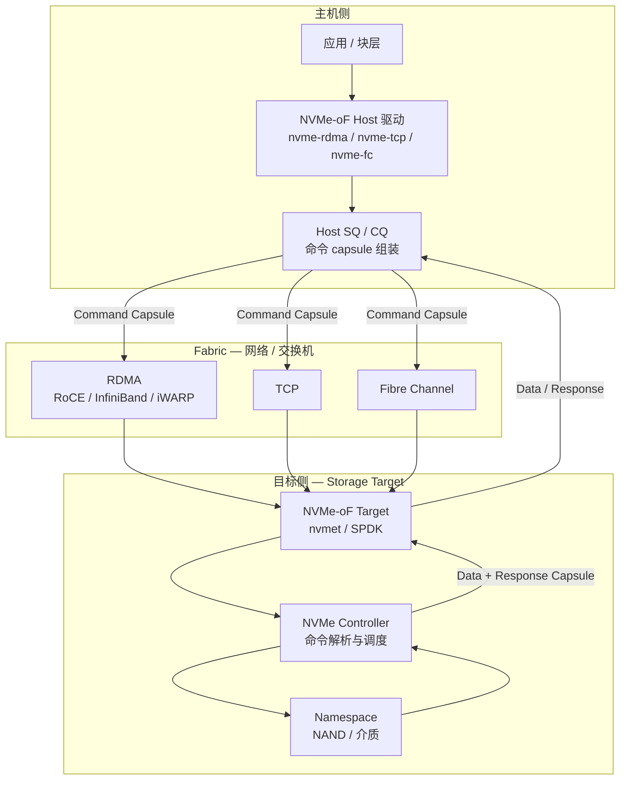

# NVMe over Fabrics

> **一句话定位**：NVMe-oF 把本地 NVMe 的"命令 - 完成"模型原封不动地搬到网络上，用 capsule 封装命令与数据、用 transport 抽象屏蔽 RDMA / TCP / FC 的差异，让远端 SSD 看起来仍是一条可提交命令的队列。

## 1. 它解决什么问题

NVMe 解决了本机 PCIe SSD 的接口并行度问题，但存储不可能永远挂在同一台机器上：

- PCIe 的物理覆盖只有机箱内几米（线缆化后仍限于一个机架/机房），跨节点访问只能走网络。
- 传统网络存储（iSCSI、FC、NFS）命令语义与块设备语义存在翻译损耗，且往往挂在 SCSI 栈上，延迟与软件开销都偏高。
- 应用需要的是"像访问本地 NVMe 一样访问远端 NVMe"，而不是又一层文件/对象协议。

NVMe-oF 的解法是**只换传输、不换命令语义**：

- 命令仍然是 64B 的 SQE，完成仍然是 16B 的 CQE；
- 把命令和（可选）数据打包成 **capsule**，通过 fabric 发送；
- 定义 **Transport 抽象层**，同一套命令可以跑在 RDMA、TCP、FC 上；
- 保留多队列、多 namespace、多路径、ANA 等本地 NVMe 的能力。

代价是每一次命令都要多一次（或多次）网络往返，网络 RTT 直接叠加到 I/O 延迟上。

## 2. 协议栈与分层位置

NVMe-oF 位于 NVMe 命令层与网络 transport 之间，向主机暴露的仍是 SQ/CQ 命令接口。

Transport 抽象的意义：命令层只面对"发送 capsule、收到 capsule、执行/完成"这几个原语，具体的零拷贝、注册内存、连接管理由 transport 实现（RDMA 上的零拷贝即把主机缓冲注册为 MR，直接由 HCA 读写）。

## 3. 请求模型

NVMe-oF 里所有请求**同样是 Non-Posted**：发出 capsule 后必须等 response capsule 才能算完成。数据可以选择内联在 capsule 里，或作为独立的 out-of-capsule 传输。

| 请求类型 | 是否 Posted | 完成方式 | 数据单位 |
| --- | --- | --- | --- |
| Connect | Non-Posted | Connect Response Capsule | 连接参数、队列数量 |
| Property Get / Set | Non-Posted | Response Capsule | 控制器属性 |
| I/O Read | Non-Posted | 先 Command Capsule，再 Data + Response Capsule | 512B / 4KiB 起的逻辑块 |
| I/O Write | Non-Posted | Command Capsule（可内联数据）→ Response Capsule | 逻辑块 |
| Flush / DSM | Non-Posted | Response Capsule | 无数据 / LBA 区间 |
| Keep Alive / Async Event | Non-Posted | Response Capsule | 保活与事件 |

两种数据承载方式：

- **In-capsule data**：小 I/O 直接把数据塞进命令或响应 capsule，省掉一次独立的 RDMA 操作，降低小 I/O 延迟。
- **Out-of-capsule data**：大 I/O 通过 SGL 指向主机内存，由 transport 做 RDMA Read / Write 搬运，避免 capsule 过大、保持零拷贝。

## 4. 关键机制

### 4.1 Capsule：命令与数据的容器

一个 **Command Capsule** 至少包含一条 64B 命令，后面可以跟 in-capsule 数据或 SGL。目标执行后回一个 **Response Capsule**，其中包含 16B CQE 与可选的数据（读操作的小数据）。capsule 是 NVMe-oF 的最小交互单位，也是事务边界的载体。

### 4.2 队列映射：Host 侧 SQ/CQ 与 Controller 侧队列

Host 侧仍然维护 SQ/CQ。以 RDMA transport 为例，目标通过 RDMA Read 去读取 Host 内存中的 SQ 条目，执行完后用 RDMA Write 把 CQE 写回 Host 的 CQ；TCP transport 则更接近"发送 capsule 出去、收到 capsule 回来"。无论哪种，**队列的所有权与深度语义保持一致**，只是取命令/放完成的手段从本地 DMA 变成了网络传输。

### 4.3 队列级流控与 Credit（SQHD）

NVMe-oF 不会让主机无限发出命令。每个 Response Capsule 里带回 **SQHD（SQ Head Pointer）**，它表示目标已经消费到队列的哪个位置。主机据此判断可用槽位：队列已满时就停止提交。SQHD 实际上扮演了**队列级 credit** 的角色，把网络传输的背压传导给上层块层，避免目标侧被冲垮。

### 4.4 读要先发命令，再等数据与响应

这是与本地 NVMe 最直观的差异：

- **本地 NVMe 读**：提交 SQE → 设备直接把数据 DMA 到主机 → 写 CQE。
- **NVMe-oF 读**：发送 Command Capsule（一个网络往返）→ 目标解析并向主机发起数据搬运（RDMA Read/Write 或 Data Capsule）→ 返回 Response Capsule（又一个方向）。

也就是说，一次远端读至少叠了一个网络 RTT，大 I/O 的吞吐则受限于 fabric 带宽与传输长度。in-capsule data 与 out-of-capsule data 的取舍，正是为了在小 I/O 延迟与大 I/O 效率之间平衡。

### 4.5 传输选择：RDMA 与 TCP 的取舍

| 传输 | 优势 | 代价 | 典型场景 |
| --- | --- | --- | --- |
| RDMA（RoCE / IB / iWARP） | 内核旁路、零拷贝、低 CPU 占用、低延迟 | 需要无损网络/拥塞控制、RDMA 网卡与内存注册 | 高性能数据中心、AI 训练存储 |
| TCP | 通用、无需专用网卡、易运维、可路由 | 拷贝与内核路径开销、延迟更高、CPU 占用高 | 云环境、通用服务器、成本敏感 |
| FC | 既有 SAN 生态、成熟运维 | 专用网络、生态相对封闭、速度演进慢 | 传统企业存储 |

## 5. 队列与并发结构

| 结构 | 规则 | 作用 |
| --- | --- | --- |
| Admin Queue | 每控制器一对 | Connect、Property、创建 I/O 队列 |
| I/O Queue Pair | 数量由 Connect 协商，可很多 | 承载 I/O，与本地 NVMe 同构 |
| 队列深度 | 由控制器能力与传输协商 | 决定 outstanding 命令数 |
| 流控 | 每个 Response 带 SQHD | 队列级 credit，形成背压 |
| 多路径 | 多个 controller / 路径 + ANA | 高可用与负载均衡 |
| Namespace | 通过 subsystem 暴露 | 远端逻辑块地址空间 |

并发要点：

- 多个 I/O 队列可以映射到不同 CPU 核，保持本地 NVMe 的"每核一队列"扩展性；不同队列的读写在 fabric 上独立并行。
- **ANA（Asymmetric Namespace Access）** 给每条路径标注 optimize / non-optimize / inaccessible，主机据此选路与故障切换。
- 多路径下同一 namespace 可通过多条路径并发访问，队列与 credit 是**按队列/连接**独立的。

## 6. 主线视角：读进行时，写会怎样？

**结论：远端读挂起时，写照样可以并发，而且比本地 NVMe 更需要并发——因为读的等待里多了一整个网络往返。**

拆开来看：

- **命令通道**：NVMe-oF 沿用 NVMe 的 Non-Posted 语义，读写都是 capsule 往返。不同 I/O 队列对应不同的 transport 连接 / QP，读与写在 fabric 上互不阻塞；同一队列内完成项顺序仍与提交顺序一致。
- **数据通道**：读是目标向主机搬数据（RDMA Write / Data Capsule），写是主机向目标搬数据（命令携带或 RDMA Read）。二者在 fabric 上反向流动，争的是网络带宽与目标侧缓冲，而不是本地 PCIe 事务顺序。
- **流控的影响**：如果读把队列占满、SQHD 不前进，后续写会因为拿不到 credit 而排队——这时的"写不能走"是**队列 credit 用尽**，不是协议禁止。
- **屏障**：与本地 NVMe 相同，跨路径没有顺序保证；需要"写到远端已持久化"仍靠 **Flush / FUA**，其语义经过 fabric 透传。

所以主线答案要补一句：**读进行时写通常并发，但读的网络往返会占用队列槽位，从而通过 SQHD credit 间接影响写的提交；真正的顺序保证来自 Flush / FUA，而不是 fabric。**

## 7. 性能特性与典型实现

| 指标 | 量级 | 说明 |
| --- | --- | --- |
| 本地 NVMe 4KiB 随机读延迟 | 几十 μs | 对照基线 |
| NVMe-oF over RDMA 增加延迟 | 约 5 ~ 20 μs / 往返 | 同机房、无损网络；队列深度大时可流水掩盖 |
| NVMe-oF over TCP 增加延迟 | 数十 ~ 上百 μs | 内核路径与拷贝开销更高 |
| 单连接带宽 | 10 / 25 / 100 / 200 / 400 GbE 级 | 受 fabric 与 HCA 能力限制 |
| 目标侧聚合带宽 | 聚合多连接可达数十 ~ 数百 GB/s | 取决于目标 CPU、网卡与后端介质 |
| 扩展性 | 队列数、连接数可水平扩展 | 通过多路径与多目标分散 |

生态实现：

- **主机侧**：Linux `nvme-rdma`、`nvme-tcp`、`nvme-fc`；SPDK 用户态 host。
- **目标侧**：Linux `nvmet`（含 `nvmet-rdma` / `nvmet-tcp` / `nvmet-fc`）、SPDK NVMe-oF target、DPDK 加速。
- **硬件**：NVIDIA/Mellanox ConnectX 系列、Broadcom、Marvell 等 RDMA/以太网适配器；智能网卡上的 target 卸载。
- **上层**：可对接 Ceph、分布式块存储、AI 训练的数据加载路径。

## 8. 要点速记

- NVMe-oF = **NVMe 命令语义 + 网络 transport**，命令仍是 SQE/CQE，只是多了 capsule 封装。
- **Transport 抽象**统一了 RDMA / TCP / FC；RDMA 的价值在零拷贝与内核旁路。
- **Capsule** 是最小交互单位；小 I/O 用 in-capsule data，大 I/O 用 out-of-capsule + SGL。
- **SQHD 就是队列级 credit**，是 fabric 上的流控与背压来源。
- 远端读 = 命令 capsule → 数据搬运 → response capsule，至少多一个网络 RTT。
- 多路径靠 **ANA** 选路；顺序保证仍靠 **Flush / FUA**，跨路径无顺序。
- 主线答案：**读进行时写并发，但读的 RTT 会占用队列 credit 间接影响写；同步点仍是 Completion。**
