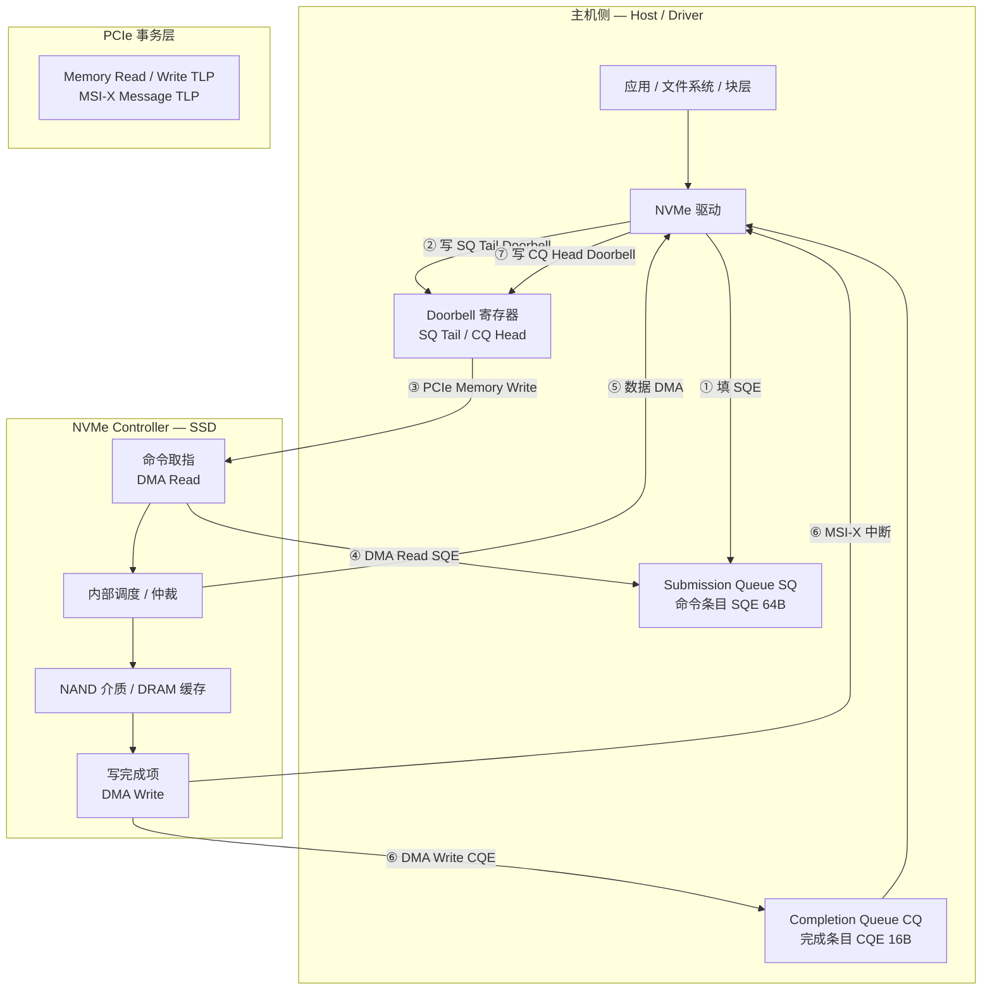

# NVMe

> **一句话定位**：NVMe 是跑在 PCIe 之上的存储命令协议，用成对的 Submission Queue / Completion Queue 把"提交命令"和"拿到完成"解耦，让主机以极低的软件开销把并行 I/O 压满设备内部带宽。

## 1. 它解决什么问题

在 NVMe 之前，PCIe SSD 大多仍以 AHCI / SCSI 的方式被访问，而这两套接口是为旋转介质和单队列时代设计的：

- **队列浅且少**：AHCI 每个端口只有一条深度 32 的命令队列，且命令提交要读写一组寄存器，天然串行。
- **软件路径重**：SCSI 命令需要经过 SCSI → ATA 翻译层，块层与驱动之间存在锁与全局队列，多核扩展性差。
- **同步方式昂贵**：每条命令一次中断、一次寄存器轮询，快速路径上既有 MMIO 读也有全局状态。

NVMe 直接把"存储设备"当成一个 PCIe 上的高并行设备来重新设计：

- **多队列**：最多 64K 条 I/O 队列，每条队列最多 64K 条目，驱动可以给每个 CPU 核分配独立队列，快路径无锁。
- **寄存器只写不读**：提交命令只写一个 **SQ Tail doorbell**，回收完成只写一个 **CQ Head doorbell**，全部是 MMIO write（Posted 事务）。
- **命令与完成分离**：命令放进 SQ，设备处理后把 16B 的完成项放进 CQ；主机不需要等设备回读寄存器。
- **为 NVM 而生**：命令集直接面向逻辑块与持久化语义（Flush、FUA、Dataset Management），不背 SCSI 的历史包袱。

结果是把协议开销压到近似只剩下 DMA 与介质时间，让接口不再是瓶颈。

## 2. 协议栈与分层位置

NVMe 位于 PCIe 事务层之上、块设备抽象之下：对上是命令队列接口，对下是纯 DMA 与 MSI-X。

关键点：主机侧的"提交"是一次 **Posted 写**（doorbell），但命令本身是 **Non-Posted** 的 —— 设备最终必须回一条完成项。DMA 数据搬运发生在设备与主机内存之间，走的是 PCIe Memory 事务。

## 3. 请求模型

NVMe 没有 PCIe 内存写那种"发出即结束"的语义：**每一条命令都要有一个 Completion**，Completion 是唯一同步点。

| 命令 / 请求类型 | 是否 Posted | 完成方式 | 数据单位 |
| --- | --- | --- | --- |
| Admin：Identify | Non-Posted | Admin CQ 写 16B CQE 后中断 | 4KiB 页（控制器/namespace 信息） |
| Admin：Create / Delete I/O SQ、CQ | Non-Posted | Admin CQE | 无数据 |
| Admin：Set / Get Features、Async Event Request | Non-Posted | Admin CQE（AER 可长期挂起） | 特征结构 / 事件 |
| I/O Read | Non-Posted | 数据 DMA 到主机缓冲后，向 I/O CQ 写 CQE | LBA，512B / 4KiB，可跨多个 PRP/SGL |
| I/O Write | Non-Posted | 数据写入介质或掉电保护缓存后，向 I/O CQ 写 CQE | LBA |
| Flush | Non-Posted | 之前对该 namespace 的写全部持久化后 CQE | 无数据 |
| Write Zeroes / Compare | Non-Posted | 操作完成后 CQE | LBA 区间 |
| Dataset Management（Deallocate / TRIM） | Non-Posted | 完成后 CQE | LBA 区间列表 |

要点：

- I/O Read 与 I/O Write 在队列模型里是对称的：都是"把 SQE 放进 SQ，等一条 CQE"。区别只在数据方向。
- **FUA（Force Unit Access）** 是写命令上的一个位：带 FUA 的写必须真正落到非易失介质后才产生 Completion，相当于把这条写变成屏障。
- 命令的"完成"只表示设备接受了操作并给出了结果状态，不代表数据已经可以被别的命令读到 —— 可见性由 Flush / FUA 与上层文件系统共同定义。

## 4. 关键机制

### 4.1 队列对与 doorbell

每条 I/O 队列是一对 SQ / CQ，位于主机内存。主机填充 SQE 后，把新的 **SQ Tail** 写到该队列对应的 doorbell 寄存器，设备据此知道"有新命令可取"。设备写完 CQE 后按 MSI-X 通知，主机处理完把 **CQ Head** 写回 doorbell，设备据此回收 CQ 槽位。快路径上主机只做 MMIO 写，没有寄存器读回，也没有跨核锁。

### 4.2 Phase Tag：区分新完成与旧完成

CQ 是环形缓冲，条目会被复用。每个 CQE 里有一个 **Phase Tag (P)** 位，初始相位为 0，环回一圈后翻转为 1。主机用"当前期望相位"逐个比较 CQ 槽位：相位匹配才说明这是一个尚未处理的新完成项。这样不需要额外计数器，就能在无锁环形缓冲上判断"有没有新完成"，也让 CQ Head 的推进与设备写 CQE 天然解耦。

### 4.3 PRP 与 SGL：数据缓冲区怎么描述

命令要访问主机内存（数据缓冲、PRP 列表等），有两种描述方式：

- **PRP（Physical Region Page）**：把缓冲区切成物理页（4KiB 起），用两级的 PRP List 串起不连续的物理页。简单、开销低，适合大多数块 I/O。
- **SGL（Scatter Gather List）**：更通用的分散聚集描述，可以表达任意长度、任意对齐的段，也是 NVMe-oF 与部分高级特性必需的描述方式。

选择合适的数据指针形式，直接决定了命令取指阶段需要多少次额外的 DMA 读。

### 4.4 中断聚合、轮询与 MSI-X

- **MSI-X**：每个队列可以有独立的中断向量，天然分散到不同 CPU 核；向量数由设备能力决定，常见从几十到上千。
- **中断聚合（Interrupt Coalescing）**：用 Interrupt Coalescing 特征控制"攒够 N 个完成或等 T 微秒再发一次中断"，用一点点延迟换中断率下降。
- **轮询（Polling）**：驱动可以不启用中断，直接轮询 CQ 的 Phase Tag。在队列深度高、IOPS 需求大的场景（如 SPDK、io_uring 轮询模式）能显著降低尾延迟，代价是占满一个核。

### 4.5 顺序语义：FUA、Flush 与内部调度

NVMe 不承诺跨队列的任何顺序。对同一 SQ：

- 控制器通常按提交顺序取指，但**启动与执行可以重叠，完成也可能乱序**；因此主机**不能**依赖"提交顺序 = 完成顺序"。
- 真正的顺序保证来自两个显式机制：**Flush**（阻塞到此前所有写持久化）与**写命令上的 FUA 位**。
- 命令中还有 SQ/CQ 深度、队列优先级（urgent / high / medium / low，加权轮询仲裁）等特性，影响的是调度公平性，而不是数据可见性。

## 5. 队列与并发结构

| 结构 | 规模 / 规则 | 作用 |
| --- | --- | --- |
| Admin Queue | 1 对，队列深度 ≤ 64K | 管理命令：Identify、创建 I/O 队列、设特征 |
| I/O Queue Pair | 最多 64K 对 | 承载读、写、Flush 等 I/O 命令 |
| 每队列深度 | 最多 64K 条目 | 决定 outstanding 命令上限 |
| SQ → CQ 映射 | 多个 SQ 可共用一条 CQ | 灵活分配中断与 CPU 亲和 |
| Doorbell | 每队列独立，步长由 DSTRD 决定 | 无锁提交 / 回收 |
| 中断 | MSI-X 每队列一个向量 | 队列与核绑定，避免惊群 |
| 命名空间 Namespace | 每控制器最多多个 | 逻辑块地址空间；可共享、可 ZNS 分区 |
| 多路径 | 多条路径 + ANA 状态 | 双端口高可用与负载均衡 |

并发要点：

- **每核一队列**是标准做法：CPU i 只碰自己的 SQ/CQ，doorbell 也是自己的，快速路径上没有 cache line 争用。
- 设备内部有一个**调度器/仲裁器**，在多个 SQ、多个 namespace、多个介质通道之间分配内部带宽；主机提交的先后不决定介质访问的先后。
- 通过 **SR-IOV** 可以把控制器虚拟化出多个 VF，每个 VF 有独立队列资源，直通给虚拟机。

## 6. 主线视角：读进行时，写会怎样？

**结论：在 NVMe 里，读挂起期间写可以正常进行，而且这是常态。** 需要分两层来看。

**命令通道：读写是对等的。** NVMe 里没有 PCIe 那种"Posted 写可以越过 Non-Posted 读"的仲裁问题，因为**所有命令都是 Non-Posted、都要 Completion**。一条读命令在 SQ 中等待结果时，另一条写命令完全可以被提交、被设备取走、甚至先完成：

- 跨队列之间没有任何顺序保证，读写天然并行；
- 同一队列内的完成项按提交顺序排列，但设备**执行**读与写可以重叠，二者争的是介质带宽与内部缓冲，不是总线顺序；
- 因此"读进行中没有写"在 NVMe 里不是协议特性，而是软件自己串行（或队列深度只有 1）造成的。

**数据通道：读写会反向争用 PCIe。** 读要把数据从设备 DMA 到主机内存（设备发起 Memory Write），写要把数据从主机 DMA 到设备（设备发起 Memory Read）。这两股流量在 PCIe 上受排序与带宽约束，但被 NVMe 完全封装在"命令 - 完成"模型之下，上层看不到。

**如果软件要"读到之前的写"，靠什么？** 不靠总线，靠协议里的两个屏障：

- **Flush**：它的 Completion 保证此前对该 namespace 的写已经持久化；
- **FUA 写**：这条写的 Completion 保证数据已落盘；
- 再往上才是文件系统 / journal 的写序与 fsync 语义。

所以，回答主线问题时要点明：NVMe 把"同步点"从 PCIe 的 Completion 包抽象成了 **CQ 中的一条完成项**；总线级的读写排序被隐藏，读写的并发与否完全由队列深度、设备调度与上层是否需要屏障决定。

## 7. 性能特性与典型实现

| 指标 | 量级 | 说明 |
| --- | --- | --- |
| 命令提交软件开销 | 约百纳秒级 | 填 SQE + 一次 doorbell MMIO 写 |
| 设备端 4KiB 随机读延迟 | 几十 μs | 高端 SSD 可低至 ~10μs 级，NAND 主控多为几十 μs |
| 端到端 4KiB 随机读延迟 | 数十 ~ 百余 μs | 含块层、调度、中断/唤醒 |
| 单盘 4KiB 随机读 IOPS | 十万 ~ 百万级 | 取决于队列深度与介质并行度 |
| 顺序带宽 | Gen4 x4 约 7 GB/s；Gen5 x4 约 14 GB/s | 协议开销小，接近 PCIe 链路上限 |
| 队列规模 | 每队列 ≤ 64K 条目，≤ 64K 队列 | 主机侧可扩展性来源 |

生态实现：

- **驱动 / 用户态栈**：Linux `nvme` 驱动、`io_uring`、SPDK、libaio；Windows `stornvme`。
- **控制器厂商**：Samsung、Micron、Kioxia、SK hynix、Solidigm、WD 等几乎全部 PCIe SSD 主控。
- **扩展特性**：ZNS（分区命名空间）、CMB / PMR（控制器内存缓冲 / 持久内存区）、多路径与 ANA、端到端数据保护（PI）。
- **形态**：U.2 / M.2 / E1.S / E3.S，OCP 数据中心 SSD 规范大量基于 NVMe。

## 8. 要点速记

- NVMe 是**命令队列协议**，不是总线协议：SQ 提交、CQ 完成、doorbell 通知，快路径只有 MMIO 写。
- 所有命令都是 **Non-Posted**，Completion 是唯一同步点；没有"发出即忘"的写。
- **Phase Tag** 解决环形 CQ 的新旧判断，无需额外锁。
- **PRP vs SGL** 是数据指针的两种表达，影响命令取指开销与适用范围。
- 读写命令在 SQ 中交错、在设备内部由调度器仲裁；**跨队列无顺序**，顺序靠 **Flush / FUA** 显式建立。
- 主线答案：**读进行时，写照常发生**；需要"读到最新写"时，用 Flush / FUA，而不是假设总线会帮你排序。
