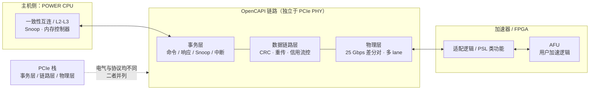
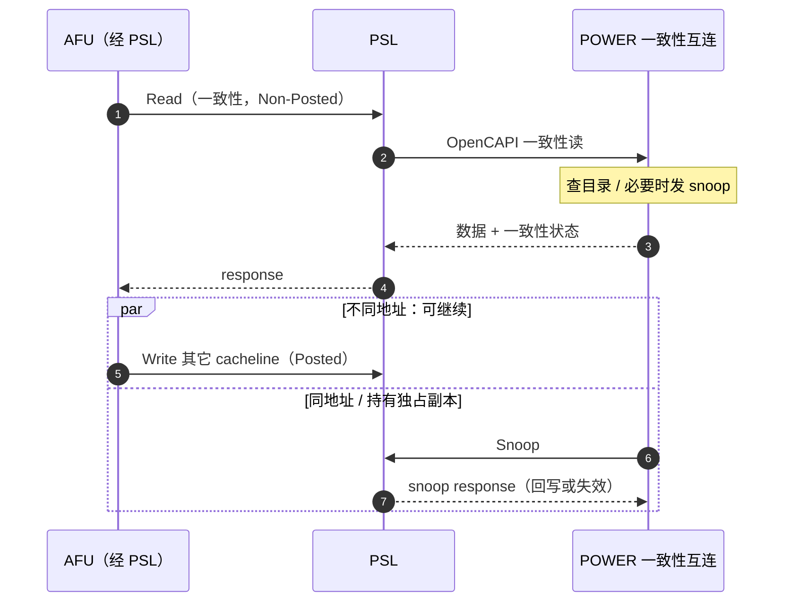

# OpenCAPI

> **一句话定位**：OpenCAPI 是 IBM 把多年 CAPI 经验开放出来的一套一致性加速器接口，用独立的 25 Gbps 差分链路（而不是 PCIe 电气）连接 POWER CPU 与 FPGA / 加速器，让加速器以 load/store 语义低延迟访问主机内存。

## 1. 它解决什么问题

在 POWER8 时代，IBM 用 CAPI 把处理器的缓存一致性互连暴露给 FPGA，加速器可以像访问本地内存一样访问主机内存。但 CAPI 是 IBM 私有接口，生态只有自家平台，FPGA 厂商每支持一代都要重新适配。为了让更多厂商参与，IBM 于 2016 年牵头成立 OpenCAPI Consortium（成员含 Google、AMD、Xilinx、Mellanox、Micron 等），把一致性加速器接口开放出来。

OpenCAPI 的核心动机有两点：一是**低延迟** —— PCIe 的 DMA 模型需要描述符、doorbell、往返，访问主机数据要经过多次软件可见的跳转；OpenCAPI 让加速器直接发一致性请求，省掉这些中间步骤。二是**更简单的编程模型** —— 加速器与 CPU 共享地址空间，用 load/store 语义读写主机内存，不需要把数据搬到设备侧再处理。

与 PCIe 的关系：OpenCAPI **不复用 PCIe 物理层**，它有自己的物理层（25 Gbps 量级差分信号）、数据链路层与事务层，因此在电气上与 PCIe 是并列而非叠加关系。这一点与 CXL（复用 PCIe PHY）和 CCIX（复用 PCIe PHY）都不同，也是 OpenCAPI 系统集成成本更高的原因之一。

把 OpenCAPI 放回主线，它要回答的问题是：**加速器能不能成为一致性域的正式成员，而不是域外的 DMA 引擎**。PCIe 的读是 Non-Posted 的事务，但访问主机内存仍要经过驱动编排；OpenCAPI 让加速器的读直接进入缓存一致性协议，命中与未命中都由硬件 snoop 处理，软件只负责初始化与错误路径。

## 2. 协议栈与分层位置

OpenCAPI 是一条独立链路，与 PCIe 栈并列；它的物理层后来还被 OMI（Open Memory Interface）继承用于内存缓冲芯片：

与 PCIe 对照：PCIe 设备访问主机内存必须经过 DMA 与软件同步，而 OpenCAPI 的事务层直接携带一致性的读 / 写 / snoop，加速器是**一致性域内的参与者**，不是域外的 DMA 引擎。

## 3. 请求模型

| 事务 / 命令 | 方向 | 是否 Posted | 完成方式 | 数据单位 |
| --- | --- | --- | --- | --- |
| Read（带一致性） | AFU → 主机内存 | 否 | response 带数据与状态 | cacheline（POWER 为 128 B） |
| Write / WriteFlush | AFU → 主机内存 | 是（可 Posted） | 无完成或按需响应 | cacheline |
| Atomic | AFU → 主机内存 | 否 | response | 数据字 |
| Snoop | 主机 → AFU 缓存 | 否（需响应） | snoop response | cacheline |
| Interrupt | 主机 → AFU 或 AFU → 主机 | 是 | 无 | 由驱动处理 |
| Command / Response 队列 | 双向 | 由实现决定 | doorbell 触发 | 描述符 |
| DMA（穿过适配逻辑） | 双向 | 是 | 无 | 描述符 / 数据块 |

一致性读是 Non-Posted、必须等数据与状态返回；写默认 Posted，除非需要状态转移而要求响应。

## 4. 关键机制

### 4.1 独立的 25 Gbps 差分链路

OpenCAPI 使用 25 Gbps 量级的差分信号，多 lane 聚合提供带宽。因为不复用 PCIe PHY，它不需要在训练阶段做协议协商，链路直接按 OpenCAPI 语义工作，省掉了 PCIe 的很多兼容性开销；代价是主机必须提供专用端口，无法直接用普通 PCIe 插槽。

### 4.2 AFU 与 PSL 的分工

FPGA / 加速器侧的逻辑分成两层：**AFU（Accelerator Function Unit）** 实现用户算法，**PSL（Processor Service Layer）** 是运行在 FPGA 上的协议层，负责在 AFU 与 POWER 一致性互连之间做转换 —— 排队、地址翻译、snoop 处理、中断与错误上报都由 PSL 完成。AFU 只看到一组命令 / 响应接口与缓存接口，一致性细节被 PSL 屏蔽。这一分工与 CAPI 一脉相承，详见 [CAPI / PSL](/protocols/capi-psl)。

### 4.3 面向一致性的内存访问

OpenCAPI 的读请求可以指定一致性状态（共享读 / 独占读），主机侧 home agent 据此决定是否向其它缓存代理发 snoop。加速器可以持有主机 cacheline 的缓存副本，状态由主机的 snoop 机制维护。相比 PCIe DMA 的"先 flush 再读"，这种方式把一致性交给硬件，降低了软件同步频率。

### 4.4 地址翻译与保护

加速器使用与 CPU 相同的地址视图访问主机内存，翻译由主机侧完成；加速器侧可缓存翻译结果以减少往返。多进程 / 多上下文场景下，通过上下文标识区分地址空间，避免不同进程互相干扰。

### 4.5 OMI：物理层的延续

OpenCAPI 的链路技术后被用于 **OMI（Open Memory Interface）**，把 DDR 内存挂在一条串行链路上，由内存缓冲芯片完成协议转换。这让 OpenCAPI 的物理层在内存扩展方向留下了实际产品，而不是随接口本身一起消失。

## 5. 一致性语义

OpenCAPI 提供的是**全缓存一致性**：AFU 可以作为一致性域内的缓存代理持有主机数据副本，主机的 snoop 会到达 AFU，状态由 PSL 维护。这与 CXL.cache 的定位类似，但 OpenCAPI 的地址粒度是 POWER 平台的 cacheline（128 B），与 CXL 的 64 B 不同。

需要区分：**一致性覆盖的是主机内存，而不是 PCIe DMA 语义**。OpenCAPI 也允许设备做类 DMA 的数据搬运，但那条路径不受一致性保护，需要软件同步；只有走 OpenCAPI 一致性事务的访问才由硬件保证。

| 维度 | OpenCAPI | CXL.cache |
| --- | --- | --- |
| 一致性级别 | 全缓存一致性 | 全缓存一致性 |
| 覆盖对象 | 主机内存（加速器缓存主机数据） | 主机内存（设备作为 caching agent） |
| 一致性粒度 | 128 B cacheline（POWER） | 64 B cacheline |
| 物理层 | 独立 25 Gbps 差分链路 | 复用 PCIe PHY |
| 地址空间 | 与 CPU 共享，主机侧翻译 | 与 CPU 共享，ATS / PASID 翻译 |
| 软件介入 | 初始化与错误路径 | 初始化与错误路径 |

## 6. 主线视角：读进行时，写会怎样？

OpenCAPI 的一致性读是 Non-Posted，必须等 response 返回。读进行时的写，同样按地址区分：

- **不同地址**：写可以继续，链路与主机互连按地址独立处理，读不会阻塞无关写。
- **同一地址**：写会被主机侧的排序点（home agent）串行化在未完成的读之后，或先通过 snoop 协调状态，避免读到旧值。
- **AFU 缓存持有的行**：若主机要写入 AFU 正持有独占副本的地址，主机会发 snoop，AFU 必须回写或失效，这次写才能完成 —— 此时是"写等读（等 snoop 响应）"，方向反过来。

所以 OpenCAPI 下"读进行中没有写"只发生在同一 cacheline；跨 cacheline 的读写是流水重叠的。由于读要等一个完整的一致性往返，outstanding 数量与 snoop 延迟决定吞吐上限，这一点与 CXL.cache 类似。

## 7. 性能特性与典型实现

| 项目 | 量级 | 说明 |
| --- | --- | --- |
| 单 lane 速率 | 25 Gbps 量级 | 差分信号，独立于 PCIe |
| 多 lane 带宽 | 数十 GB/s 量级（视 lane 数） | x8 量级可达 25 GB/s 单向 |
| 一致性访问延迟 | 数百纳秒量级 | 明显低于 PCIe DMA 往返 + 软件同步 |
| 与 PCIe DMA 对比 | 更低延迟、更少软件介入 | 代价是专用端口 |
| 一致性粒度 | cacheline（POWER 128 B） | 读写都可能触发 snoop |

| 角色 | 代表实现 / 平台 |
| --- | --- |
| CPU | IBM POWER9 / POWER10 |
| 加速器 | AMD（Xilinx）Altera FPGA 上的 OpenCAPI 设计 |
| 联盟 | OpenCAPI Consortium（IBM、Google、AMD、Xilinx、Micron 等） |
| 物理层延续 | OMI（Open Memory Interface）用于 DDR 内存缓冲 |
| 现状 | 未在 POWER 之外广泛落地，工业界转向 CXL |

没有 OpenCAPI 时，POWER 上的加速器只能走 PCIe DMA 或私有 CAPI；有 OpenCAPI 后，第三方 FPGA 可以用统一接口做低延迟一致访问，但可移植性仍局限于 POWER 平台。

## 8. 要点速记

- OpenCAPI 由 IBM 主导、2016 年成立联盟，目标是开放的一致性加速器接口。
- 物理层是独立的 **25 Gbps 量级差分链路**，不复用 PCIe PHY，与 PCIe 栈并列。
- 加速器以 load/store 一致性语义访问主机内存，省掉 DMA 描述符与软件同步。
- 设备侧分为 **AFU（用户逻辑）** 与 **PSL（协议适配层）**，一致性、翻译、中断由 PSL 处理。
- 提供**全缓存一致性**，一致性粒度是 POWER 的 128 B cacheline。
- 读是 Non-Posted，写默认 Posted；同地址读写被主机排序点串行化。
- 物理层被 OMI 继承用于内存接口，是它留下的实际影响。
- 生态局限在 POWER，最终被 CXL 取代。
