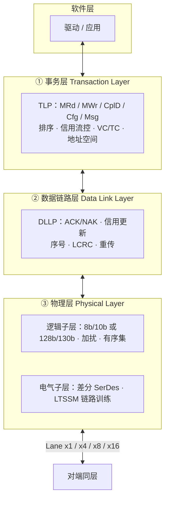
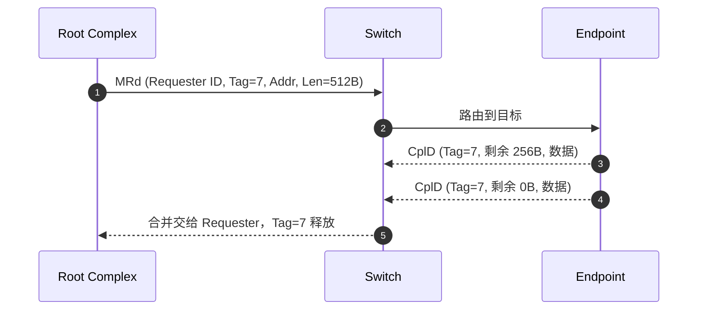
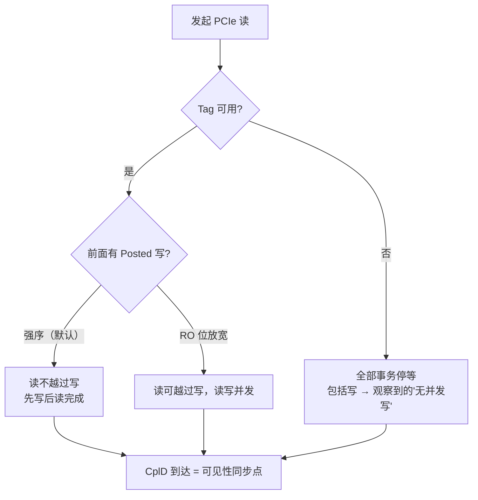

# PCIe（Peripheral Component Interconnect Express）

> **一句话定位**：现代计算机的"总线语法"。它定义了事务（TLP）、完成（Completion）、
> 流控与排序，其它板级协议要么复用它，要么照抄它的思想。

## 1. 它解决什么问题

PCIe 要解决的是 PCI/PCI-X 那套**共享并行总线**的扩展性瓶颈：

| 老问题（PCI/PCI-X） | PCIe 的方案 |
| --- | --- |
| 总线是共享的，同一时刻只能一个主设备用 | 点对点链路（Point-to-Point），每个设备独占自己的 lane |
| 并行信号线多、频率上不去、走线难 | 高速串行差分对（Lane），按 lane 数扩展（x1/x2/x4/x8/x16） |
| 阻塞式事务，一次读占满总线 | 拆分事务（Split Transaction），请求与完成解耦 |
| 中断是共享的中断线 | MSI / MSI-X：用 Posted 写发送中断消息 |
| 设备只能 DMA 到物理地址 | ATS/PASID：设备侧地址翻译 + 进程地址空间 |

结果是 PCIe 从"一条总线"变成了**一个可交换的网络**：Root Complex、Switch、Endpoint 组成树形拓扑，每段链路独立训练与流控。

## 2. 协议栈与分层位置

PCIe 分三层，每层只跟对端同层对话：

三层的分工可以这样记：

- **事务层**：定义"要干什么"（读、写、配置、中断），并负责排序与流控。
- **数据链路层**：保证"这段链路上别丢包"。用序号、LCRC 与 ACK/NAK 重传实现可靠传输。
- **物理层**：把比特送出去，负责链路训练、速率协商、编码与加扰。

::: tip 一个关键分工
**PCIe 的可靠性是在链路层做的**（LCRC + ACK/NAK + 重传），而**端到端的可靠性靠 ECRC/AER**。这也是它与 RDMA 的区别起点：RDMA 把可靠性做成了端到端、且绕开内核。
:::

## 3. 请求模型

PCIe 的事务由 **TLP** 承载。四种地址空间对应不同事务类型：

| 地址空间 | 读 | 写 | 说明 |
| --- | --- | --- | --- |
| Memory | `MRd` | `MWr` | 主角：DMA 与 MMIO |
| Configuration | `CfgRd0/1` | `CfgWr0/1` | 设备枚举与配置空间 |
| I/O | `IORd` | `IOWr` | 历史遗留，逐渐淘汰 |
| Message | — | `Msg` / `MsgD` | 中断（MSI/MSI-X）、电源管理、错误信令 |

按 posted 属性分：

| 类型 | Posted？ | 完成包 | 典型用途 |
| --- | :---: | --- | --- |
| `MWr` 内存写 | ✅ | 无 | 设备 DMA、写 MMIO 寄存器 |
| `MRd` 内存读 | ❌ | `CplD` | 设备读内存、CPU 读设备 BAR |
| `CfgWr` 配置写 | ❌ | `Cpl`（无数据） | 配置设备 |
| `AtomicOp` 原子 | ❌ | `CplD` | 跨设备原子（FetchAdd/Swap/CAS） |
| `Msg` / `MsgD` | ✅ | 无 | MSI-X 中断 |

**要点**：一次读可以有多个 `CplD`；`Tag` 是唯一配对键；`Byte Count` 判断是否收齐（详见[主线页](/guide/request-lifecycle)）。

## 4. 关键机制

### 4.1 信用流控（Credit-Based Flow Control）

PCIe 不用"发出去再重传"做流控，而是**接收方先把缓冲空间通告出来**：

| 信用类型 | 对应资源 | 说明 |
| --- | --- | --- |
| `PH` / `PD` | Posted 头 / 数据 | 给 MWr、Msg |
| `NPH` / `NPD` | Non-Posted 头 / 数据 | 给 MRd、CfgWr |
| `CPLH` / `CPLD` | Completion 头 / 数据 | 给 CplD |

接收方用 `InitFC` 初始通告、`UpdateFC` 动态补充。**发不出去不是丢包，而是没有信用**。这带来两个后果：

- 不会因为拥塞而丢包，因此延迟更可预测；
- 信用耗尽会直接把上游背压住，形成天然的限流。

### 4.2 虚拟通道与流量类别（VC / TC）

TC（Traffic Class）标记 TLP 的优先级类别，VC（Virtual Channel）是物理链路上承载 TC 的独立缓冲与信用池。**不同 TC 之间没有顺序保证，可以互相超过**——这既是 QoS 手段，也是排序模型的关键前提。

### 4.3 中断：MSI / MSI-X

- 传统 INTx：物理中断线，共享、易丢失。
- **MSI**：设备用 `MWr` 写一个约定地址（Posted 写）产生中断，携带一个数据字作为向量号。
- **MSI-X**：支持更多向量（最多 2048），每个向量可独立指定地址与数据 ——**可以让每个队列绑定一个独立中断**，天然适合多队列设备。

### 4.4 SR-IOV：硬件虚拟化

单个物理设备暴露为 **PF（Physical Function）** + 多个 **VF（Virtual Function）**，每个 VF 可直通给一个虚拟机。这让"虚拟机直接用硬件"而不必经过 virtio 软件模拟，代价是要处理 VF 的地址翻译与隔离（配合 ATS/PASID）。

### 4.5 ATS / PASID / PRI：设备侧地址翻译

| 机制 | 全称 | 作用 |
| --- | --- | --- |
| **ATS** | Address Translation Services | 设备缓存 IOMMU 的地址翻译结果，减少每次 DMA 都查表 |
| **PASID** | Process Address Space ID | 让设备请求携带进程标识，支持共享虚拟内存（SVA） |
| **PRI** | Page Request Interface | 设备遇到未映射页时，主动向 IOMMU 请求换页 |

三者合起来让设备可以像 CPU 一样使用**虚拟地址**，而不只是物理地址 DMA。这是 GPU/加速器与 CPU 共享地址空间的基础。

### 4.6 P2P DMA

两个 Endpoint 之间直接传数据，不经过主内存（或经 RC 转发）。对 GPU 直连 NVMe、GPUDirect Storage 这类场景至关重要。P2P 能否成立取决于拓扑（是否在同一 Switch 下）与 RC 的转发能力。

### 4.7 错误处理：AER 与 Completion Timeout

Posted 写出错是静默的，所以 PCIe 需要：

| 机制 | 作用 |
| --- | --- |
| `AER` | 高级错误报告：正确/非正确错误分级上报 |
| `Completion Timeout` | 读超时（目标不该）。可配置超时策略 |
| `Poisoned TLP` | 标记数据已损坏，避免误用 |
| `ECRC` | 端到端 CRC，跨 Switch 校验 |

## 5. 队列与并发结构

PCIe 本身没有"提交队列/完成队列"这种软件队列（那是 NVMe 的事），它的并发单位是：

| 资源 | 含义 | 对性能的影响 |
| --- | --- | --- |
| Tag | 未完成 Non-Posted 事务的编号 | 默认 32/function，Extended Tag 256；决定 outstanding 上限 |
| VC 信用 | 每个 VC 的头/数据信用 | 决定能否持续灌满链路 |
| MRRS | 单次读请求最大字节 | 影响读效率与完成包数量 |
| MPS | 单 TLP 最大载荷 | 影响包头开销占比 |
| RCB | 完成包边界 | 影响完成包的对齐与数量 |

**吞吐直觉**：

在途请求数为 $N$、单次数据量为 $S$、往返时间为 $RTT$ 时，可达到的吞吐为

$$
\text{Throughput} \approx \min\!\left( BW_{\text{link}},\ \frac{N \times S}{RTT} \right)
$$

在链路很宽（Gen5 x16）而往返时间在数百纳秒时，**outstanding 数往往先于链路带宽成为瓶颈**。

## 6. 一致性语义

PCIe 自己**不提供缓存一致性**。它提供的是：

- **排序**：默认强序 + RO/IDO 放松（见[顺序页](/guide/ordering)）；
- **地址翻译与隔离**：ATS/PASID/PRI；
- **原子操作**：`AtomicOp` 可用于跨设备的无锁同步。

所以 PCIe 设备看到的内存是"某一时刻的物理/IO 虚拟地址内容"，CPU 缓存里的最新值不保证可见。要一致性，得往上走：

  <a class="p-card" href="/protocols/cxl">
    
CXL.cache缓存一致

    
设备缓存主机内存，由 CXL 一致性协议接管监听。

  </a>
  <a class="p-card" href="/protocols/nvlink">
    
NVLink内存语义

    
GPU 之间 load/store，但需要显式 fence。

  </a>

## 7. 主线视角：读进行时，写会怎样？

这是全站主线在 PCIe 上的标准答案：

| 视角 | 结论 |
| --- | --- |
| **规范** | Posted 写**允许越过**挂起的 Non-Posted 读（防死锁）。所以硬件层面读写可以并存 |
| **强序约束** | Non-Posted 读**不能越过** Posted 写；Posted 写**不能越过** Posted 写 |
| **完成即同步点** | 读的 `CplD` 返回，意味着 Target 已经处理完这次读；软件常把它当作"此前的写已生效"的锚点 |
| **资源受限时** | 若 Tag 用尽或读缓冲只有一份，读未完成前发不出任何事务（含写）→ 表现为"读进行中没有写" |

对上你提出的那个观察：**PCIe 规范并不禁止读与写并存**，所以"BAM 完成读请求时不存在进行中的写"更可能是以下之一：

1. **Tag/缓冲单份**：一次只允许一个事务在途，天然串行；
2. **软件串行**：读-改-写被写成顺序代码，或在中间插了屏障；
3. **把读当同步点**：为确保可见性，刻意先等读完成再发写。

如果你能确认 BAM 一侧的 Tag 配置与驱动代码，这三种情况是可以区分开的 —— 这也是定位性能瓶颈的第一步。

## 8. 性能特性与典型实现

### 8.1 每代速率与单 lane 有效带宽

单 lane 有效带宽由速率与编码效率决定：

$$
BW_{\text{lane}} = \frac{Rate_{\text{GT/s}} \times \eta_{\text{encoding}}}{8}
$$

其中 8b/10b 的 $\eta = 0.8$，128b/130b 的 $\eta = 128/130 \approx 0.985$。

| 代次 | 速率 | 编码 | 单 lane 单向有效带宽 | x16 单向 |
| --- | --- | --- | --- | --- |
| Gen1 | 2.5 GT/s | 8b/10b | ~0.25 GB/s | ~4 GB/s |
| Gen2 | 5.0 GT/s | 8b/10b | ~0.5 GB/s | ~8 GB/s |
| Gen3 | 8.0 GT/s | 128b/130b | ~0.985 GB/s | ~15.75 GB/s |
| Gen4 | 16 GT/s | 128b/130b | ~1.97 GB/s | ~31.5 GB/s |
| Gen5 | 32 GT/s | 128b/130b | ~3.94 GB/s | ~63 GB/s |
| Gen6 | 64 GT/s | PAM4 + FLIT | ~7.88 GB/s | ~126 GB/s |

::: warning 量级而非承诺值
以上为编码后理论有效带宽量级，实际受 TLP 头开销、流控、拓扑与 outstanding 限制影响。Gen6 引入 PAM4 与 Flit 模式，重传粒度与编码都变了，实际效率与 Gen5 不可直接比较。
:::

### 8.2 延迟量级

| 访问 | 量级 | 说明 |
| --- | --- | --- |
| MMIO 寄存器读写 | 数百纳秒 | 一次 Non-Posted 读 = 一个往返 |
| DMA 读 | 数百纳秒（端到端） | 加上设备处理与内存访问 |
| MSI-X 中断投递 | 数百纳秒 ~ 微秒 | Posted 写 + 中断控制器 |
| Switch 增加一跳 | 数十 ~ 100+ ns | 每级交换都加延迟 |

### 8.3 生态

- **Root Complex / Switch**：Intel/AMD CPU 内集成 RC；Broadcom、Microchip、ASMedia 等提供 Switch。
- **Endpoint**：GPU、NVMe SSD、网卡（HCA）、FPGA 加速卡。
- **FPGA/ASIC IP**：Xilinx（AMD）XDMA、Intel PCIe 硬核、Pango 等。
- **软件**：Linux `pci` 子系统、`/sys/bus/pci`、VFIO、DPDK。

## 9. 要点速记

- 三层分工：事务层管语义与流控，链路层管可靠重传，物理层管信号与训练。
- 写 Posted、读 Non-Posted；配置写/IO 写虽是写却 Non-Posted。
- 一次读可产生多个 `CplD`，用 `(Requester ID, Tag)` 配对，`Byte Count` 判收齐。
- Tag 数与信用是"吞吐不达链路带宽"的头号嫌疑。
- 排序表两条核心：写不越写、写可越读（防死锁）。
- PCIe 不提供缓存一致性；要一致性交给 CXL，要扩展内存交给 CXL.mem。
- SR-IOV 是虚拟化入口，ATS/PASID/PRI 是设备侧虚拟地址的三件套。

继续：[CXL](/protocols/cxl) 看 PCIe 物理层上如何长出缓存一致性与内存池化。
