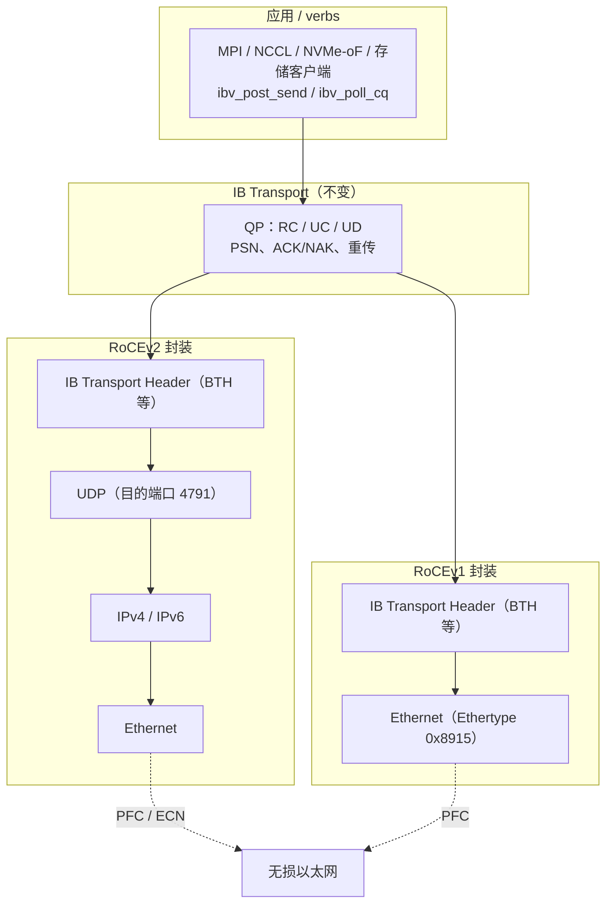
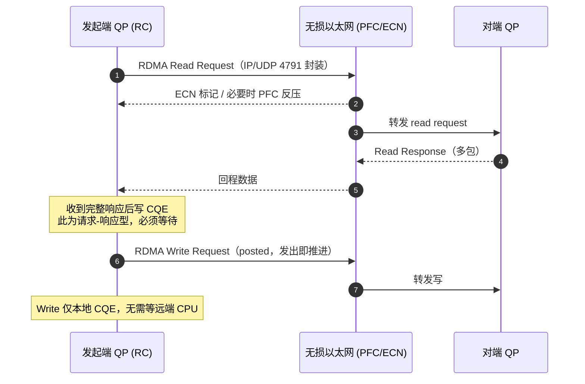

# RoCE

> **一句话定位**：RoCE（RDMA over Converged Ethernet）把 InfiniBand 的 verbs 语义原封不动搬到以太网上，用 RoCEv1 做二层、RoCEv2 做可路由的三层 UDP 封装；它复用了 IB 的 QP / WQE / CQE 模型，代价是必须把以太网配置成"无损"，这成为部署中最难的一环。

## 1. 它解决什么问题

InfiniBand 的 verbs 很好用，但要求专用交换机、专用线缆、专用运维体系。数据中心里已经铺满了以太网，于是自然的问题变成：

- **能不能保留 verbs 编程模型与 RDMA 性能，同时跑在标准以太网链路与交换机上？**
- **能不能复用现有 IP 网络的路由、运维与规模？**

RoCE 就是这两个问题的答案：它不重新发明内存访问语义，而是重新发明"承载链路"。

它带来的直接收益：

1. **统一网络**：存储、计算、管理流量可以共享一张以太网，减少专用网络与运维成本；
2. **API 兼容**：应用代码与 `libibverbs` 基本不变，`Send` / `RDMA Read` / `RDMA Write` / `Atomic` 语义一致；
3. **可路由（RoCEv2）**：以 IP 为基础，可跨子网扩展，适合大规模数据中心。

它引入的代价同样明确：**以太网默认是有损、无连接、共享缓冲的**，而 RDMA 的可靠传输假设底层丢包极少。于是"如何让以太网接近无损"成了 RoCE 的核心工程问题。

## 2. 协议栈与分层位置

RoCE 的关键是"IB 传输层 + 以太网链路层"的拼装。两个版本的分层差异就在封装位置：

两种封装的根本差别：

| 维度 | RoCEv1 | RoCEv2 |
| --- | --- | --- |
| 封装层 | 直接叠在 Ethernet 之上 | IB 传输头 → UDP → IP → Ethernet |
| 标识 | Ethertype `0x8915` | UDP 目的端口 **4791** |
| 可路由 | 否，二层内 | 是，跨子网可路由 |
| 寻址 | GID 基于 MAC | GID 基于 IPv4 / IPv6 |
| 现状 | 基本被 v2 取代 | 事实标准 |

**为什么是 UDP 而不是 TCP？** 因为 RDMA 的可靠性已经在 IB transport 层自己做了（PSN、ACK/NAK、重传）。再套一层 TCP 会引入重复的可靠性状态机与额外开销，还会破坏 RDMA 的乱序容忍与零拷贝路径。UDP 提供最薄的"多路复用 + 可路由"能力，正好够用。

## 3. 请求模型

RoCE 的请求模型与 InfiniBand **完全一致**，因为动词层与传输层是同一套规范。区别只在链路与封装，不在操作语义。

| 操作 / verb 类型 | 是否 Posted | 完成方式 | 数据单位 |
| --- | --- | --- | --- |
| `RDMA Write` | 是（发出即对本地完成） | 仅发起端产生 CQE，远端无 CQE | 由 `rkey` 指定的远端 MR，可多包 |
| `RDMA Write with Immediate` | 是 | 发起端 CQE + 远端 Receive WQE 被消耗产生 CQE | 数据 + immediate 值 |
| `RDMA Read` | 否（请求-响应型） | 必须等远端 read response 才产生 CQE | 读 `rkey` 指定 MR，响应多包 |
| `Send`（two-sided） | 是 | 双端 CQE，远端 Receive WQE 匹配 | 消息，远端 RQ 预投递缓冲 |
| `Receive`（预投递） | 不适用 | 被 Send / Write-with-Imm 匹配后产生 CQE | 接收缓冲 |
| `Atomic`（FetchAdd / CmpSwap） | 否（请求-响应型） | 等远端原子响应后产生 CQE | 单字 / 双字原子操作 |

> 换句话说：**把 IB 那一页的请求模型表原样搬过来即可**。RoCE 改变的是这些包"怎么在链路上走、丢了怎么办、拥塞了怎么办"，而不是"操作是什么、完成意味着什么"。

## 4. 关键机制

### 4.1 无损以太网：PFC 优先流控

以太网交换机缓冲在拥塞时会丢包。RDMA 的重传成本高（回退、乱序重组），且丢包会同时打击多条 QP。RoCE 的第一道防线是 **PFC（Priority Flow Control，IEEE 802.1Qbb）**：

- 把流量按 802.1p 优先级分类，给 RDMA 流量分配一个（或几个）专用优先级；
- 当交换机某个优先级的接收缓冲接近满时，向上一跳发送 **PAUSE** 帧，让上游暂停该优先级的发送；
- 效果是"按优先级"做到接近无损，而不是暂停整条链路。

PFC 的隐患是**暂停帧可能级联扩散**，形成"拥塞树"甚至死锁（PAUSE 风暴、队头阻塞），这也让无损网络的配置成为部署公认的难点。

### 4.2 拥塞控制：ECN + DCQCN

PFC 是"最后手段"，平时更希望用主动拥塞控制来调速。RoCEv2 生态普遍采用 **ECN + DCQCN**：

- **ECN（Explicit Congestion Notification）**：交换机在队列超阈值时给 IP 头打上拥塞标记（而非丢弃），端侧据此感知即将到来的拥塞；
- **DCQCN（Data Center Quantized Congestion Notification）**：一种基于速率的拥塞控制算法，端侧收到拥塞通知后按量化因子降低发送速率，再逐步恢复；
- **CNP（Congestion Notification Packet）**：接收端把拥塞反馈回发送端，形成闭环。

设计意图是：**让端侧在交换机缓冲真正溢出前减速，从而避免触发 PFC，更避免丢包重传。** 参数整定（阈值、速率增减曲线）对性能与稳定性影响很大，是 RoCE 调优的核心之一。

### 4.3 GID 表与 RoCEv2 寻址

RoCE 用 **GID（Global Identifier）** 标识端点，语义上对应 IB 里的地址：

- **RoCEv1 的 GID**：由 MAC 与链路信息派生，本质是二层地址，不可路由；
- **RoCEv2 的 GID**：基于 **IPv4 / IPv6** 地址，配合 UDP 4791 端口和 MAC，构成可路由的端点标识；
- **GID 表**：每张 HCA 端口维护一张 GID 表，同时列出 v1 与 v2 条目；建连时通过 `librdmacm` 的地址解析，把 IP / GID 映射到具体的 QP 路径；
- 同一个物理端口可以有多个 GID（多 IP、多 VLAN、v1 / v2 并存），应用要显式选择使用哪一个，否则可能出现"v1 走不通、v2 才可路由"这类问题。

### 4.4 部署难点：无损网络配置

RoCE 的性能上限很大程度上由网络配置决定，常见坑点包括：

- **PFC 优先级映射**：DSCP → 802.1p → 交换机队列，端到端必须一致，一处配错就退化成有损；
- **PFC 死锁**：环形依赖或缓冲不足时，PAUSE 可能形成循环等待；
- **ECN 阈值**：设得太低会频繁降速，太高则等不到反馈就已丢包；
- **多厂商互通**：不同交换机对 PFC / ECN 的实现细节有差异，跨厂商调优成本高；
- **监控与验证**：需要专门工具观测 PFC 帧、ECN 标记与丢包，才能判断"到底是有损还是配置问题"。

一句话：**RoCE 的协议很薄，工程很厚；大部分"RoCE 不稳定"其实是无损网络没配好。**

## 5. 队列与传输结构（QP / WQE / CQE）

RoCE 完全沿用 IB 的队列模型，这里只强调与以太网相关的差异点：

- **QP 与服务类型**：同样有 RC / UC / UD；RC 仍是最常用的可靠按序类型；
- **SQ / RQ / CQ**：与 IB 相同，`ibv_post_send` 挂 WQE，`ibv_poll_cq` 收 CQE；
- **MTU**：由链路 MTU 与 IB MTU 共同决定，需与以太网 MTU（含封装开销）匹配，封装后不能超过链路允许的最大帧；
- **PSN 与重传**：由 IB transport 层负责，与底层是否 PFC 无关；PFC / ECN 只是降低丢包概率、推迟重传；
- **GID 与路径**：QP 建立时把对端 GID / IP / UDP 端口写进地址向量，之后所有包按该路径封装。

## 6. 主线视角：读进行时，写会怎样？

结论与 IB 相同，但要多考虑一层网络拥塞因素。

- **语义层**：`RDMA Read` 是请求-响应型，发起后 QP 在等 response，占用该 QP 的未完成读名额；`RDMA Write` 是 posted 型，发出即对本地完成路径推进。因此**读进行时，写可以在传输层正常穿行**，不受读阻塞。
- **顺序层**：RC 下同一 QP 语义与 IB 一致；排序边界同样在 QP，不同 QP 之间无顺序保证。
- **拥塞层（RoCE 特有）**：当网络拥塞时，PFC 可能对某个优先级整体反压。此时"读的请求"和"写的请求"**可能一起被暂停**——这不是协议不允许写超过读，而是链路级流控暂时冻结了整条优先级。ECN/DCQCN 的作用正是尽量用端侧降速替代 PFC 暂停，让读写交织更平滑。
- **可见性层**：与 IB 一样，RoCE **不提供缓存一致性**；远端内存可见性靠 fence / 屏障与显式同步保证。

一句话总结：**RoCE 在语义上与 IB 一样，读不阻塞写；但在拥塞时会额外叠一层链路流控，把读写一起"卡住"，这正是无损网络配置重要的原因。**

## 7. 性能特性与典型实现

RoCE 的性能目标与 IB 接近，实际表现更依赖网络质量：

| 指标 | 量级 | 说明 |
| --- | --- | --- |
| 小消息延迟 | 数微秒量级 | 通常略高于同代 IB，差异主要来自封装与网络配置 |
| 单端口带宽 | 100G ~ 400G，新一代 800G 量级 | 取决于网卡与交换机能力 |
| 消息速率 | 每秒上千万次操作量级 | 与网卡卸载能力相关 |
| 扩展规模 | 跨子网大型数据中心 | RoCEv2 可路由是相对 IB 的优势 |
| 尾延迟 | 依赖拥塞控制 | 配置良好时接近 IB；有损时抖动明显 |

生态现状：

- **网卡**：NVIDIA ConnectX 系列、Broadcom、Intel 等均支持 RoCEv2；Linux 侧由 `rdma-core` / `libibverbs` + `librdmacm` 支撑；
- **交换机与调优**：Cisco、Arista、NVIDIA Spectrum 等提供 PFC / ECN 配套；DCQCN 是事实上的参考拥塞控制方案；
- **上层**：NCCL、MPI、NVMe-oF、分布式存储（Ceph、DAOS 等）都可直接跑在 RoCE 上；
- **与 IB 的关系**：RoCE 常被描述为"用以太网承载 IB verbs"，两者共享 API，选型多在成本、生态、延迟与运维复杂度之间权衡。

## 8. 要点速记

- **定位**：RDMA over Ethernet，复用 IB verbs 与 transport，只换承载链路。
- **版本**：RoCEv1 二层（Ethertype `0x8915`，不可路由）；RoCEv2 三层（UDP **4791**，可路由），事实标准。
- **请求模型**：与 IB 完全一致；`RDMA Write` posted，`RDMA Read` / `Atomic` 请求-响应。
- **无损三件套**：PFC（802.1Qbb 优先流控）+ ECN（拥塞标记）+ DCQCN（速率控制）。
- **寻址**：GID 表，v2 基于 IPv4 / IPv6。
- **队列**：QP / SQ / RQ / CQ / WQE / CQE 原样沿用。
- **部署难点**：DSCP / PFC 映射、ECN 阈值、跨厂商互通、PFC 死锁。
- **主线答案**：读不阻塞写（语义层），但拥塞时 PFC 会一起暂停读写（链路层）；无缓存一致性，可见性自管。
- **对比锚点**：IB 是自研链路，RoCE 是以太网链路；iWARP 则改用 TCP 承载。
