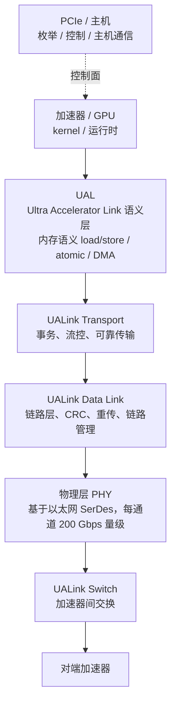

# UALink

> **一句话定位**：UALink（Ultra Accelerator Link）是由多家厂商发起的**开放加速器互连**规范，目标是在加速器之间提供内存语义的 load/store、原子与交换网络，作为 NVLink/NVSwitch 私有方案的开放对标。

## 1. 它解决什么问题

AI 训练/推理把"加速器之间的通信"推到了系统设计的中心，但可用的高带宽互连长期偏向私有：

1. **私有互连的封闭性**：NVLink + NVSwitch 性能强，但端点与交换由单一厂商提供，其他加速器厂商无法自建兼容网络。
2. **以太网/InfiniBand 的语义错位**：它们擅长跨节点消息传递，但要把"加速器间内存语义 + 交换"做到极低延迟、极高带宽，需要额外的协议转换与软件栈。
3. **机柜级扩展需求**：单机内 8 卡之外，机柜级（数十到上百加速器）需要可扩展、可混插的交换网络。
4. **生态碎片化**：各家有各家的私有 D2D/加速器互连，软件要为每种拓扑写优化。

UALink 的解法：**定义一套开放的、分层的加速器互连规范**，物理层基于成熟以太网 SerDes，往上定义加速器事务、内存语义与交换，让多厂商加速器能在同一个 fabric 里通信。

- 它是**规范/联盟**产物（UALink Consortium），不是某家的私有接口。
- 它是**加速器对加速器**的互连，定位对标 NVLink/NVSwitch 的域内网络。
- 它**不是**要取代以太网/IB 做跨机柜通用网络，而是把"域内高速内存语义"这块标准化。

## 2. 协议栈与分层位置

UALink 采用分层设计，物理层复用高带宽以太网 SerDes，协议层则面向加速器事务。

层次职责大致为：

- **UAL（语义/应用层）**：定义内存语义操作、原子操作、DMA 等面向加速器的请求类型。
- **UALink Transport**：把语义请求拆成可传输的事务，处理流量控制、可靠性语义。
- **UALink Data Link**：链路级 CRC、重传、链路训练与错误管理。
- **PHY**：基于以太网物理层，每通道速率量级为 **200 Gbps**，一个 link 由多个通道聚合。

需要特别注意**已发布与规划的区别**：

- UALink **1.0 规范**（及 200G 版本）是已推进的成果，主要面向加速器间内存语义与交换；
- 更高速率、更大规模、更多功能的版本处于**规划/推进中**；
- 具体的通道速率、聚合方式、交换规模以 **UALink Consortium 官方发布为准**，本页不给出未确认的精确数字。

## 3. 请求模型

UALink 的关键卖点是：**在开放规范里提供内存语义的 load/store**，而不仅是 DMA。

| 事务 / 请求类型 | 是否 Posted | 完成方式 | 数据单位 |
| --- | --- | --- | --- |
| 内存语义 Load（读远端加速器内存） | Non-Posted | 需要返回读数据 | cache line / 访存粒度 |
| 内存语义 Store | 语义上 Posted | 发出后靠 fence/释放语义定序 | cache line / 写合并 |
| Atomic（原子操作） | 视操作，可能需返回结果 | 由目标侧原子单元执行并回填 | 标量/若干字节 |
| DMA（批量搬运） | 发起型 | 完成通知 / 事件 | 批量字节 |
| 交换转发事务 | 由 fabric 承载 | 由交换与链路层保证送达 | 事务级 |

对齐主线的说法：UALink 的"读"是**内存语义的 Non-Posted 读**，必须等数据回程；"写"是**Posted 语义**，可见性通过**释放/屏障语义**建立。**具体字段与编码属于规范细节，以官方为准。**

## 4. 关键机制

### 4.1 三/四层开放栈

- **UAL / Transport / Data Link / PHY** 的分层让不同厂商可以分别实现不同层，并在交换层面互通。
- 物理层复用**以太网 SerDes** 是重要设计选择：成熟 IP、成熟测试、供应链广。
- 代价是"以太网物理层 + 加速器协议"需要仔细处理延迟与流控，不能简单照搬以太网交换机的策略。

### 4.2 内存语义与原子

- **内存语义 load/store**：让一个加速器可以按地址访问另一个加速器的内存，而不是只能发 DMA。
- **Atomic**：跨加速器的计数、规约、锁的基础；对 all-reduce 之类的集合通信很关键。
- 这些操作让上层集合通信库可以像写单机 kernel 一样编排分布式计算。

### 4.3 交换与可扩展拓扑

- **UALink Switch** 把点对点 link 组织成域内网络，目标是让任意加速器对之间的带宽不随规模急剧收敛。
- 支持**多跳**拓扑，允许机柜级、甚至更大域的扩展。
- 交换规模、收敛比、路由方式属于规范/实现细节，**未公开部分以官方为准**。

### 4.4 可靠传输与链路管理

- **Data Link 层**做 CRC、重传与错误管理，确保物理误码不会污染上层事务语义。
- 链路训练、降速、错误恢复是长距离/多跳交换可维护性的基础。
- 与以太网类似，但需要为**低延迟事务**而不是大包吞吐做优化。

### 4.5 与 PCIe / 以太网 / 私有互连的关系

| 互连 | 角色 | 语义 |
| --- | --- | --- |
| PCIe / CXL | 主机内枚举、配置、通用外设；CXL 可带缓存一致 | TLP / CXL.cache |
| 以太网 / InfiniBand | 跨节点通用网络，消息传递为主 | 报文 / RDMA verb |
| NVLink / NVSwitch | NVIDIA 私有域内加速器网络 | 内存语义 + 非透明一致 |
| **UALink** | **开放域内加速器网络** | **内存语义 + 交换** |

UALink 不取代 PCIe 的控制面角色，也不取代跨数据中心网络；它是"加速器域"这一层的开放答案。

## 5. 一致性语义

| 层级 | UALink 的态度 | 说明 |
| --- | --- | --- |
| 无一致性 | 否 | 至少提供内存语义操作 |
| IO 一致性 | 是（面向加速器访存） | 可见性可通过 fence/释放语义管理 |
| 全缓存一致性 | 规范目标范围内讨论，**并非透明窥探式全一致** | 以规范定义的内存序与同步原语为准 |

关键点：

- UALink 提供**内存语义 load/store**，不等于提供**透明缓存一致性**；跨加速器可见性依然依赖**fence/原子/释放语义**。
- 具体的一致性模型、fence 类型与作用域是规范核心内容之一，**必须查官方规范**，不同版本会有差异。
- 与 CXL.cache 的"设备加入 CPU 一致域"不同，UALink 更像 NVLink：**加速器之间**的内存语义网络。

## 6. 主线视角：读进行时，写会怎样？

问题：**一次 UALink 上的远端 load 还在等待数据时，写会怎样？**

- **链路层面允许并发**：交换网络与链路层按事务/虚拟通道组织，读挂起时写可以在 link 上继续传输，不会因为一次读而停下整条链路。
- **顺序由内存序与 fence 定义**：UALink 的内存语义是**松弛序为默认、同步原语负责定序**的路线；"读到的写是否可见"由 fence/释放语义与原子操作建立，而不是链路自动串行化。
- **交换侧公平性**：在多跳交换里，读响应与写请求可能经过不同路径/队列，fabric 需要防止饥饿与死锁；这属于规范的可靠传输与流控范畴。
- **与 PCIe 的精神一致**：都允许写越过挂起的读以避免阻塞；差别是 UALink 面向加速器内存语义，且规范是开放的。

一句话：**UALink 里读挂起时写可穿行；跨加速器可见性靠 fence/原子等同步语义保证，默认不是透明缓存一致。**

## 7. 性能特性与典型实现

UALink 仍在快速演进，下面的量级用于建立直觉，**精确数值以 UALink Consortium 官方为准**。

| 维度 | 量级 / 现状 | 备注 |
| --- | --- | --- |
| 每通道速率 | 200 Gbps 量级（UALink 200G / 1.0） | 基于以太网物理层 |
| 每 link 聚合 | 多通道聚合，达数百 Gbps 到 Tbps 量级 | 依 link 宽度 |
| 单跳延迟 | 百纳秒量级目标 | 面向内存语义低延迟 |
| 交换规模 | 机柜级到更大域 | 拓扑与收敛比依规范/实现 |
| 规范状态 | 1.0/200G 已发布推进，更高速率与功能规划中 | **注意区分已发布与规划** |

生态现状：

- **发起方多元**：由 AMD、Broadcom、Cisco、Google、Meta、Microsoft、Intel 等参与发起，组成 UALink Consortium，明确以开放对标识私有方案。
- **软件栈**：需要编译器/运行时/集合通信库对 UALink 拓扑做优化；与现有 ROCm/CUDA 生态的衔接仍在演进。
- **落地节奏**：规范发布、加速器集成、交换硅片、软件成熟是四个不同阶段，**不要把规范发布等同于大规模部署**。
- **最大不确定性**：与 NVLink 相比，UALink 需要靠多厂商协作追赶成熟度；与以太网/UEC 相比，它更专注"域内内存语义"。

## 8. 要点速记

- UALink 是**开放的加速器互连规范**，由 UALink Consortium 推动，对标 NVLink/NVSwitch。
- 分 **UAL / Transport / Data Link / PHY** 层，物理层复用**以太网 SerDes**。
- 提供**内存语义 load/store 与 atomic**，以及可扩展的**加速器交换网络**。
- **不是透明缓存一致**：跨加速器可见性靠 **fence/释放语义/原子**。
- 每通道速率量级 **200 Gbps**，link 由多通道聚合；更高速率与更大规模在**规划中**。
- 与 PCIe 分工：PCIe 管枚举/控制/主机，UALink 管加速器域数据面。
- 与 NVLink 的差别是**开放性**；与以太网/IB 的差别是**域内内存语义**。
- 主线复述：**读挂起时写可穿行，默认松弛序，靠同步原语建立可见性**。
- 一切精确规格以 **UALink Consortium 官方发布为准**。
