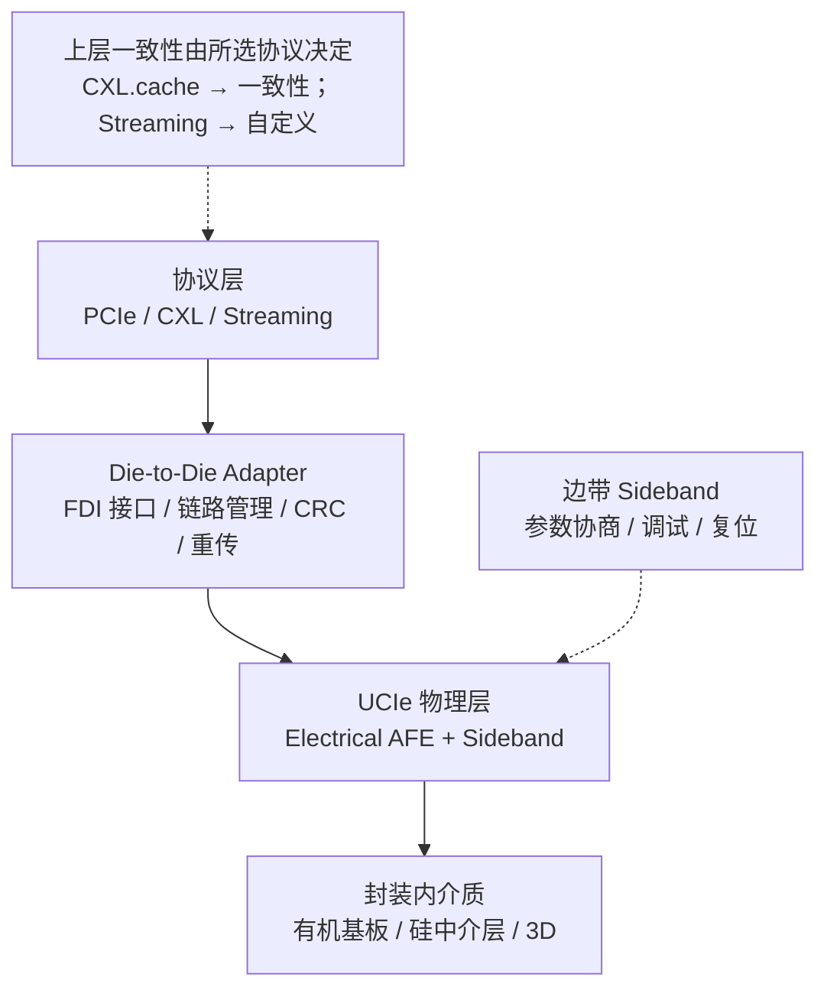

# UCIe

> **一句话定位**：UCIe（Universal Chiplet Interconnect Express）是开放的 **Die-to-Die（D2D）** 互连规范，用"物理层 + D2D Adapter + 协议层"的分层结构，让不同厂商的 chiplet 能在封装内互连，并把 PCIe / CXL / Streaming 映射到同一条链路上。

## 1. 它解决什么问题

当芯片设计从"单片 SoC"转向"多个芯粒（chiplet）封装在一起"，互连要解决的是**封装内的短距离高密度连接**：

1. **D2D 没有统一接口**：各家用私有并行总线，芯粒无法跨厂商复用，IP 生态碎片化。
2. **协议层重复造轮子**：既然很多芯粒要跑 PCIe/CXL，为什么还要各自定义一遍事务层？
3. **物理形态多样**：有机基板、硅中介层、3D 堆叠，bump pitch 与线长差异巨大，需要统一抽象。
4. **能效是硬指标**：封装内链路数量极大，**pJ/bit** 直接决定功耗预算。
5. **可测试性与可靠性**：D2D 链路必须有链路训练、CRC、重传。

UCIe 的解法：**定义一套开放分层的 D2D 规范**，物理层负责电气与边带，中间加一个 **Die-to-Die Adapter** 处理链路与 Flit，上层直接复用 **PCIe / CXL / Streaming** 协议，从而最大化生态复用。

## 2. 协议栈与分层位置

UCIe 的经典分层是三层，外加两侧的"管理/边带"：

三层职责：

| 层 | 职责 | 关键概念 |
| --- | --- | --- |
| Protocol Layer | 复用 PCIe / CXL / Streaming 事务 | 协议选择、FDI 对接 |
| Die-to-Die Adapter | 链路管理、CRC、重传、Flit 组包 | **FDI** 接口 |
| Physical Layer | 电气 AFE、时钟、边带、lane | **Sideband**、Lane、Flit |

要点：

- **协议层是三选一或动态选择的**：PCIe 用于通用、CXL 用于内存语义与缓存一致、Streaming 用于自定义流式数据。
- **D2D Adapter 是 UCIe 自己的核心**：它把上层协议与底层物理连接解耦，并提供可靠的 Flit 传输。
- **一致性语义完全取决于协议层选了什么**：UCIe 本身不新增缓存一致性。

## 3. 请求模型

UCIe 自身不定义"读/写事务"，它**透传**上层的请求模型。但可以按所映射的协议、以及 Flit 这一层来对齐主线：

| 事务 / 请求类型 | 是否 Posted | 完成方式 | 数据单位 |
| --- | --- | --- | --- |
| PCIe 映射下的 Memory Read | Non-Posted | 需要 CplD 返回 | TLP / cache line |
| PCIe 映射下的 Memory Write | Posted | 发出即结束 | TLP |
| CXL.cache 映射下的缓存行访问 | Non-Posted（读）/ Posted（写） | 由 CXL 一致性协议处理 | cache line |
| CXL.mem 映射下的内存读写 | 读 Non-Posted / 写 Posted | 由内存语义与 CXL 协议完成 | cache line |
| Streaming 映射 | 上层自定义 | 上层自定义 | 字节流 / Flit |
| 物理层 Flit 传输 | 链路层可靠交付 | CRC + 重传保证 | Flit（68B 或 256B 形态） |

核心结论：**问"UCIe 里读进行时写会怎样"，必须先问"上层映射的是哪个协议"**。UCIe 把这个问题原样交给了 PCIe/CXL/Streaming。

## 4. 关键机制

### 4.1 三种协议映射

- **PCIe**：直接复用成熟事务层，适合通用 IO、配置、外设扩展。
- **CXL**：适合内存语义、缓存一致、内存池化；CXL.cache/CXL.mem 的语义原样带进封装内。
- **Streaming**：没有标准事务语义，由上层自定义，适合专用加速器之间的大流量搬移。
- 映射方式可以是静态的，也可以在支持时动态协商；**具体能力随 UCIe 版本变化**。

### 4.2 Flit 格式与 Lane

- UCIe 定义 **Flit** 作为链路层传输单位，常见形态有 **68B** 与 **256B** 两类（对应不同协议映射与实现）。
- 链路由多条 **Lane** 组成，每 lane 速率量级从"数 Gbps"到"数十 Gbps"。
- Lane 数量、速率、编码共同决定有效带宽；具体组合是规范附表内容。
- **不给出未确认的精确定值**，实现方按版本与封装选型。

### 4.3 Die-to-Die Adapter 与 FDI

- **FDI（Flit-aware Die-to-Die Interface）** 是协议层与 D2D Adapter 之间的接口抽象，让不同协议能接入同一适配层。
- Adapter 负责：Flit 组包/解包、CRC、重传、链路状态管理、错误上报。
- 这层让 UCIe 能"一套物理链路，多种上层协议"。

### 4.4 Standard Package 与 Advanced Package

| 形态 | 介质 | 特点 | 适用 |
| --- | --- | --- | --- |
| Standard Package | 有机基板 | 成本低、bump pitch 较大、速率较低 | 成本敏感的中带宽 D2D |
| Advanced Package | 硅中介层 / 2.5D / 3D | bump pitch 小、密度与带宽高、能效好 | 高带宽、高性能 chiplet |

- **Advanced Package** 可进一步细分 2D/2.5D/3D 堆叠形态；3D 对能效与密度最有利，但热与制造复杂度高。
- UCIe 的版本演进（1.0 → 1.1 → 2.0 等）逐步扩展了对 **3D**、更高带宽与更强管理能力的支持。

### 4.5 能效与延迟：D2D 的真正 KPI

- **能效（pJ/bit）** 是封装内互连的第一指标：链路数量大，每 bit 多花 1 pJ 都会累积成可观的功耗。
- **延迟**：D2D 通常只有几毫米到几十毫米线长，延迟在纳秒到数十纳秒量级，远低于跨板/跨机。
- 因此 UCIe 的设计取舍偏向"**短距离、高密度、低电压、简单编码**"，与板级高速 SerDes 的思路不同。

## 5. 一致性语义

UCIe **不定义自己的一致性模型**，它把一致性交给协议层：

| 协议映射 | 一致性语义 | 说明 |
| --- | --- | --- |
| PCIe | 无缓存一致性（IO 一致） | 需软件 flush / 非一致访存 |
| CXL（cache/mem） | 可达全缓存一致 / 内存语义 | 由 CXL 协议定义 |
| Streaming | 上层自定义 | UCIe 不介入 |

- 所以对 UCIe 而言，主线第三问的答案是：**"取决于你选了哪个协议。"**
- 这也是 UCIe 开放性的代价：规范本身不保证一致性，一致性是**组合出来的属性**。
- 若目标是缓存一致的多 chiplet，典型选择是 **UCIe + CXL**。

## 6. 主线视角：读进行时，写会怎样？

因为 UCIe 透传上层协议，所以答案要分两层回答：

**第一层：UCIe 链路本身。**

- 物理层与 D2D Adapter 按 **Flit** 组织传输，收发方向通常有独立的 Lane 组，**读与写可以在两个方向上同时进行**（全双工为主）。
- 链路层只保证 **Flit 的可靠交付（CRC + 重传）**，**不负责上层事务的读写排序**；排序语义由上层的 PCIe/CXL 规则决定。
- 因此从 UCIe 自身看：**读 Flit 在途时，写 Flit 可以照常通过对向或同向链路**。

**第二层：上层协议。**

- 若映射 **PCIe**：回到 PCIe 的排序表 —— Posted 写允许越过 Non-Posted 读，避免死锁。
- 若映射 **CXL**：由 CXL 的一致性/排序规则处理，可能涉及缓存行状态与 snoop。
- 若映射 **Streaming**：完全由上层自定义，UCIe 不做任何承诺。

一句话：**UCIe 在链路层允许读写并行、只保证 Flit 可靠；"读进行时写会怎样"由所选协议回答——这让它既灵活又要求系统设计者自己想清楚语义。**

## 7. 性能特性与典型实现

量级描述，**精确 spec 以 UCIe 官方规范为准**。

| 维度 | 量级 / 现状 | 备注 |
| --- | --- | --- |
| 每 lane 速率 | 数 Gbps ~ 数十 Gbps | 随版本与封装形态变化 |
| Lane 数量 | 数条到数十条每链路 | 决定聚合带宽 |
| Flit 大小 | 68B / 256B 形态 | 与协议映射/版本相关 |
| 单跳延迟 | 纳秒到数十纳秒量级 | 线长几毫米到几十毫米 |
| 能效 | 个位数 pJ/bit 量级 | **D2D 第一 KPI** |
| 封装形态 | Standard / Advanced（2D/2.5D/3D） | 成本与性能取舍 |
| 版本 | 1.0 / 1.1 / 2.0 演进 | 2.0 支持 3D 与更高带宽方向 |

生态现状：

- **开放性**：UCIe 由多家公司共同推动，目标是让不同厂商的 chiplet 可以互连，形成 D2D IP 生态。
- **Chiplet 商业模式**：先有 D2D 标准的统一，才可能形成"芯粒货架"式的组合设计。
- **依赖协议生态**：UCIe 的价值很大一部分来自能直接跑 **PCIe/CXL**，所以它的普及与 CXL 生态强相关。
- **对照**：BoW 更轻量、AIB 更偏物理接口，UCIe 是三者中**协议最完整、生态最广**的一个（见 [BoW](/protocols/bow)、[AIB](/protocols/aib)）。

## 8. 要点速记

- UCIe 是**开放的 Die-to-Die 互连规范**，分 **物理层 + D2D Adapter + 协议层**。
- 协议层支持 **PCIe / CXL / Streaming** 三种映射；**一致性由所选协议决定，UCIe 本身不新增一致性**。
- 物理形态分 **Standard Package（有机基板）** 与 **Advanced Package（2.5D/3D）**。
- **D2D Adapter** 负责链路训练、CRC、重传，并提供 **FDI** 接口抽象。
- **Flit** 有 68B / 256B 形态，Lane 速率数 Gbps ~ 数十 Gbps，**能效（pJ/bit）是第一 KPI**。
- 版本从 1.0 演进到 1.1、2.0，**2.0 加强了 3D 与更高带宽能力**。
- 与 BoW/AIB 相比，UCIe **协议最完整、生态最广**。
- 主线复述：**链路层允许读写并行、只保证 Flit 可靠交付；读写顺序与一致性由上层 PCIe/CXL/Streaming 决定**。
- 精确规格以 **UCIe 官方规范**为准。
