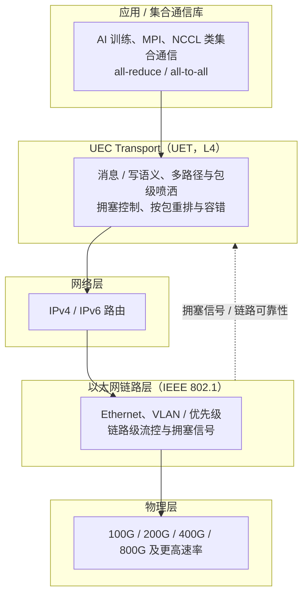

# UEC（Ultra Ethernet）

> **一句话定位**：UEC（Ultra Ethernet）是 Ultra Ethernet Consortium 主导的开放以太网传输方案，目标是在标准以太网之上做一套面向十万级端点、AI/HPC 规模化的传输层（UET）；它强调包级多路径、多路径容错与低尾延迟，与 RoCEv2 兼容演进而非简单替代，规范与生态仍在推进中。

## 1. 它解决什么问题

AI 训练与大规模 HPC 把网络推到了新量级，RoCEv2 在这类场景暴露出几个结构性问题：

- **规模压力**：十万级端点、单作业跨数千节点，连接状态与路由收敛成为瓶颈；
- **尾延迟敏感**：all-reduce / all-to-all 让任何一条慢路径都拖累整个集合操作的完成时间，平均带宽高不代表作业快；
- **无损网络的脆弱性**：PFC 依赖逐跳反压，容易队头阻塞、拥塞扩散甚至死锁；ECN/DCQCN 调参复杂，且难以覆盖多路径；
- **负载不均**：传统按流哈希的 ECMP 在多路径下容易冲撞，导致部分链路热点、部分空闲。

UEC 的设计意图就是回答：**能否在标准以太网上，用一套面向 AI/HPC 优化过的传输层，实现超大规模、多路径、低尾延迟，并减少对 PFC 的依赖？**

它要服务的典型负载是：大规模集合通信（all-reduce、all-gather、all-to-all）、参数同步、分布式训练的梯度交换，以及大规模 HPC 的 MPI 通信。

## 2. 协议栈与分层位置

理解 UEC 的关键是**分工**：底层链路与拥塞信号仍由以太网 / IEEE 802.1 定义，UEC 主要定义其上的传输层（UET）与配套的软件接口。

分工可以概括为：

| 范围 | 负责方 | 内容 |
| --- | --- | --- |
| 传输语义、多路径、端到端拥塞控制 | UEC / UET | 包级喷洒、乱序容忍、重排、按序交付给上层 |
| 链路层、优先级、链路级拥塞信号 | IEEE 802.1 | Ethernet 帧、VLAN、优先级、部分链路级反馈机制 |
| 路由 | IP | 三层可路由与多路径可达性 |
| 软件接口 / 库 | UEC 生态 | 与 verbs 类接口、集合通信库的对接 |

> 一句话记法：**UEC 不重造以太网，而是在以太网之上重造"面向 AI 的传输层"，并明确把 L2 相关能力留给 IEEE 802.1。**

## 3. 请求模型

UEC 的一个显著特点是：在保留"写 / 读远端内存"这类内存语义之外，还明确定义了**消息语义与写语义**，以适配 AI 集合通信中更高效的数据搬运模式。下面的对应关系是**设计意图层面**的概括，具体字段与操作集以 UEC 已发布规范为准：

| 操作 / 语义类型 | 是否 Posted | 完成方式 | 数据单位 |
| --- | --- | --- | --- |
| 写语义（write-based） | 是（设计上偏向 posted / 单边） | 发起端完成通知，目标端按语义接收 | 消息 / 数据块，可跨多包 |
| 消息语义（message） | 是 | 双端完成语义，接收端按消息边界交付 | 消息，保留边界 |
| 读语义（read，若支持） | 否（请求-响应型） | 需等对端返回数据后完成 | 按目标内存描述符读取 |
| 集合操作 / 聚合 | 依实现 | 由传输层与网络协同完成 | 归约结果或中间值 |

需要强调两点：

- UEC 传输层**显式拥抱乱序与多路径**，因此"完成"的语义更多是**传输层保证的最终交付与重排**，而非线上严格按序；
- 由于规范与实现仍在推进，"哪些操作在哪个版本被定义、字段如何编码"应以**已发布规范**为准，不要把路线图中的目标当作已实现能力。

## 4. 关键机制

### 4.1 包级多路径与 Packet Spraying

这是 UEC 最核心的性能手段，也是与 RoCEv2 最大的差异之一：

- **传统方式**：按流（flow）做哈希，把整条流固定到某条路径（ECMP）。一旦某条路径拥塞，整条流一起受害，且哈希碰撞会制造热点；
- **UEC 方式**：把**消息拆成包，按包粒度分派到多条等价路径**（packet spraying），让同一消息的不同包走不同链路；
- **收益**：链路利用率更高、热点更少、单条慢路径不再拖累整条消息，从而压低尾延迟；
- **代价**：包到达顺序被打乱，接收端必须能**按包重排并容忍乱序**，这正是 UET 传输层要处理的。

设计意图很直接：**用多路径换尾延迟与利用率，把"选路"从流级降到包级。**

### 4.2 拥塞控制与减少对 PFC 的依赖

UEC 的拥塞控制目标是在不需要 PFC 硬撑无损的前提下，维持低延迟与高吞吐：

- 设计上结合**基于信用的机制与基于速率的控制**思路：既对缓冲占用敏感，又能平滑调节发送速率；
- 结合**显式的链路 / 网络拥塞信号**（与 IEEE 802.1 定义的链路级机制配合），让端侧尽早减速；
- 目标是**避免依赖全局无损**、减少 PFC 引发的队头阻塞与级联暂停；
- 与 RoCE 不同，多路径场景下拥塞反馈需要与包级选路协同，否则反馈可能滞后于路径切换。

> 这里属于设计目标密集区：具体算法、信号格式与参数应以已发布规范为准，不宜按细节断言。

### 4.3 面向 AI 集合通信的语义

AI 训练的通信模式与通用存储/RPC 很不一样，UEC 针对性优化：

- **all-reduce / all-to-all**：流量模式是大量小消息 + 规整的通信矩阵，对延迟与尾延迟极敏感；
- **写 / 消息语义**：减少接收端参与，让数据以更接近"直接放置"的方式落地，降低 CPU 与同步开销；
- **网络内计算倾向**：延续 SHARP 一类的思路，把部分归约放到网络或端点侧协同完成（以规范定义为准）；
- **可扩展集合操作**：面向十万级端点的通信拓扑与作业内集合同步。

### 4.4 与 RoCEv2 的关系

UEC 与 RoCEv2 不是简单的"新替旧"关系：

| 维度 | RoCEv2 | UEC / UET |
| --- | --- | --- |
| 承载 | IB transport over UDP/IP | 自有传输层 over IP / Ethernet |
| 可靠性与顺序 | IB transport 保证按序 | 拥抱乱序，传输层负责重排 |
| 多路径 | 主要靠流级 ECMP | 包级 spraying，显式多路径 |
| 无损网络 | 强依赖 PFC + ECN/DCQCN | 目标减少对 PFC 的依赖 |
| 集合通信 | 由上层库实现 | 传输层与生态协同优化 |
| 生态成熟度 | 高，广泛部署 | 规范与生态推进中 |

两者的共同点是都跑在标准以太网上、都面向数据中心与 AI/HPC；差异在传输层设计哲学。实际网络里两者**可以并存**，UEC 也强调在现有以太网基础上演进。

### 4.5 规范与推进状态

必须区分两类信息：

- **已发布规范**：UEC 已发布 1.0 系列规范（以官方发布为准），覆盖传输层等核心内容，并持续迭代；
- **设计目标 / 路线图**：超大规摸端点、包级多路径、低尾延迟、减少 PFC 依赖等，是目标与方向，落地程度随版本与厂商实现而不同。

使用时建议：**以官方规范版本号为准，区分"规范已定义"与"产品已实现/已互操作"。**

## 5. 队列与传输结构（QP / WQE / CQE 等）

UEC 对上仍需要一套请求 / 完成抽象，以便与现有 verbs 类接口和集合通信库对接。其结构与 IB 家族的类比关系如下（具体命名与接口以规范为准）：

| 概念 | UEC 语境下的作用 | 与 IB / RoCE 的类比 |
| --- | --- | --- |
| 工作请求 / 描述符 | 应用提交一次传输任务 | 类似 WQE / Work Request |
| 传输上下文 | 维护一次传输的状态与多路径信息 | 类似 QP（但多路径语义更强） |
| 完成通知 | 传输完成后的异步通知 | 类似 CQE / 完成队列 |
| 内存描述符 | 定位目标内存与鉴权 | 类似 MR + rkey / STag |
| 多路径状态 | 记录可用路径与选路状态 | IB / RoCE 中不存在或很弱 |

几个关键点：

- **重排职责在传输层**：因为包级喷洒会导致乱序，接收端必须按消息 / 传输上下文重组，再向上交付；
- **完成不等于线上按序**：完成通知代表传输层已保证交付与重排，不隐含"包按发送顺序到达"；
- **多路径是内建状态**：与 RoCE 把选路交给交换机不同，UEC 的端点需要参与路径管理与故障切换；
- **接口兼容取向**：设计目标之一是让现有 RDMA 生态（verbs 类 API、集合通信库）能够迁移或复用，而非完全另起炉灶。

## 6. 主线视角：读进行时，写会怎样？

UEC 的答案是"**设计上更彻底地解耦读写，用多路径与乱序容忍换取并发**"，与 IB / RoCE 有相同的语义分界，但更强：

- **语义层**：写语义偏向 posted（发出即推进），读语义（若支持）偏向请求-响应型。读在进行时，写不会因为"读占用了一个包序列"而被阻塞——因为传输层本就不假设按序，读写可以在不同路径上并行推进。
- **多路径层（UEC 特有）**：同一消息的不同包可以走不同路径，因此"读的请求 / 响应"与"写的包"可以在物理链路上真正并行，而不会被单条路径的顺序约束捆绑。这是 UEC 相对 RoCE 在并发上的核心增益。
- **拥塞层**：设计目标是减少对 PFC 的依赖，用端到端 / 链路拥塞信号与信用 / 速率控制来调速，尽量不让读写被同一次全局暂停一起冻结；但拥塞时仍会有反压，只是粒度与控制方式不同。
- **可见性层**：与所有 RDMA 类方案一样，UEC 面向的是**内存 / 消息搬运语义，不是全缓存一致性**；远端可见性仍需显式同步，不能假设接收端缓存自动失效。

一句话总结：**UEC 里读同样不阻塞写，而且通过包级多路径把这种并行从"单路径上的穿行"扩展成"多路径上的真并行"；它用重排与拥塞控制来买单，换取低尾延迟与超大规模可扩展性。**

## 7. 性能特性与典型实现

UEC 的性能数字应谨慎对待：规范与实现仍在推进，以下为**设计目标与量级方向**，而非实测承诺。

| 指标 | 目标 / 量级 | 说明 |
| --- | --- | --- |
| 端点规模 | 十万级端点量级 | 超大规模 AI/HPC 集群的设计目标 |
| 单链路速率 | 100G / 200G / 400G / 800G 及更高速率 | 依赖以太网物理层演进 |
| 尾延迟 | 显著改善为目标 | 靠包级多路径与拥塞控制压低 P99 类指标 |
| 多路径 | 包级、灵活多路径 | 核心设计特征 |
| 无损网络依赖 | 目标降低对 PFC 的依赖 | 并非完全不需要拥塞控制 |
| 互操作性 | 与标准以太网 / IP 生态兼容 | 强调在现有网络上演进 |

生态现状：

- **组织**：Ultra Ethernet Consortium 于 2023 年成立，成员覆盖芯片、网络设备、系统与云厂商；IEEE 802.1 负责链路层相关标准，UEC 聚焦传输层，两者互补；
- **规范**：UEC 已发布 1.0 系列规范并持续演进，后续版本与配套软件接口仍在推进；
- **实现**：网卡、交换机与软件栈的落地程度随厂商与时间不同，需以官方互操作性信息为准；
- **定位**：面向 AI/HPC 规模化的开放以太网传输，是 RoCEv2 的重要演进方向之一，但短期内与现有 RDMA 生态并存。

## 8. 要点速记

- **定位**：Ultra Ethernet Consortium 主导的开放以太网传输，核心是传输层 UET。
- **解决什么**：超大规模、多路径、低尾延迟、减少对 PFC 无损网络的依赖。
- **关键机制**：包级 packet spraying、显式多路径、乱序容忍与重排、信用 + 速率拥塞控制。
- **语义**：在内存语义之外强调写语义与消息语义，面向 all-reduce / all-to-all。
- **分工**：IEEE 802.1 管链路层与拥塞信号，UEC 管传输层与软件接口。
- **与 RoCEv2**：兼容演进，不是简单替代；多路径与顺序哲学差异最大。
- **状态**：UEC 1.0 系列规范已发布并演进中，注意区分**已发布规范**与**设计目标 / 路线图**。
- **主线答案**：读不阻塞写；包级多路径把并行从单路径穿行扩展为多路径真并行，代价是重排与拥塞控制复杂度。
