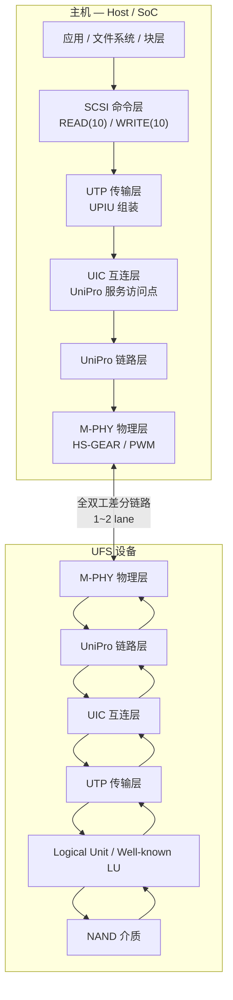

# UFS

> **一句话定位**：UFS 是面向移动与嵌入式的串行存储接口，用 MIPI UniPro + M-PHY 做全双工多 lane 链路，在其上跑 SCSI 命令集与深度 32 的命令队列，取代 eMMC 的半双工并行总线。

## 1. 它解决什么问题

手机、平板、车机、嵌入式设备对存储的需求在几代内急剧上升，而传统 eMMC 接口开始成为瓶颈：

- **半双工**：eMMC 的数据线同一时刻只能单向传输，读与写必须分时，无法重叠。
- **命令串行**：早期 eMMC 一次只处理一条命令，没有命令队列，随机 I/O 的并行度低。
- **速率受限**：并行总线在高速下信号完整性变差，继续提升频率代价很高。

UFS 的做法是把"链路"和"命令"彻底分层：

- **链路**：借用 MIPI 的 **UniPro** 链路层与 **M-PHY** 物理层，使用差分、全双工、可多 lane 的串行链路，速率按 **HS-GEAR** 逐代提升。
- **命令**：沿用成熟的 **SCSI 命令集**，主机侧直接复用 SCSI 块设备栈，降低软件迁移成本。
- **并发**：引入 **Command Queue（CQ）**，深度 32，允许设备乱序执行并用 tag 回收完成。

一句话：UFS 用"现代串行链路 + SCSI 命令 + 命令队列"替代了"并行总线 + 串行命令"的 eMMC。

## 2. 协议栈与分层位置

UFS 是典型的分层结构：命令集在最上，物理层在最下，中间由 UTP / UIC / UniPro 逐层封装。

分层职责：

- **UTP（UFS Transport Protocol）**：把命令、数据、状态封装成 **UPIU**（UFS Protocol Information Unit）。
- **UIC（UFS Interconnect）**：主机与设备之间的互连服务，承载 UPIU 与 UIC 控制命令。
- **UniPro**：可靠的链路层，负责流控、错误恢复、lane 管理。
- **M-PHY**：物理层，定义电气特性与 **HS-GEAR** 速率档位、低功耗 PWM 模式。

## 3. 请求模型

UFS 使用 SCSI 命令集，因此请求模型是"命令 → 数据 → 响应"的 SCSI 三段式。所有请求都是 **Non-Posted**，最终都要一个 Response UPIU。

| 请求类型 | 是否 Posted | 完成方式 | 数据单位 |
| --- | --- | --- | --- |
| SCSI READ(10) | Non-Posted | DATA IN UPIU(s) + RESPONSE UPIU | LBA，512B / 4KiB 逻辑块 |
| SCSI WRITE(10) | Non-Posted | DATA OUT UPIU(s) + RESPONSE UPIU | LBA |
| SCSI SYNCHRONIZE CACHE(10) | Non-Posted | RESPONSE UPIU | 无数据（屏障） |
| SCSI UNMAP / WRITE SAME | Non-Posted | RESPONSE UPIU | LBA 区间 |
| QUERY REQUEST | Non-Posted | QUERY RESPONSE UPIU | 设备/单元描述符 |
| TASK MANAGEMENT | Non-Posted | RESPONSE UPIU | 任务控制 |
| UIC 命令（DME） | Non-Posted | UIC 完成确认 | 属性 / 寄存器 |

要点：

- 每条命令由一个 **Command UPIU** 启动，携带 **Task Tag** 用于在队列中标识与回收；响应通过 **Response UPIU** 返回。
- **WRITE(10)** 命令里的 **FUA（Force Unit Access）** 位要求数据真正落盘后才算完成；**SYNCHRONIZE CACHE** 则作为显式的写屏障。
- 命令队列深度为 **32**，设备可以对不同 tag 的命令乱序执行；UFS 4.0 进一步引入 **MCQ（Multi-Circular Queue）** 提升队列并行度。

## 4. 关键机制

### 4.1 UPIU：命令、数据与响应的统一容器

UTP 把所有交互都表示成 UPIU：**Command UPIU** 下发命令，**DATA IN / DATA OUT UPIU** 搬运数据，**Response UPIU** 回状态，**Task Management UPIU** 做中止与查询。统一封装让 UniPro 只负责可靠传输，不必理解 SCSI 语义。

### 4.2 Command Queue：深度 32 与 Tag 回收

UFS 2.1 起引入命令队列：主机最多同时下发 32 条命令，每条带唯一 Task Tag。设备可以并行处理 NAND、乱序完成。这比 eMMC 的"一次一条"在随机读 IOPS 上有数量级提升，也是 UFS 相对 eMMC 的核心差异之一。

### 4.3 全双工与多 lane

M-PHY 的 TX / RX 是独立的差分对，因此链路层**全双工**：读的数据从设备流向主机的同时，写的数据可以从主机流向设备。配合多 lane（常见 2 lane，每条 lane 独立串行），总带宽近似按 lane 数线性叠加。这让"读进行时写也在进行"在物理层就成立。

### 4.4 HS-GEAR 速率演进与 Gear 切换

M-PHY 定义了 **HS-GEAR1 ~ HS-GEAR5**，每 lane 速率逐代翻倍：

| 档位 | 每 lane 速率（量级） | 说明 |
| --- | --- | --- |
| HS-G1 | 约 1.25 Gbps | 早期 |
| HS-G2 | 约 2.5 Gbps | |
| HS-G3 | 约 5.8 Gbps | |
| HS-G4 | 约 11.6 Gbps | UFS 3.x 主流 |
| HS-G5 | 约 23.2 Gbps | UFS 4.x |

设备会根据负载与功耗在 PWM 低功耗模式与各 HS-GEAR 之间动态切换，兼顾空闲功耗与突发带宽。

### 4.5 Logical Unit 与 Well-known LU

UFS 设备对外呈现多个 **Logical Unit（LU）**，有普通 LU，也有 **Well-known LU**（如 UFS Device LU、Report LUNs、Boot LU、**RPMB** 重放保护内存块）。主机通过 SCSI 的 LUN 寻址访问它们，LUN 模型与 SCSI 生态无缝对接。

## 5. 队列与并发结构

| 结构 | 规模 / 规则 | 作用 |
| --- | --- | --- |
| Command Queue | 深度 32 | 并发下发命令，Tag 标识 |
| MCQ（UFS 4.x） | 多条环形队列 | 进一步提升队列并行度 |
| Logical Unit | 多个普通 LU + Well-known LU | 逻辑块地址空间与特殊功能 |
| Task Tag | 每条命令一个 | 乱序完成时的匹配与回收 |
| Lane | 1 ~ 2 条 | 带宽扩展 |
| 双工 | 独立 TX / RX | 读写可同时进行 |
| 功耗状态 | PWM / HS-GEAR 动态切换 | 空闲省电、突发提速 |

并发要点：

- 主机侧 SCSI 层把请求转成 UPIU 并压入命令队列；设备内部对 NAND 通道、die、plane 做并行调度。
- 多个 LU / 多个 tag 的命令可以同时在设备内部执行；完成顺序与提交顺序可以不同。
- 队列级流控由 UniPro 与 CQ 深度共同决定，链路忙时会有背压。

## 6. 主线视角：读进行时，写会怎样？

**结论：UFS 在物理层就是全双工的，"读在进行时写也可以进行"，但并发与否取决于命令队列与设备内部调度。**

分层来看：

- **物理层**：TX / RX 独立，读数据从设备流回主机的同时，写在反方向传输，链路层不互相阻塞。这是 UFS 相对 eMMC 半双工最本质的改进。
- **命令层**：命令队列深度 32，读与写命令可以同时驻留在队列中，设备可乱序执行、用 Task Tag 回收完成。没有 PCIe 那种 Posted/Non-Posted 排序表问题——所有命令都是 Non-Posted。
- **屏障语义**：若软件要"读到之前的写"，必须用 **FUA 写** 或 **SYNCHRONIZE CACHE**；设备不会因为总线顺序自动保证。命令队列本身**不保证跨 tag 的顺序**。
- **资源争用**：读写最终都要访问同一片 NAND，内部通道与缓存会成为真实瓶颈；因此"能并发"不等于"一定更快"，但至少不会被接口协议串行化。

主线答案：**UFS 让读写在链路层真正并行；队列层允许它们共存；真正的可见性顺序由 FUA / SYNCHRONIZE CACHE 显式建立。**

## 7. 性能特性与典型实现

| 指标 | 量级 | 说明 |
| --- | --- | --- |
| 每 lane 速率 | G4 约 11.6 Gbps / G5 约 23.2 Gbps | 见 HS-GEAR 表 |
| 2 lane 原始带宽 | G4 约 2.9 GB/s/dir；G5 约 5.8 GB/s/dir | 双向独立 |
| 随机读延迟 | 几十 μs ~ 百余 μs | 取决于 NAND 与缓存命中 |
| 命令队列深度 | 32（CQ）；4.x MCQ 更高 | 随机 I/O 并行度来源 |
| 空闲功耗 | PWM 低功耗模式 | 移动设备关键指标 |
| 双工 | 全双工 | 读写在链路层可同时进行 |

生态实现：

- **设备厂商**：Samsung、Micron、Kioxia、SK hynix、WD 等的 UFS 存储芯片与控制器。
- **控制器 / IP**：Silicon Motion、Phison、慧荣等，以及各家 SoC 内的 UFS 主机控制器。
- **软件栈**：Linux `ufs` / `ufshcd` 驱动、Android / ChromeOS 存储栈、SCSI 块设备层。
- **标准与形态**：JEDEC UFS 标准、MIPI UniPro / M-PHY 规范；UFS Card 可移动形态。

## 8. 要点速记

- UFS = **MIPI UniPro + M-PHY 链路** 之上跑 **SCSI 命令集**，取代 eMMC 的并行半双工总线。
- 分层：**SCSI → UTP（UPIU）→ UIC → UniPro → M-PHY**。
- 命令队列深度 **32**，Tag 标识、可乱序完成；UFS 4.x 用 **MCQ** 继续加并发。
- **HS-G1 ~ G5** 逐代提速，每 lane 从约 1.25 Gbps 到约 23.2 Gbps；支持多 lane 与动态 Gear 切换。
- 物理层**全双工**，读写在链路上可以真正并行。
- 可见性顺序靠 **FUA 写 / SYNCHRONIZE CACHE**，队列不保证跨 tag 顺序。
- 主线答案：**读进行时写可以进行**，这是链路特性 + 命令队列共同结果；同步点是 Response UPIU。
