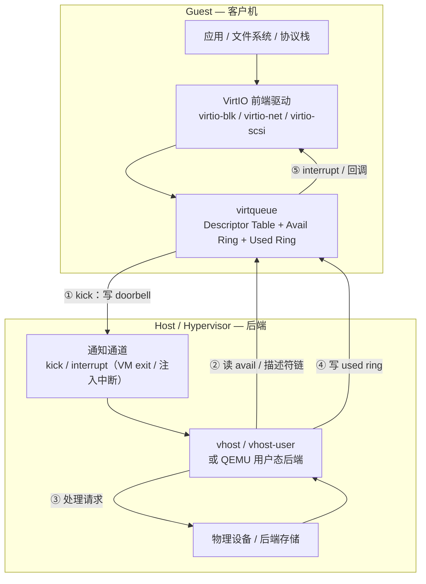

# VirtIO

> **一句话定位**：VirtIO 是半虚拟化的 I/O 标准，它用共享内存里的 virtqueue（描述符表 + avail ring + used ring）取代硬件队列，让 guest 与 host/后端通过"提交描述符 → kick → 处理 → 写 used ring → interrupt"完成一次 I/O。

## 1. 它解决什么问题

在虚拟化里，guest 无法直接操作物理设备，早期做法是全模拟：每次 PIO/MMIO 都触发 VM exit，由 hypervisor 模拟真实寄存器与 DMA，路径极长、开销巨大。

VirtIO 的思路是"协作式设计"：

- **约定一个标准接口**，而不是模拟某个具体硬件：guest 知道对面是 host，双方用最省的方式通信。
- **共享内存 + 环形缓冲**：请求、响应、数据缓冲都放在双方都能访问的内存里，避免大量数据拷贝。
- **批量与批处理友好**：一次 kick 可以携带多个描述符，amortize VM exit 的固定开销。
- **可扩展**：设备类型通过 feature bit 协商，一套框架支持块设备、网络、SCSI、控制台、GPU 等。

结果是把虚拟 I/O 的路径缩短到接近"写内存 + 一次通知"，并在后来被硬件（vDPA / 智能网卡）直接实现，成为软硬件通吃的接口标准。

## 2. 协议栈与分层位置

VirtIO 位于 guest 驱动与 host 后端之间，中间是可以被双方访问的共享内存与通知机制。

与硬件 I/O 的关键差别：这里没有真正的"设备寄存器"，提交与完成都是对**共享内存**的读写；唯一需要陷入（或通知）的是 **kick** 与 **interrupt** 这两个同步点。

## 3. 请求模型

VirtIO 的基本单位是 **描述符链**（descriptor chain），一条链描述一次请求涉及的所有缓冲。所有请求都是 **Non-Posted**：写完 avail ring 只是"提交"，必须等 device 写 used ring 才算完成。

| 请求类型 | 是否 Posted | 完成方式 | 数据单位 |
| --- | --- | --- | --- |
| 描述符链（out 方向，device 可读） | Non-Posted | device 写 used ring 后 interrupt / 回调 | 描述符链，任意长度缓冲 |
| virtio-blk read | Non-Posted | device 填充 in buffer（device 可写）并写 used ring | 512B / 4KiB 扇区 |
| virtio-blk write | Non-Posted | device 读 out buffer（device 可读）并写 used ring | 扇区 |
| virtio-net TX | Non-Posted | device 发送后写 used ring | 以太网帧 |
| virtio-net RX | Non-Posted（预先投递 buffer） | device 填充 receive buffer 后写 used ring | 帧 |
| 控制队列（config / ctrl） | Non-Posted | used ring 写回 | 控制结构 |

**方向命名要点**：描述符的 `VIRTQ_DESC_F_WRITE` 标志是**站在 device 视角**命名的，表示"device 会写这个缓冲"。所以：

- driver 的一次**读**（device → driver）= device 填充一个 **in buffer**（带 `VIRTQ_DESC_F_WRITE`）；
- driver 的一次**写**（driver → device）= device 读取一个 **out buffer**（不带该标志）。

这与"按操作命名方向"的直觉相反，是阅读 virtio 代码时最容易混淆的地方。另外，网络接收（RX）的 buffer 是 driver **预先大量投递**的，device 收到包后直接取用一个已投递的 buffer——这一点更接近 PCIe 的 Posted 预投递接收，而不是一问一答。

## 4. 关键机制

### 4.1 Split virtqueue：三块结构

经典 virtqueue 由三部分组成，位于同一片共享内存：

- **Descriptor Table**：每项 `{addr, len, flags, next}`，多个描述符可用 `next` 串成链，描述一次请求和它的响应缓冲。
- **Available Ring**：driver 写好描述符链头后，把索引追加到 avail ring，表示"这些可用了"。
- **Used Ring**：device 处理完，把 `{id, len}` 追加到 used ring，表示"这些完成了"。

avail 由 driver 写、used 由 device 写，方向固定，不需要锁。

### 4.2 Packed virtqueue

Split 结构要用两份 `idx` 和读写指针维护两个环，cache 局部性一般。**Packed virtqueue** 把描述符、avail、used 合并成一个描述符数组，用每个描述符里的标志位与一个环序号表示"哪些可用、哪些完成"，减少了内存访问与指针维护，在小队列、频繁 kick 的场景更高效。两者由 feature bit 区分。

### 4.3 Notification / kick 与 suppress

**kick** 是 driver 通知 device"有新请求"：传统 PCI 上就是写 doorbell 寄存器触发 VM exit。**interrupt** 是 device 通知 driver"有完成"。为了减少通知次数：

- device 可以只处理一部分就返回，控制 processed 计数避免"每次处理都发中断"；
- **VIRTIO_F_RING_EVENT_IDX** 允许双方用"事件索引"精确约定"到达某个位置才通知"，实现中断抑制（interrupt suppression）与通知抑制，降低空转与 VM exit。

### 4.4 Feature bit 协商

驱动与设备通过 feature bit 协商能力，例如 `VIRTIO_F_RING_EVENT_IDX`、`VIRTIO_F_RING_PACKED`、`VIRTIO_F_INDIRECT_DESC`（间接描述符，把一张描述符表本身用一个描述符指向，支持超长链）、`VIRTIO_F_ACCESS_PLATFORM` 等。协商在设备初始化时完成，之后数据路径按约定执行。

### 4.5 vhost / vhost-user / DPDK

如果每次 kick 都回到 QEMU 用户态处理，开销仍然可观。于是有：

- **vhost**：把后端处理放进内核线程，guest kick 后直接在内核处理，避免用户态往返。
- **vhost-user**：后端是独立用户态进程（如 DPDK、SPDK 应用），共享内存 + eventfd 通知。
- **vDPA**：让支持 virtio 数据路径的硬件直接处理后端，guest 几乎直接对着网卡/设备队列。

这套结构让 virtio 既能跑在纯软件里，也能被硬件卸载。

## 5. 队列与并发结构

| 结构 | 规则 | 作用 |
| --- | --- | --- |
| virtqueue 数量 | 由设备类型决定，可多队列 | 每 CPU / 每方向一条，减少争用 |
| Ring 大小 | 2 的幂 | avail / used 索引自然回绕 |
| Descriptor | 每项地址、长度、flags、next | 支持分散聚集与链式请求 |
| Avail Ring | driver → device | 提交入口 |
| Used Ring | device → driver | 完成出口 |
| 通知 | kick / interrupt + EVENT_IDX 抑制 | 同步点，也是主要开销来源 |
| 可见性 | 需要内存屏障 | 索引更新前后用 `smp_wmb` / `smp_rmb` 保证顺序 |

并发要点：

- 多队列把不同 CPU 分流；单队列内部仍是单生产者 / 单消费者模型。
- 完成顺序由 device 决定，used ring 的顺序即"完成顺序"，但不等价于提交顺序。
- 可见性是重点：avail.idx 必须在描述符内容写入之后才可见（写屏障），driver 读取 used.idx 也要有读屏障，否则会看到半成品。

## 6. 主线视角：读进行时，写会怎样？

**结论：virtqueue 里读描述符与写描述符可以共存于同一条环，device 按描述符链自行调度；真正的同步点是 notification（kick / interrupt），而不是数据本身。**

展开回答主线三问：

- **① 谁等谁**：virtio 没有 Posted 语义。driver 把请求描述符挂进 avail ring 后，只是"提交"；必须等 device 把对应 id 写进 used ring，这次 I/O 才算完成。**used ring 的写入就是 Completion。**
- **② 谁保证顺序**：没有硬件排序表。顺序来自描述符链的构造与内存屏障；跨描述符链、跨队列没有顺序保证。若需要"前面的写对后面的读可见"，要靠后端设备自身的语义（如 virtio-blk 的 flush）或上层逻辑。
- **③ 数据一致性**：靠共享内存 + 屏障。双方约定好各自可写的区域（avail 由 driver 写、used 由 device 写、数据缓冲按 flags 划分方向），用 `smp_wmb` / `smp_rmb` 保证索引与内容不会乱序可见。

那么"读进行时写会怎样"？在一个 virtqueue 里，**读和写只是方向标志不同的描述符，完全可以同时挂起**：

- device 处理完一条写（读走 driver 的 out buffer）后写 used；与此同时，下一条读（填充 driver 的 in buffer）也可以被处理，二者在环中交错。
- device 可以在一次 kick 后取多条描述符批量处理，进一步重叠。
- 每次 avail.idx 前进后若需要 device 感知，就要 kick；device 是否发 interrupt 由 suppress / EVENT_IDX 决定。**kick 与 interrupt 这两个通知，才是真正的同步点**。

所以 virtio 把硬件里的"SQ doorbell → CQ completion"完整地重演了一遍，只不过队列在内存里、门铃是一次 VM exit / eventfd，而读写请求在环中只是带不同方向标志的描述符。

## 7. 性能特性与典型实现

| 指标 | 量级 | 说明 |
| --- | --- | --- |
| kick（VM exit）开销 | 约 1 ~ 数 μs | 取决于是否 vhost / 硬件卸载，用户态往返更贵 |
| interrupt / 回调开销 | 亚 μs ~ 数 μs | 可用 EVENT_IDX 抑制 |
| virtio-blk 随机读延迟 | 几十 μs 量级 | 后端为本地 SSD 时，多了虚拟化路径 |
| virtio-net 吞吐 | 10 ~ 100 Gbps 级 | vhost-net / vhost-user / DPDK 差异明显 |
| Ring 大小 | 256 / 1024 等，2 的幂 | 越大越能批处理，但延迟与内存上升 |
| 队列数 | 可多队列 | 每 CPU 一条，提升并行 |

生态实现：

- **Hypervisor / VMM**：QEMU/KVM、Firecracker、Cloud Hypervisor、Rust-VMM。
- **后端**：vhost-net、vhost-blk、vhost-scsi、vhost-user（DPDK、SPDK）。
- **驱动**：Linux `virtio_*` 驱动族、Windows virtio-win、BSD。
- **硬件卸载**：vDPA、支持 virtio 数据路径的智能网卡与 DPU。
- **规范**：OASIS VirtIO 规范，定义了设备类型、feature bit 与各 virtqueue 布局。

## 8. 要点速记

- VirtIO = **共享内存中的 virtqueue** 取代硬件队列：Descriptor Table + Avail Ring + Used Ring。
- **Split** 三块结构经典直观；**Packed** 合并成单一描述符环，cache 更友好。
- driver 写 avail + **kick** 提交；device 写 used + **interrupt** 完成；两者是同步点。
- 方向标志是 **device 视角**：`VIRTQ_DESC_F_WRITE` = device 写 = driver 的"读"；无该标志 = device 读 = driver 的"写"。
- **VIRTIO_F_RING_EVENT_IDX** 等 feature bit 控制通知抑制；间接描述符支持长链。
- vhost / vhost-user / vDPA 把后端从用户态一路下沉到内核、独立进程与硬件。
- 与 NVMe 同构：**提交环 + 完成环 + 门铃 + 中断**，只是从 MMIO 换成了共享内存与 eventfd。
- 主线答案：**读描述符与写描述符可在同一 virtqueue 共存**，device 自行调度；**notification 才是同步点**，顺序靠内存屏障与设备语义。
